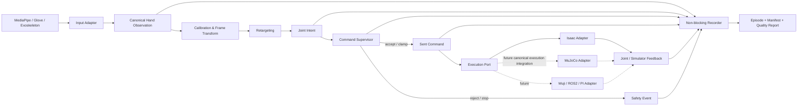

# 000：项目章程、执行预演与全局架构

| 字段 | 值 |
|---|---|
| 文档编号 | 000 |
| 状态 | 已进入多仿真后端实现阶段 |
| 建立日期 | 2026-07-11 |
| 首个垂直切片 | Google MediaPipe → Retargeting → Supervision → Isaac → Dataset |
| 文档性质 | 正式、版本化；动态任务清单另见本地 `plans/` |

## 1. 目标与范围

本项目围绕 Wuji Hand 建立一条可观察、可回放、可验证的手部控制与数据生产链路。第一阶段以 Isaac 为仿真后端，以 Google MediaPipe 为手部观测输入。当前已进一步实现 MuJoCo 的 FR3 v2 + Hand 2 right 桌面机械基线；已交付能力以 `docs/components/` 和对应验证报告为准。

架构同时为以下后续能力保留稳定扩展面：

- Wuji Glove 或外骨骼输入。
- MuJoCo 上的遥操作、采集、任务和策略执行层。
- Wuji 真机、复杂 ROS2 系统。
- 尚待明确语义的“PI 模式”server-client 集成。

本章继续约束目录、职责、数据契约、验证策略和迁移规则；具体 adapter 是否可运行必须由 component 文档和测试证据确认，不能由本章的未来边界推断。

## 2. 需求基线

1. `plans/` 保存当前执行计划和 TODO，持续更新且不进入版本同步。
2. `docs/` 是正式文档入口，解释已实现功能、代码入口、配置入口、运行方法与限制。
3. 官方资料、模型、配置和算法必须保留来源，按明确路径迁移，不能散落在根目录或失去版本信息。
4. 首个实现目标是 MediaPipe 到 Isaac 的关节映射控制、信号监督和完备轨迹记录。
5. 验证与测试必须随边界同步建立，不在功能完成后补做。
6. MuJoCo、ROS2 和 PI server-client 通过 ports/adapters 扩展，不侵入核心流水线。

## 3. 架构原则

### 3.1 Canonical contracts 优先

MediaPipe、Glove、外骨骼、Isaac、MuJoCo、Wuji SDK、ROS2 和网络服务不得直接互相调用。所有 adapter 先把外部数据转换为项目规范化契约，应用层只消费这些契约和 ports。

### 3.2 依赖方向固定

```text
specs / compat / integrity -> Python 标准库
runtime/composition        -> specs + compat + integrity + application + adapters
application                -> domain + ports
adapters                   -> specs + compat + integrity + domain + ports + external SDK
ports                      -> domain
domain                     -> no simulator/device/middleware dependency
```

核心逻辑不得 import Isaac、MediaPipe、ROS2 或 Wuji SDK。外部 SDK 对象不能越过 adapter 边界进入 application。

### 3.3 Simulation-first，不等于 simulation-only

第一阶段用 Isaac 提供安全、可重复的执行后端，但控制意图、监督、记录和回放契约不得包含 Isaac 专属类型。这样同一 pipeline 后续可切换到 MuJoCo、真机或远程 execution backend。

### 3.4 原始信号、算法意图、实际命令和反馈分开

数据集中必须区分：

- 输入源真正产生的原始数据。
- 统一坐标/单位后的 canonical observation。
- Retargeter 想要执行的 joint intent。
- Supervisor 钳制、拒绝或修正后的 sent command。
- 仿真器或真机实际反馈。

不能用“目标关节角”同时代表算法输出和真正下发值。

### 3.5 配置驱动且只允许一个合成入口

组件配置可分文件维护，但一次运行由一个 session config 组合引用。禁止同时把自定义 YAML、ROS 参数和命令行默认值都当作事实源。CLI override 必须进入最终配置快照。

### 3.6 来源和可复现性是功能的一部分

模型、算法、官方配置、SDK、标定和数据 schema 都要有版本、hash 或 commit。滚动 `latest` URL 只能用于查阅，不能充当实验锁定版本。

### 3.7 五层运行配置

仿真资产和运行环境采用
`Asset Manifest → Backend Binding → Assembly Spec → Workcell → Session`
五层组合，详细取舍见
[ADR-0003](decisions/0003-five-layer-session-composition.md)。

| 层 | 责任 |
|---|---|
| Asset Manifest | 后端无关的产品身份、代际、侧别、语义 frame、control group 与 layout |
| Backend Binding | 一个 Asset 在指定 backend 的固定 artifact、loader、frame/joint/actuator 映射 |
| Assembly Spec | 带 namespace 的资产实例、语义 attachment 与一个或多个 root |
| Workcell | world/语义 frame、mount，以及 plane/box/sphere/frustum 物理 primitive |
| Session | backend、assembly/workcell、逐实例 binding、逐 root placement 和运行合同的唯一组合入口 |

Asset 身份不得包含 MJCF/USD 路径或 simulator 原生名称；这些版本化表示只属于
Backend Binding，并引用 `third_party/sources.lock.yaml`。Assembly 是无环 forest：
每个非 root 实例恰好一个 parent，每个 root 由 Session 独立放置到 Workcell mount。
因此，同一结构既能表达当前单 root 场景，也为未来多臂、多手和多 root workcell
保留扩展面，但不表示这些新资产已经实现。

Session resolver 必须在 backend 初始化前完成引用闭合、asset/binding/backend
匹配、frame 与 control layout 校验、root placement、source lock 和配置指纹计算。
runner 不得绕开 Session 再维护第二套隐式组合默认值。现有 typed scene/runtime
profile 可暂作 compatibility leaf，以 strangler 方式迁移；兼容期只引用而不复制
既有几何、physics、控制和报告事实。

五层数据模型只表达不可变 spec 和局部不变量；YAML、安全路径、跨层解析和依赖装配
属于 runtime。`compat/` 暂存现有 MuJoCo compatibility leaf 的纯数据合同，
`integrity.py` 提供 simulator-neutral 的文件/目录 hash；二者都只依赖标准库。
adapter 可消费解析后的 spec/compat 合同，但不得反向 import runtime。此扩展不改变
3.2 节的核心方向：

```text
runtime -> specs + compat + integrity + application + adapters
adapters -> specs + compat + integrity + domain + ports + external SDK
application -> domain + ports
ports -> domain
specs / compat / integrity -> Python standard library
domain -> no simulator/device/middleware dependency
```

## 4. 全局数据流



Recorder 旁路订阅多条不同频率的流，不能同步阻塞控制环。队列溢出时记录 dropped count 和受影响通道，不允许静默丢帧。

## 5. Canonical 数据契约预案

以下只定义必要语义；字段和序列化格式在实现前通过 schema/ADR 固定。

| 契约 | 必须表达的内容 |
|---|---|
| `FrameEnvelope` | schema version、session/episode、sequence、source、左右手、frame id、单调时钟、设备时钟、clock domain、有效期 |
| `RawHandLandmarks` | MediaPipe 21 点顺序、normalized/world 表示、原始坐标、visibility/presence、handedness |
| `CanonicalHandObservation` | `21×3`、米、显式坐标系、置信度、校准和 transform 引用 |
| `JointLayout` | 产品代际、模型 ID、20 个 joint name/nid/order、单位、正方向和限位版本 |
| `JointIntent` | layout ID、20 维弧度、可选速度、求解状态、残差、输入时间 |
| `SafetyDecision` | accept/clamp/reject/stop、原值、执行值、规则版本、原因和触发时间 |
| `SentCommand` | 真正送入后端的值、发送时间、deadline、backend/session id |
| `JointFeedback` | joint name/nid、position、velocity、effort/current、online/fault、采样时间 |
| `SupervisionMetrics` | latency、jitter、staleness、drop、retarget residual、command/feedback error、clipping |
| `EpisodeManifest` | 软件/配置 hash、模型与官方资产 commit、标定、坐标/单位、通道、缺失率、终止原因和 checksum |

不变量：

- MediaPipe/通用 retargeting 边界按官方现行契约核对为 `21×3` 米输入和 20 关节弧度输出。
- 相同长度的 20 维数组不代表关节布局相同；Hand v1、Hand 2、SDK、Description 与 Isaac 资产必须通过 `JointLayout` 显式映射。
- `current`、`command effort`、`torque` 和 `contact force` 是不同量。Hand 2 当前资料明确不支持把关节电流直接当接触力。
- handedness、坐标 frame、单位和时间域不得依靠变量名或默认值隐式表达。

## 6. 仓库目录与职责

```text
.
├── plans/                         本地动态计划；Git 忽略
├── docs/
│   ├── 000-project-charter-and-architecture.md
│   ├── architecture/              稳定系统/部署视图
│   ├── components/                已实现功能和真实代码入口
│   ├── guides/                    安装、运行、采集、回放、排障
│   ├── reference/                 schema、坐标、关节布局、配置字段
│   ├── validation/                验证矩阵和验收证据
│   └── decisions/                 ADR
├── src/wujihand/
│   ├── domain/                    canonical types、单位、frame、layout、不变量
│   ├── ports/                     Input/Retarget/Execution/State/Recorder 等协议
│   ├── specs/                     五层 immutable schema 与局部不变量
│   ├── compat/                    临时、纯数据的 typed compatibility-leaf 合同
│   ├── integrity.py               simulator-neutral 文件与目录内容 hash
│   ├── application/
│   │   ├── calibration/           坐标与个体标定用例
│   │   ├── retargeting/           与外部 SDK 无关的映射用例
│   │   ├── supervision/           看门狗、限位、拒绝/钳制/停止策略
│   │   ├── recording/             多流记录、episode、回放与导出编排
│   │   └── teleop/                端到端 session orchestration
│   ├── adapters/
│   │   ├── input/                 mediapipe；未来 glove/exoskeleton
│   │   ├── retargeting/           官方 SDK/算法包装；不泄漏外部类型
│   │   ├── simulation/            isaac / mujoco
│   │   ├── robot/                 未来 wuji_sdk 真机输出
│   │   ├── transport/             未来 ros2/pi server-client
│   │   └── storage/               MCAP/Parquet/文件系统等实现
│   └── runtime/                   strict YAML、五层 resolver、compatibility bridge
├── configs/
│   ├── schema/                    配置 schema
│   ├── assets/                    后端无关 Asset Manifest
│   ├── bindings/                  按 backend 组织的锁定资产表示与映射
│   ├── assemblies/                资产实例、namespace 与 attachment forest
│   ├── workcells/                 world/语义 frame、mount 与物理 primitive
│   ├── base/                      稳定默认值
│   ├── profiles/                  typed compatibility leaf 与组件 profile
│   ├── sessions/                  五层 composition root 与运行级 override
│   ├── upstream/                  带 provenance 的上游配置快照
│   └── local/                     IP/SN/个人路径；Git 忽略
├── datasets/
│   ├── schemas/                   版本化数据 schema
│   ├── manifests/                 可提交的 manifest/profile 模板
│   └── examples/                  小型、脱敏、可复现样例
├── artifacts/                     runs/trajectory/recording/log；Git 忽略
├── third_party/
│   ├── sources.lock.yaml          外部来源锁定清单
│   ├── manifests/                 license/checksum/provenance
│   ├── patches/                   明示维护的上游补丁
│   └── src/                       将来的 pinned submodule/vendor 源
├── experiments/                   可丢弃实验；生产代码不得 import
├── tests/
│   ├── unit/                      纯算法与不变量
│   ├── contract/                  每个 adapter 的 port 契约
│   ├── integration/               MediaPipe/Isaac/storage 等边界
│   ├── e2e/                       完整 slice 与故障路径
│   ├── golden/                    小型预期输出
│   └── fixtures/                  测试输入与配置
├── tools/                         数据检查、迁移、基准等维护工具
└── skills/lookup-wuji-docs/       官方文档定位 skill
```

未来目录已经预留，只表示边界，不表示功能完成。正式能力清单只以 `docs/components/` 和测试证据为准。

## 7. 官方资料、配置与算法的迁移路径

### 7.1 官方文档

- 不批量复制滚动网页到源码。
- 使用 `skills/lookup-wuji-docs/` 定位官网、产品代际、release 和仓库。
- 经项目验证且长期有效的结论，连同来源 URL、查阅日期、版本和适用范围写入 `docs/reference/`。

### 7.2 模型和官方仓库

优先级：

```text
锁定安装包版本
  -> pinned git submodule/commit
  -> adapter 封装
  -> 必要时维护 patch
  -> 最后才 fork/vendor
```

每个来源记录 repository、tag/commit、submodule commit、license、checksum 和用途。Hand 2 Isaac 资产必须确认来自 `hand2_beta`，不能由目录名或 20 DoF 数量猜测。

### 7.3 官方配置

- 原样上游配置放 `configs/upstream/<source>/<version>/`，附 provenance。
- 后端无关身份放 `configs/assets/`；MJCF/USD/procedural 表示和映射放
  `configs/bindings/<backend>/`。外部 MJCF/USD artifact 必须引用 source lock；
  项目自有 procedural builder 可令 artifact 为空，但必须进入封闭 registry。
- 装配拓扑放 `configs/assemblies/`，世界与 mount 放 `configs/workcells/`，一次
  运行只由 `configs/sessions/` 组合。
- 迁移中的项目 typed 配置放 `configs/base/` 或 `configs/profiles/`，只能作为被
  五层引用的 compatibility leaf，不能与五层重复维护同一事实。
- 派生配置声明 `derived_from`、上游 commit、单位、修改原因和验证用例。
- IP、SN、个人路径、凭据只放 `configs/local/` 或环境变量。

### 7.4 算法代码

- 能包装官方包时只写 adapter，不复制源码。
- 项目自有 retargeting/use case 放 `application/retargeting/`；`wuji_sdk.retargeting` 等外部实现放 `adapters/retargeting/`；设备/仿真特有变换放对应 adapter。
- 原型先放 `experiments/`；只有补齐契约、测试、配置和文档后才迁入 `src/`。
- 复制或 fork 官方算法必须补 license、source lock、ADR 和行为对照测试。

## 8. 首个纵向切片：MediaPipe → Isaac

### 8.1 实现顺序

1. 固定目标产品、左右手、Isaac/Isaac Lab 版本和 USD/model commit。
2. 定义 `FrameEnvelope`、21 点 observation、`JointLayout`、intent、decision、command、feedback、manifest。
3. 先用录制 landmarks 做离线 retargeting，完成坐标、单位、手性和关节顺序验证。
4. 建立 headless Isaac adapter，用固定轨迹完成逐关节方向、范围和反馈验证。
5. 接入 supervisor，覆盖陈旧帧、低置信度、NaN、超限、速率异常和 backend fault。
6. 接入 non-blocking recorder，记录算法意图、执行命令、反馈和质量事件。
7. 最后接实时 MediaPipe 摄像头，测量 end-to-end latency、jitter、drop 和回放一致性。

### 8.2 首期不做

- 不同时实现 Isaac 与 MuJoCo 的完整功能。
- 不以 ROS2 作为首期核心依赖。
- 不先做微服务、动态插件发现或分布式消息总线。
- 不把 PI 未明确的语义固化成网络协议。
- 不复制整套官方 Retargeting 代码再改。

## 9. 信号监督设计

Supervisor 位于 Retargeting 与 Execution Port 之间，拥有最终否决权。规则至少分三类：

| 类别 | 示例 | 处理 |
|---|---|---|
| 输入健康 | stale、掉帧、低置信度、NaN、handedness 跳变 | hold/reject/stop |
| 运动约束 | 关节限位、速度/加速度、突跳、求解残差 | clamp/reject |
| 后端健康 | feedback 超时、命令-反馈误差、fault、仿真发散 | degrade/stop |

每次决定记录 rule version、原因、原 intent 和实际 command。停止/hold 策略按 backend 配置，网络中断不能绕过本地 supervisor。

## 10. 完备轨迹数据集定义

首期定义 `teleop_trajectory_v1` 完备性 profile。一个 episode 至少包含：

```text
raw input landmarks
canonical 21×3 landmarks
retargeted joint intent
supervision decision and metrics
sent command
Isaac/robot joint feedback
timing, drop, warning and error events
manifest, config snapshot, calibration and model provenance
quality report and checksums
```

### 10.1 多速率事实源

实时阶段先保存各通道原始时间序列，不强行在线拼成单频率大表。离线生成训练视图时显式记录：

- 对齐时钟和容差。
- 插值/保持方法。
- 缺失值 mask。
- 被 supervisor 拒绝或钳制的样本。
- 原始通道到派生样本的可追溯索引。

MCAP 是规范日志候选，Parquet/Arrow/NumPy 是训练导出候选；通过 ADR 选择唯一事实源。不能让 MCAP、ROS bag 和 Parquet 同时宣称是原始真值。

### 10.2 “完备”的适用范围

`teleop_trajectory_v1` 只保证控制/动力学轨迹完备。若用于视觉模型训练，还需额外 profile 保存视频帧、相机内外参、曝光/同步和数据授权信息。

## 11. 验证与测试安插

| 阶段 | 必须同时加入的验证 |
|---|---|
| Domain/schema | 序列化 round-trip、shape/dtype、单位/frame/layout 不变量 |
| MediaPipe adapter | normalized/world 区分、21 点顺序、左右手、缺点/低置信度 |
| Retargeting | golden 帧、关节顺序、限位、左右手镜像、NaN/退化输入 |
| Supervisor | accept/clamp/reject/stop 表驱动测试和属性测试 |
| Isaac adapter | headless smoke、逐关节方向/范围、固定轨迹回放、feedback 时间戳 |
| Recorder | 非阻塞、drop 计数、断电/异常终止 manifest、checksum、schema 兼容 |
| E2E | 离线 replay 确定性、实时延迟/抖动/掉帧、backend 失联安全路径 |

默认快速测试不得要求 GPU、摄像头或真机。Isaac GPU、实时摄像头和硬件测试分别用 marker/独立 CI job 或人工验收门槛。

## 12. 阶段门槛

### Gate 0：架构

- 目录职责、数据契约草案、来源迁移和文档制度完成。
- 未实现能力没有被写成已支持。

### Gate 1：离线映射

- 固定样例可稳定完成 21 点规范化和 20 关节输出。
- 坐标、手性、单位、关节布局有 golden/contract tests。

### Gate 2：Isaac 执行

- Isaac 和模型版本锁定。
- headless 回放和逐关节验证通过。
- NaN、超限、陈旧输入触发预期监督决定。

### Gate 3：实时与观测

- MediaPipe → Isaac 可报告 latency、jitter、drop、queue depth 和 command-feedback error。
- 输入失联可 hold/stop；记录器不阻塞控制。

### Gate 4：数据集

- manifest、必要通道、时钟关系、缺失 mask、校验和与 validator 完整。
- 同一 episode 可重放并生成一致的派生训练视图。

### Gate 5：扩展

- Glove、外骨骼、MuJoCo 各自通过同一 port contract tests，不修改 canonical 核心契约。
- ROS2/PI/真机先 shadow，再限幅/限速，最后闭环控制。

## 13. 文档和计划治理

- `plans/current.md` 是本地动态 TODO，不进 Git，不作为长期知识源。
- 稳定计划、里程碑或验收标准写入正式文档。
- 模块边界、数据事实源、安全策略和依赖选择写 ADR。
- 每个已实现组件在 `docs/components/` 说明代码入口、配置、运行、限制和测试入口。
- 每次官方依赖升级同步更新 source lock、兼容性测试和相关 reference。

## 14. 待决问题

在 Gate 1 前确认：

1. 目标手是 Hand 2 Beta 1 还是第一代，左手还是右手。
2. Isaac Sim / Isaac Lab / Python / GPU 的固定版本组合。
3. MediaPipe 输入使用 world landmarks、normalized landmarks 还是两者记录后规范化。
4. Retargeting 选 Wuji SDK 内建版本、独立开源仓库，还是项目算法。
5. 规范日志事实源选择 MCAP 还是其他容器。
6. PI 的准确含义、延迟模型、消息语义和部署边界；在用户确认前只保留 transport adapter 占位，不定义协议。

## 15. 过度设计警戒线

- 不因未来需求提前引入微服务、消息总线或插件系统。
- 不让 Hydra、ROS 参数、自定义 YAML 同时成为配置真值。
- 不建立抽象到抹掉产品代际、关节布局和安全语义的通用 N-DoF 框架。
- 不把五层配置误解为跨 backend 的万能 scene compiler，也不在架构调整中提前实现
  UR5、双臂 Franka、ROS 或 Tracker/Glove 映射。
- 不把 GPU/Isaac/真机测试塞进默认单元测试。
- 不允许实验目录被生产 package import。
- 不复制官方资料或算法后丢失版本、license、commit 和行为来源。
