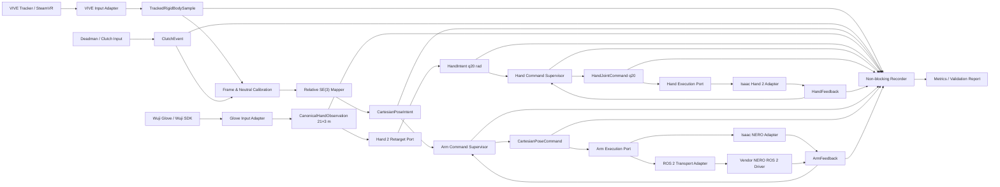
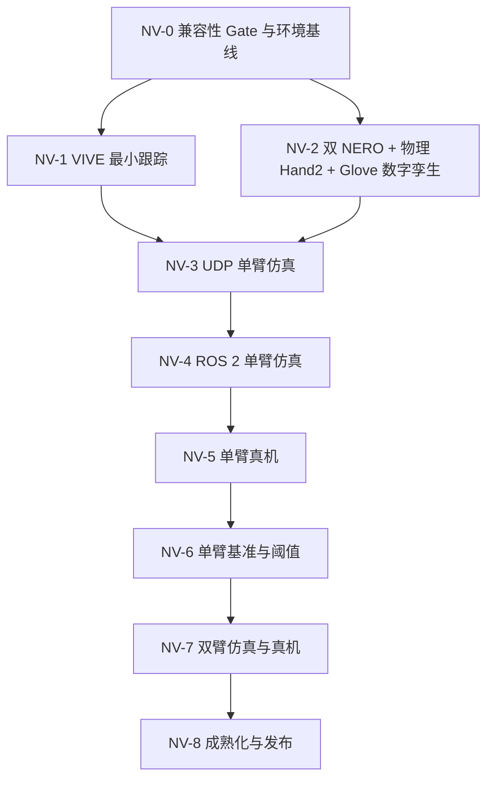

# 001：NERO—VIVE 单/双臂数字孪生与真机遥操作版本计划

| 字段 | 值 |
|---|---|
| 文档编号 | 001 |
| 迭代代号 | NERO-VIVE R1 |
| 状态 | 实施中（NV-0/NV-1/NV-2） |
| 建立日期 | 2026-07-28 |
| 原始需求 | 本地动态需求 [`plans/nero_vive_sim.md`](../plans/nero_vive_sim.md) |
| 目标环境 | `lenovo-piper2`，Ubuntu 24.04、Isaac Sim 6.0.1、RTX 5090；CUDA 版本以 NV-0 实测矩阵为准 |
| ROS 2 基线 | Jazzy |
| 首个受控对象 | 右侧 NERO |
| 文档性质 | 正式、版本化；作为本次大版本开发、验收和范围变更的主大纲 |

## 0. 如何使用本计划

本计划不是“实现已经完成”的组件文档，而是本次版本从环境验收到双臂真机遥操作的
范围合同和执行大纲。维护规则收敛为：

1. 每个里程碑只有在对应 Gate 通过并链接到验证证据后，才能标记完成。
2. `docs/components/` 只描述已实现能力；本计划中的未来项不得提前写成“当前支持”。
3. 任何改变控制语义、安全状态机、坐标事实源、ROS 2 接口、真机控制模式或验收阈值
   的决定，必须先形成 ADR 或计划变更记录，并与项目负责人对齐。
4. 环境缺失、硬件未连接或人工检查未执行时，相关 Gate 记为“未执行”。
5. 每个阶段结束时执行“材料与工具评审”，主动提出缺失的官方资料、模型、CAD、
   固件信息、标定治具、测试夹具或知识工具需求。
   新资料按复用性和必要性选择承载形式：一次性结论进入正式文档和 source lock；
   可重复工程流程可建设项目 skill；持续更新、适合权威检索的资料源可建设只读 MCP。

## 1. 版本目标

本版本要建立一条从 VIVE Tracker 3.0 刚体位姿，到 NERO 数字孪生，再到 NERO 真机的
可观察、可回放、可监督、可逐级放行的遥操作链路。开发顺序固定为：

```text
第 0 步：Isaac Sim 6.0.1 + Python 3.12 当前代码兼容性快速验证
  -> 通过后补齐目标机环境基线
  -> VIVE 最小跟踪
  -> 双 NERO + 双物理 Hand 2 + Wuji Glove 手部遥操作数字孪生
  -> 本机最小 server-client 单臂仿真遥操作
  -> ROS 2 单臂仿真遥操作
  -> ROS 2 单臂真机遥操作
  -> 单臂精度/延迟基线与阈值冻结
  -> ROS 2 双臂仿真遥操作
  -> ROS 2 双臂真机遥操作
  -> 稳定性、可复现性和发布收口
```

最终交付应做到：

- VIVE 设备身份、位姿、质量、按钮和失联状态以规范化契约进入系统。
- 相同的 canonical Cartesian intent 可由 Isaac 和 NERO 真机 adapter 分别执行。
- 所有运动命令先经过坐标标定、工作空间、速度/加速度、陈旧数据和状态机监督。
- 仿真与真机都能记录输入、意图、监督决定、实际命令、反馈和分段延迟。
- 左右臂拥有显式 stream、namespace、标定和设备绑定，不能依赖数组位置猜测。
- Wuji Glove 的左右手骨架以 canonical `21×3 m` 观测进入系统，经锁定的 Hand 2
  retargeting 产生显式 layout 的 `q20 rad`，驱动对应侧物理 Hand 2，不能把 Glove
  的 21 DoF 人手角直接透传为机器人 20 关节命令。
- 版本结束时产生可复现配置、正式运行指南、验证报告和性能基线。

## 2. 已确认范围与前提

### 2.1 目标机与共享环境

- 目标机别名为 `lenovo-piper2`，是共享设备。
- NV-0 实测目标机为 Ubuntu 24.04.4、Isaac Sim 6.0.1.0 / Python 3.12.3、
  RTX 5090 / driver 595.58.03。`nvidia-smi` 的 CUDA 13.2 是驱动兼容上限；
  系统 toolkit 为 12.8.61，Isaac Warp 报告 toolkit 12.9。
- ROS 2 Jazzy、SteamVR/OpenVR 和设备运行态由 NV-0/NV-1 补齐，不根据硬件齐全
  直接推定软件已安装或设备已配对。
- 后续项目 checkout、ROS workspace、缓存、派生 USD、运行 artifact 和临时工具原则上
  均位于 `~/swy/` 下。
- 实施前记录 Ubuntu point release、kernel、NVIDIA driver、GPU、Isaac build、
  Python、ROS 2、RMW、SteamVR/OpenVR、USB/CAN 设备和固件版本。
- 本计划不依赖当前设备能够访问目标机；远端盘点属于里程碑 NV-0。

### 2.2 工作台、机械臂和末端

- 工作台标称尺寸为 `1.2 m × 1.2 m`。
- 两台 NERO 位于工作台同一侧，端口侧朝桌外、工作方向朝桌内；NV-2 已建立明确标记为
  `simulation_nominal` 的桌沿姿态。精确台高、底座中心、底座 yaw、两臂间距、安装孔位
  和可达空间仍必须现场测量，不由仿真示意反推。
- 本体二维码页《机械臂PIPER NERO（7F）》标称 7 自由度、1.5 kg 负载、580 mm
  工作半径；公开《NERO用户手册》则写 3 kg，二者不得拼成同一产品参数集。具体固件、
  序列号、CAN 口、零位和当前限位仍需逐臂只读获取。
- 本版本 NERO 真机保持裸法兰，不安装、供电或控制 Wuji Hand 2 真机。
- 数字孪生包含：
  - 左 NERO + 左 Wuji Hand 2；
  - 右 NERO + 右 Wuji Hand 2。
- 两只虚拟 Hand 2 使用官方完整物理 USD，保留 articulation、rigid body、collision
  和 20 个主动关节；由对应侧 Wuji Glove 手骨架经 Hand 2 retargeting 后进行
  position target 控制。
- NV-2 只验收自由空间手型、逐指、左右隔离和基础接触稳定性，不包含 Hand 2 真机、
  力控、触觉闭环或抓取任务。
- 遥操作控制 frame 固定为 NERO `tool_flange`/经确认的 TCP，而不是虚拟 Hand 2 掌心；
  手臂链与手部链分别形成 `ArmIntent` 和 `HandIntent`，在仿真 Session 执行边界合并。

### 2.3 VIVE 硬件

- 当前可用硬件为 VIVE Tracker 3.0、SteamVR Tracking Base Station 2.0、Watchman
  dongle 及连接附件；没有 HMD 或控制器。SteamVR 的 HMD requirement 已关闭，
  NV-1 不以 HMD/控制器为前提。
- 首个单臂闭环默认使用一枚操作 Tracker；独立精度评估优先再在真机法兰安装一枚
  测量 Tracker。
- 双臂操作默认一臂一枚操作 Tracker；双臂独立外部精度评估需要额外两枚法兰测量
  Tracker；实际数量决定外部精度测试范围。
- Tracker pogo/button 可作为调试输入候选；若当前 Tracker 附件不提供可靠按钮，
  NV-3 前另选独立 deadman/clutch 输入。真机必须有独立、可触达的机械臂急停手段。

### 2.4 控制与验收策略

- 首个受控对象为右侧 NERO。
- 操作语义为 clutch-relative SE(3)；平移比例默认 `1.0`、可配置。
- VIVE 失联、质量不足、数据陈旧或 calibration epoch 异常时，先保持最后安全目标，
  随后失能跟踪；恢复必须重新 clutch。
- NERO 真机首次运动通过官方 ROS 2 Cartesian `move_p` 路径，以低速、小范围方式验证。
- CPV 不是本版本完成条件；仅在 `move_p` 无法达到已冻结指标时另行评审。
- 性能采用“先建立基线、再冻结阈值”：安全与数据完整性从一开始就是硬 Gate；
  p50/p95/p99 延迟、误差、抖动和掉帧阈值在单臂仿真和初始真机基线后确认。

## 3. 当前项目基线与架构差距

### 3.1 可复用能力

当前仓库已经具备：

- backend-neutral 的关节布局、四元数、frame ID、单调时间戳和标定 ID 校验。
- rotation-only 的 `PoseIntent`、clutch epoch 和 fail-closed `PoseSupervisor`。
- q20 与 q20+rotation 的严格 JSON/UDP loopback transport，包含 session、sequence、
  timestamp、layout 和 calibration 校验。
- `JointCommandSupervisor` 及陈旧输入、限位和速率监督的基础模式。
- `Asset Manifest → Backend Binding → Assembly → Workcell → Session` 五层配置、
  strict YAML、source lock、artifact hash 和稳定 `session_hash`。
- multi-root forest、namespace prefix 和跨层碰撞检查的配置表达能力。
- Wuji Hand 2 Beta 1 right 的固定 Asset/Isaac Binding，以及左手上游模型可用性依据。
- MediaPipe `21×3 m` → Hand 2 `q20 rad` 的 canonical observation、retargeting、
  supervision、Isaac execution 先例，可复用于 Glove 输入而不改变核心契约。
- Isaac、MuJoCo、MediaPipe 和 UDP 的分层 adapter 先例及 fast/contract/integration
  测试组织方式。

### 3.2 待补能力

- 当前 `PoseIntent` 只表达旋转，不表达 NERO 末端平移、TCP、twist 或 Cartesian feedback。
- 机械臂需要独立的 hold/disarm 失联策略，不能沿用手指回 rest 行为。
- 当前 UDP q20/v2 协议只面向一只右手，没有 arm ID、side、stream route 或双臂 bundle。
- 当前 Session v1 的 backend 只有 `isaac`/`mujoco`，runtime role 也没有硬件执行、
  shadow、recorder 或部署图语义。
- 五层 schema 与 NV-2 专用 Isaac runner 已实现双 root / 双 q27 materialization；这只
  证明当前 NERO—Hand 2 组合，不代表已支持任意双臂 topology。
- Isaac 5.1.0 / Python 3.11 仍是原有完整回归基线；NV-0 已新增 Isaac 6.0.1 /
  Python 3.12 的固定 Hand 2 Session 最小兼容证据。
- NV-1 已建立 VIVE input adapter；NV-2 已建立 NERO/Hand 2 Asset 与 Binding、固定导入
  recipe、双根 Assembly、`simulation_nominal` Workcell、Session v1、canonical
  Glove/retarget/supervision 链和双 q27 runner。当前 tabletop v5 已通过 82/82，
  覆盖原 68 项 scripted physical Gate，以及桌沿安装、左右分侧 q7 准备位、手—小臂
  轴对齐、掌面向下和端口假设轴朝外；仍需关闭实际 Glove live、deliberate
  contact/异常穿透近景资格、合并 q27 self-collision 最终决策，以及后续 measured
  Workcell/attachment。
- 当前仍没有 ROS 2 package、真机 robot adapter、通用 recorder、延迟分解或独立
  精度评估。

### 3.3 已知资料冲突

本体二维码页、公开《NERO用户手册》、官方 URDF 和 `pyAgxArm` 的参数属于至少两组
互相冲突的资料：二维码页为 1.5 kg、J2 `±102°`，公开手册为 3 kg、J2
`-15°～190°`。锁定 URDF/SDK 接近对称 `±100°`，且当前 URDF 对二维码页 J1～J6
每端约内缩 2～3°、J7 内缩 7°，因此 NV-2 继续使用 URDF 作为严格保守的临时仿真
范围，不再把两份产品资料任意拼接。该结论不替代逐臂固件、零位、方向和当前限位的
只读回读；真机不兼容时必须暂停并修订 ADR/profile。

## 4. 本版本不做

- 不安装、供电或控制 Wuji Hand 2 真机；Hand 2 只在 Isaac 中按位置目标进行物理仿真。
- 不把 Glove 21 DoF 人手角直接映射为 Hand 2 q20，不做力控、触觉闭环或抓取任务。
- 不安装相机，不实现视觉、自主避障或自主抓取。
- 不做力控、MIT、接触任务、直接 CAN 运动控制或 CPV 主线。
- 不启用 NERO 内建主从联动作为双臂实现；两臂由本项目显式独立 stream 编排。
- 不承诺现有通用 Isaac compiler 已支持任意机器人。

## 5. 需求追踪

| 原始需求 | 本计划工作包 | 主要退出证据 |
|---|---|---|
| Isaac 6.0.1 / Python 3.12 起始兼容性确认 | NV-0 第 0 步 | 最小测试记录与继续/暂停结论 |
| Tracking 工具套装最小测试 | NV-1 | 设备清单、位姿日志、静止/运动/遮挡报告 |
| 双 NERO + 物理 Hand 2 数字孪生 | NV-2 | source lock、Session、结构/物理/运动验证 |
| Wuji Glove 遥控仿真 Hand 2 | NV-2 | Glove fixture/live contract、retarget q20、左右隔离验证 |
| server-client 单臂数字孪生遥操作 | NV-3 | loopback contract、右臂 headless/GUI 验证 |
| ROS 2 单臂数字孪生遥操作 | NV-4 | ROS graph、QoS/namespace contract、等价性报告 |
| ROS 2 单臂 NERO 真机遥操作 | NV-5 | 安全清单、shadow、小范围真人操作证据 |
| 真机精度与延迟统计 | NV-6 | 原始记录、分析产物、基线与阈值审批 |
| 双臂数字孪生和真机验证 | NV-7 | 双流、双标定、同步/碰撞/失联验证 |
| 成熟 pipeline 与效率分析 | NV-8 | 一键部署、soak/fault suite、最终验证报告 |
| 新材料、skill、MCP 需求 | NV-X5，贯穿 NV-0~NV-8 | 材料缺口登记与工具形态评审记录 |

## 6. 目标架构

### 6.1 总体数据流



ROS 2 是 transport/deployment 边界，不是 domain 类型，也不作为伪造的 simulator
backend。Isaac 和 NERO 真机分别实现同一个执行 port；外部 SDK/ROS 消息不能越过
adapter 边界进入 application。

### 6.2 依赖方向

现有依赖方向继续成立，并增加设备/ROS adapter：

```text
specs / compat / integrity -> Python standard library
domain                     -> no simulator/device/middleware dependency
ports                      -> domain
application                -> domain + ports
adapters/input             -> domain + external tracking runtime
adapters/retargeting       -> domain + ports + external retarget runtime
adapters/simulation        -> specs + domain + ports + Isaac
adapters/robot             -> specs + domain + ports + vendor SDK/ROS boundary
adapters/transport         -> domain + ports + UDP/ROS serialization
runtime                    -> specs + compat + integrity + application + adapters
```

ROS 2 node package 可依赖稳定的 wire/domain contract，但不得把 `rclpy`、ROS message、
SteamVR 或 `pyAgxArm` 类型放进核心 domain。

### 6.3 五层配置与部署层演进

五层继续拥有机器人身份、表示、装配、工作空间和单次执行合同：

- Asset Manifest：NERO 产品身份、q7 layout、`base`/`tool_flange` 等语义 frame。
- Isaac Backend Binding：锁定 NERO URDF 来源、派生 USD、frame/joint map 和导入配方。
- Assembly：`left_arm -> left_hand`、`right_arm -> right_hand`，两个 NERO root。
- Workcell：1.2 m × 1.2 m 桌面、左右 mount 和安全区；NV-2 可使用明确标记为
  `simulation_nominal` 的 bring-up revision，实测 revision 留给物理对应与真机阶段。
- Simulation Session：Isaac 6.0.1、两 root placement，以及四个显式 commanded control
  group：`left_arm.q7`、`right_arm.q7`、`left_hand.q20`、`right_hand.q20`。
- Session runtime 的 typed qualification compatibility profile：仅保存本次仿真的左右
  q7 准备位、Isaac q7 drive gain 和几何验收轴/阈值；不得改写共享 Asset 的机械零位，
  也不得把 gain 描述为真机控制器参数。

五层配置负责“什么资产、如何绑定、怎样装配、位于哪个工作台、一次运行控制哪些
group”；Glove 设备连接与 `21×3 → q20` 算法仍位于 input/retargeting adapter，
通过 canonical `HandIntent` 接入 Session runner。设备 SDK 类型或 21 DoF 原始数组
不进入五层 schema，因此新增手部遥操作不改变五层职责和依赖方向。

Isaac 物理实现不会把四个逻辑 command group 误建成四棵 articulation。专用 simulation
adapter 在 PhysX 初始化前根据已解析的 Assembly transform 放置 Hand 2，禁用 Hand 2
USD 原有的 world-fixed `root_joint`、移除其 `ArticulationRootAPI`，再 author
`NERO link7 → Hand 2 base` FixedJoint。固定上游 USD 保持只读。运行时恰好形成左右
两棵 articulation，每棵为 `NERO q7 + 同侧 Hand 2 q20 = q27`；adapter 按 canonical
joint name 与 USD joint path 验证 q7/q20 分区。四个逻辑 route 与两棵物理
articulation 是两个不同层次的事实。

当前 Session v1 不足以表达跨进程 ROS graph 和真实设备。默认采用兼容性加法演进：

1. 保留 Session v1 解析和现有 golden。
2. 增加 device/execution binding，表达 NERO 序列号、CAN interface、固件、adapter
   和反馈能力。
3. 增加 `DeploymentSpec v1`，引用 producer/executor Session，声明：
   - node/process；
   - stream ID 与左右臂路由；
   - transport、ROS namespace/domain/remap/QoS；
   - supervisor、calibration、recorder 和 safety profile；
   - shared-host port/domain ownership。
4. 多臂配置以 instance/stream ID 显式映射。

### 6.4 Python 版本方案

NV-0 第 0 步已选择并验证以下方案：

- 基础 package、五层解析、domain 和 transport 支持 Python 3.11/3.12。
- Python 3.11 保留为最低版本静态检查和现有 perception/retarget worker 回归基线。
- Isaac Sim 6.0.1 与系统 ROS 2 Jazzy 使用 Python 3.12。
- Isaac vendor environment 不安装项目依赖；runner 从受控 checkout 加载项目源码，
  避免用项目的 NumPy/SciPy 约束覆盖 Isaac 自带 ABI。
- 跨进程能力仍通过版本化 contract/DeploymentSpec 编排，不共享环境内 SDK 对象。

## 7. Canonical 契约预案

字段在实现前由 ADR/schema 固定；下表规定必须表达的语义。

| 契约 | 最低内容 |
|---|---|
| `TrackedRigidBodySample` | schema、stream/device/serial/role、sequence、tracking frame、position m、active quaternion wxyz、tracking state/quality、device/host time、clock domain |
| `ClutchEvent` | source、button/deadman identity、press/release edge、host time、target stream、epoch request |
| `CalibrationSnapshot` | calibration ID、tracker serial、operator anchor、robot TCP anchor、axis map、translation scale、frame chain、采样窗口、残差、配置 hash |
| `CartesianPoseIntent` | stream/side、target frame、position、quaternion、source time、calibration ID、quality、mapping version |
| `CartesianPoseCommand` | 监督后的 TCP target、可选 twist/acceleration limits、sequence、deadline、safety profile、target instance |
| `ArmFeedback` | stream/instance、q7/dq7/effort、flange/TCP pose、mode/status/error、enabled、sample time、adapter time |
| `ArmSafetyDecision` | accept/limit/hold/reject/disarm/stop、输入与输出摘要、规则/原因、时间、是否要求新 clutch |
| `CanonicalHandObservation` | side、MediaPipe 21 点顺序、`(21,3)`、米、frame、逐点 confidence、Glove frame header、标定引用 |
| `HandIntent` | side、Hand 2 q20 layout、20 维弧度、retarget model/config、输入时间、求解状态 |
| `HandSafetyDecision` | accept/clamp/hold/reject、原 q20、执行 q20、规则/原因、freshness 和 layout 结果 |
| `HandFeedback` | side/instance、Hand 2 q20 position/velocity、simulation time、fault/status |
| `BimanualCommandEnvelope` | group sequence、左右 stream command、最大允许 skew、coupling policy、deadline |
| `TimingTrace` | acquire、map、supervise、publish、receive、send-to-backend、feedback 各阶段单调时间 |
| `RunManifest` | source/config/session/deployment hash、OS/GPU/driver/Isaac/ROS/RMW/SteamVR、设备序列号、固件、标定、阈值、通道和 artifact checksum |

### 7.1 契约不变量

- 内部位置单位一律为米，角度为弧度，四元数为 active `wxyz`；ROS `xyzw` 只在 adapter
  内转换。
- 内部姿态不以 Euler 角持久化；NERO `move_p` 所需 RPY 由 robot adapter 在边界转换，
  并明确 ZYX convention 和奇异区处理。
- `source_time`、host monotonic time、ROS time、simulation time 和 wall clock 不混用。
- 同一 calibration ID 只对应一个 tracker anchor、robot anchor 和 axis/scale mapping。
- 新 calibration epoch 的首个命令必须是 identity-relative clutch；旧 epoch 数据拒绝。
- sequence 必须在 session/stream 内单调；跨进程重启用新 session UUID。
- stale command 不排队补发；command deadline 过期即拒绝。
- `ArmFeedback.effort` 的含义按 NERO/ROS 原始合同记录，不能推断为外部接触力。
- Glove 的 `hand_joint_angles` 是 21 DoF 人手模型结果，不是 Hand 2 q20；NV-2 使用
  `hand_skeleton` 的 MediaPipe 21 点、米制位置，经目标为 `WujiHand2` 且 side 匹配的
  retargeter 生成 q20。
- 四个 Session control group 均显式 commanded；不存在遗漏 route、runner 特判或
  “默认全零手指命令”暗中驱动。
- Glove/retarget 数据 stale、低置信度、错误 side、错误 layout 或非 finite 时，
  对应手进入 hold/reject；不会影响未配置为 coupled 的 NERO q7 scripted smoke。

### 7.2 最小 server-client 与 ROS 2 映射

- NV-3 首选 strict JSON + IPv4 loopback UDP，延续现有小型、可测、无 broker 的模式。
- 新协议使用独立 schema 名，不扩写 `wujihand.hand_command.v2`。
- datagram 设严格字段集合、大小上限、finite/unit/frame/layout/sequence/time 校验。
- NV-4 将相同语义映射为 ROS 2 IDL；标准 `PoseStamped` 可作为观察接口，但不能单独
  承载 quality、calibration、deadline 和 safety state。
- raw pose/高频 command 使用 `KEEP_LAST(1)`、有界 lifespan/deadline，并基于实测决定
  best-effort 或 reliable；不得因 reliable backlog 执行陈旧命令。
- safety event、mode change、enable/disable 和 run metadata 使用可靠通道。
- 任一执行目标同一时刻只能有一个 command owner。RViz、测试发布器、teleop 和
  vendor demo 不得同时发布控制话题。

## 8. 坐标、标定与控制语义

### 8.1 Frame 树

最低 frame 集合：

```text
vive_tracking
├── operator_tracker_left
├── operator_tracker_right
├── measurement_tracker_left        optional
└── measurement_tracker_right       optional

workcell_world
├── nero_base_left
│   └── nero_tool_flange_left
│       └── hand2_base_left
└── nero_base_right
    └── nero_tool_flange_right
        └── hand2_base_right
```

虚拟 Hand 2 的 `hand_base` 是法兰下的物理 attachment；手臂 target frame 仍为
NERO flange/TCP，手部 target 则是独立 q20 layout。两个 target 不互相冒充。

### 8.2 Clutch-relative SE(3)

按下 clutch 时记录：

- 操作 Tracker anchor `T_tracking_tracker_anchor`；
- 当前安全 TCP anchor `T_base_tcp_anchor`；
- calibration ID；
- tracker-to-control-handle 固定变换；
- tracking 到 robot 语义轴的 rotation map；
- translation scale。

运行中：

```text
delta_tracker = inverse(T_tracking_tracker_anchor) * T_tracking_tracker_current
delta_robot   = map_axes_and_scale(delta_tracker)
T_base_tcp_intent = T_base_tcp_anchor * delta_robot
```

随后 supervisor 再应用：

- Cartesian workspace/keep-out zone；
- translation/orientation step；
- linear/angular velocity；
- acceleration/jerk；
- reachable/IK/singularity；
- self/inter-arm/workcell clearance；
- tracker quality、age 和 deadman；
- robot status、mode 和 feedback freshness。

### 8.3 安全状态机

建议状态：

```text
DISARMED
  -> CLUTCH_PENDING
  -> ARMED_HOLD
  -> TRACKING
  -> DEGRADED_HOLD
  -> DISARMED
  -> ESTOP_LATCHED
```

- 启动永远进入 `DISARMED`。
- clutch 必须在 Tracker 稳定、机器人反馈新鲜、目标位于安全包络且 deadman 有效时建立。
- `DEGRADED_HOLD` 只短暂保持最后安全目标，不做“自动回零”。
- 超过失联阈值、按钮释放、calibration 改变或 robot fault 后进入 `DISARMED`。
- 急停、碰撞、通信异常或控制模式异常进入 `ESTOP_LATCHED`；恢复需要人工检查，
  不能由新数据包自动清除。
- 数值阈值在 NV-3/NV-4 基线后冻结；首次真机前必须写入显式 safety profile。

### 8.4 双臂默认安全语义

- 左右臂各自拥有 supervisor、calibration、feedback watchdog 和 workspace。
- 双臂同时运行时默认使用 coupled deadman：任一操作流丢失或任一机器人重大 fault，
  两臂先 hold 并共同 disarm。
- 单臂独立模式只用于隔离调试，必须显式选择，不能成为双臂默认。
- 两臂命令进入 `BimanualCommandEnvelope`，记录 command skew；超过阈值时不发送半组
  新命令。
- inter-arm keep-out 和最小间距在仿真中先验证；无相机版本不得声称具备动态障碍避让。

## 9. 配置、来源与 artifact 计划

### 9.1 NERO 资产

- 锁定 `agilexrobotics/agx_arm_urdf` 的精确 commit、license、NERO URDF、visual mesh、
  collision mesh 和 tree hash。
- Isaac 6.0.1 通过固定导入 recipe 将 URDF 派生为 USD；记录 importer 版本、参数、
  drive、density/inertia 处理和产物 hash。
- URDF 的 joint name、axis、limit、inertial、collision 和 tool frame 必须与手册、
  SDK 和实机反馈逐项对照。
- 派生 USD 属于 Backend Binding；collision、inertia 或 drive 调整保留 derivation 记录。

### 9.2 Hand 2 资产

- 继续固定现有 `wuji-description v2026.6.27` 作为本轮起点，新增相同 revision 的左手
  Asset/Isaac Binding。
- 左右 Binding 直接引用该 revision 的官方完整物理 USD，保留 articulation、rigid
  body、collision 和 revolute joint；不再制作 visual-only 派生 USD。
- Isaac 6.0.1 迁移或上游模型升级形成独立 Binding revision；20 个主动关节必须按
  Asset canonical q20 layout 显式映射。
- 左右手 attachment transform 在取得法兰/适配器 CAD 前标记为
  `simulation_nominal`，不得升级为真实机械装配事实。
- Glove 侧固定 Wuji SDK/Retargeting 版本、设备 side、SDK user/标定引用、21 点
  frame/layout 和 Hand 2 retarget config/hash。

### 9.3 Workcell

- NV-2 功能仿真 Gate 可使用显式 `simulation_nominal` 桌面和 mount，仅用于装配、
  命令隔离与基础物理 bring-up，不支持物理精度、间隙或安全包络结论。
- 桌面尺寸、台高、两底座位姿、安全边界和观察相机的正式 revision 均来自现场测量表，
  并在 NV-5 前替换 nominal revision。
- 测量原始记录、工具、单位、测量人和日期进入 provenance。
- 标称场景用于资产 bring-up；双臂/精度结果使用 measured workcell revision。

### 9.4 本地敏感配置

- Tracker serial、NERO serial、CAN interface、ROS_DOMAIN_ID、个人路径和现场 IP 放入
  `configs/local/` 或环境变量。
- 提交内容使用占位 schema、匿名化映射或设备 identity hash。

## 10. 里程碑与 Gate

### NV-0：第 0 步兼容性 Gate 与目标机基线

**目标**

先用最小成本判断 Isaac Sim 6.0.1、Python 3.12 与当前代码是否兼容。只有通过后，
才补齐目标机环境和设备基线。

#### 0A：开始前兼容性快速验证

这是整个版本实施的第 0 步，先于 ROS 2、VIVE、NERO、资产导入和新功能开发：

1. 固定当前仓库 commit、`pyproject.toml` Python 约束、Isaac Sim 6.0.1 build 和其
   Python 3.12 版本。
2. 在干净 Python 3.12 环境中尝试安装和导入当前项目，运行最小 fast 测试集合，至少
   覆盖 domain、spec/session 解析和现有 transport contract。
3. 在 Isaac Sim 6.0.1 中运行一个现有 Hand 2 固定资产/Session 的最小 headless smoke，
   验证项目导入、场景启动和基础 stepping。
4. 保存命令、完整输出、退出码和版本信息，形成一页兼容性记录。

判定规则：

- 两项都通过：记录 `PROCEED`，进入 0B。
- 任一项不通过：记录 `PAUSED`，立即停止 NV-0 后续工作及 NV-1~NV-8；把失败证据、
  影响范围和少量可选路线提交给项目负责人，对齐后再更新计划。此时不直接修改
  Python 版本约束、兼容代码或环境架构。

#### 0B：通过后补齐目标机基线

1. 盘点 Ubuntu、kernel、NVIDIA driver、GPU、CUDA、Isaac、磁盘、USB 和显示会话。
2. 运行 Isaac Compatibility Checker 和空场景 GUI/headless 自检。
3. 在 `~/swy/` 下建立经 0A 确认的项目环境、ROS 2 Jazzy workspace、派生资产和
   artifact 目录；安装并核对 ROS 2 Jazzy、RMW 和 DDS。
4. 验证 Isaac ROS bridge，盘点 SteamVR/OpenVR、VIVE 设备、两台 NERO、USB-CAN、
   固件和连接状态；NERO
   盘点保持只读。
5. 恢复 source lock，执行商定的 fast、ruff、mypy 基线。

**输出**

- `docs/validation/<date>-isaac-6.0.1-python-3.12-compatibility.md`，明确
  `PROCEED` 或 `PAUSED`。
- 环境清单和版本矩阵。
- 共享机目录、端口、ROS domain 和 artifact 约定。
- NERO/VIVE 只读设备清单。
- `docs/validation/<date>-lenovo-piper2-baseline.md`。

**Gate NV-0**

- 0A 明确为 `PROCEED`。
- 经确认的项目、Isaac 和 ROS 环境可分别启动，fast 基线无未解释失败。
- 关键环境、设备和外部来源已有版本记录。

**材料与工具评审**

优先请求目标机安装记录、Isaac 安装来源、两台 NERO 固件、USB-CAN 型号和工作台资料。
若环境核验会重复执行，再评估 `isaac6-ros2-jazzy-environment-check` skill。

### NV-1：VIVE 最小跟踪垂直切片

**目标**

在不启动 Isaac、ROS 控制或 NERO 的情况下，证明指定 Tracker 能稳定产生可解释的
6-DoF 位姿和按钮事件。

**工作**

1. 安装并固定 SteamVR/OpenVR 版本，在关闭 HMD requirement 的模式下完成
   Base Station 2.0 与 Tracker/dongle 配对。
2. 记录 Base Station 布局、反光源、遮挡区和 SteamVR room/tracking origin。
3. 以 serial 为设备主键、role 为可变配置，禁止依赖 OpenVR 临时 device index。
4. 实现/验证 read-only VIVE input adapter，输出 `TrackedRigidBodySample`。
5. 采集静止、慢速平移、绕三轴转动、快速运动、部分遮挡、完全丢失和重新捕获样例。
6. 核对 HTC Tracker frame、OpenVR frame 与项目 active `wxyz` 约定。
7. 验证 controller/pogo/button 事件，选择仿真 clutch 与真机 deadman 的候选输入。
8. 统计采样频率、stationary jitter、短期 drift、dropout、reacquisition、timestamp
   monotonicity 和 CPU 占用。
9. 保存脱敏 fixture 和 golden，后续无硬件测试使用录制数据。

**输出**

- VIVE input component 设计及正式来源记录。
- 原始/规范化位姿样例、设备映射和质量报告。
- Tracker 安装方向、视场和附件 transform 说明。
- VIVE 故障/遮挡测试报告。

**Gate NV-1**

- 指定 serial 在重启后仍能确定性映射到同一 logical stream。
- position/quaternion finite、单位/frame/时间域明确。
- 三轴方向人工检查通过。
- 丢失和重捕获被显式报告，不产生伪造的连续姿态。
- clutch/deadman 事件可与 pose stream 对齐。

**材料与工具评审**

可能需要：Tracker 3D 模型、固定座 CAD、防转定位销、减振件、Base Station 布局夹具、
反光处理材料。若调试步骤会跨多个项目复用，评估 `validate-vive-tracker-pose` skill；
只有在需要持续检索 HTC/SteamVR 权威资料且现有公开源不足时再评估只读 MCP。

### NV-2：双 NERO + 双 Hand 2 数字孪生

**目标**

在 Isaac Sim 6.0.1 中建立可复现的双根工作台场景；NERO 可独立关节运动，两只
物理 Hand 2 具有显式 q20 命令入口，并可由对应侧 Wuji Glove 经 canonical
observation 与 Hand 2 retargeting 驱动。

**执行状态（2026-07-28，PARTIAL / 实施中）**

- NERO 来源、固定导入 recipe、q7 profile 与 NERO-only pre-composition smoke 已完成；
  固定派生 USD 连续两次导入得到相同 package/report hash。
- 左右 Hand 2 来源、Asset 和完整物理 Backend Binding 已建立；原始物理 USD 正是目标
  表示，不再等待 visual-only 资产。
- 双根 Assembly、nominal Workcell、Session v1 四个 logical route、canonical Glove
  observation/HandIntent 契约、supervision composition 及 q27 simulation adapter 已建立。
- Workstation2 / Isaac Sim 6.0.1 上的 tabletop v5 已通过 82/82：保留 scripted
  physical v2 的左右 q7、双侧五指/组合手型、隔离、finite/limits、reset/recovery
  68 项检查，并新增左右显式 q7 初态、reset 后回到该初态、手—小臂轴对齐、手向桌内、
  掌面向下和端口假设轴朝外等 Gate。
- Assembly 将左右 `link7 → hand_base` 固定为 local `Ry(+90°)`；Workcell 将两底座
  放到同一近侧桌沿 `x=±0.32 m, y=-0.52 m`，yaw 均为 `+90°`。Session 引用的 typed
  qualification profile 保存左右 q7
  `[∓10°, -60°, 0°, -30°, -90°, 0°, 0°]` 及 Isaac-only q7 drive gain
  `stiffness=3000, damping=150`，没有修改通用 NERO profile 的全零机械初态或固定
  来源 USD。
- v5 运行测得左右手纵轴与小臂轴点积接近 `1.0`、朝桌内点积约
  `0.9816/0.9818`、竖直分量绝对值约 `0.0903/0.0877`、掌面朝下点积约
  `0.9959/0.9961`。端口轴 `base local -X` 来源于固定 mesh 外凸特征推断，朝桌外
  点积为 `1.0`，仍等待实物确认，不能写成现场实测。
- 固定外部工作台 collider 已保留；每个 scripted hand baseline 与 reset 后均在
  `0.005 rad` 容差内有界收敛。该证据没有引入 deliberate unknown
  penetration/contact probe，不能替代后续接触与近景资格验证。
- Wuji SDK 2026.7.21 已在 Python 3.12 环境验证左右 `21×3 → q20` 求解；live
  Glove→Isaac Gate 尚未执行，当前等待专用网口 `enx6c1ff7cd0e76` 临时配置
  `192.168.1.10/24` 后继续。
- 正式实物 mount 仍等待法兰/适配器 CAD 和现场测量；NV-2 使用显式
  `simulation_nominal` transform 完成仿真 Gate，不把该值声明为真机事实。

**本阶段冻结的两点架构决策**

1. Hand 2 Backend Binding 使用官方完整物理 USD，不做 visual-only 派生。Asset 保持
   后端无关 q20 身份，Binding 负责物理 artifact 与 joint map，Assembly 只表达
   NERO flange → Hand2 base attachment。
2. 沿用向后兼容的 Session v1，左右 NERO q7 与左右 Hand 2 q20 全部是显式 commanded
   group；不新增 `inactive`/Session v2。Glove input adapter 输出 canonical
   `21×3 m` observation，Hand 2 retarget adapter 输出带 layout 的 q20 `HandIntent`，
   runner 只消费 canonical command，不直接依赖 Wuji SDK 对象。

**工作**

1. 锁定并审计 NERO URDF/mesh、NERO 手册、SDK 和 ROS driver 来源。
2. 通过固定 recipe 导入 NERO USD，验证 scale、link/joint、axis、limit、inertia、
   collision、articulation root 和 tool flange。
3. 固定本体二维码页、手册、URDF、SDK 来源；把 1.5 kg/J2 `±102°` 与
   3 kg/J2 `-15°～190°` 记录为不同修订资料，验证当前 URDF 是二维码范围的严格
   保守子集，建立 canonical NERO q7 layout/profile。
4. 新增 NERO Asset、Isaac Binding；同一 Asset 复用为左右两个实例。
5. 新增 Hand 2 left Asset/Binding，并复用现有 right Asset/Binding。
6. 建立双根 Assembly：左右 NERO 为 root，对应完整物理 Hand 2 为 child；锁定
   `simulation_nominal` flange attachment `Ry(+90°)` 并验证 side/frame。Isaac adapter 在
   初始化前将每个 NERO+Hand 2 组合为一棵 q27 articulation，且不修改来源 USD。
7. NV-2 功能仿真使用明确标记的 `simulation_nominal` Workcell/mount；它可关闭
   软件装配与运动 Gate，但不得升级为现场机械事实。当前 nominal mount 位于同一
   桌沿并使 mesh 推断的端口轴朝外；精确 Workcell revision 留待法兰 CAD、实物端口
   朝向确认和现场测量后替换。
8. 为所有 backend symbol 应用稳定 namespace，避免两套 `joint1`/`base_link` 冲突。
9. 在 Session v1 中建立四条显式 command route：左右 NERO q7、左右 Hand 2 q20；
   resolver 必须验证 Asset/Binding/layout/backend/source lock 闭合。左右不同的桌面
   q7 初态和 Isaac-only drive gain 由 Session 唯一引用的 typed qualification profile
   持有，不写入共享 Asset home，也不硬编码进 runner。
10. 新增 Wuji Glove input adapter：保留 header、sequence、timestamp、frame、side、
    21 点名称/位置/置信度与 calibration provenance；提供 SDK-independent canonical
    JSONL、有界 replay 和 fake-SDK fixture，使默认测试不依赖实体 Glove。首次 live
    后再保存脱敏 `hand_skeleton` fixture 与 q20/rejection 记录。
11. 包装官方 Hand 2 retargeting：`21×3 m → q20 rad`，固定 `WujiHand2`、side、
    joint name/order 和 config/version；禁止 21 DoF hand angles 直接透传。
12. 建立专用 Isaac twin adapter/runner，组合 q7 scripted command 与 q20
    fixture/live command，不绕开 Session resolver。
13. 执行 author-only、headless、GUI、逐关节方向/限位、reset、基础接触、错误
    side/layout、stale/low-confidence 和双实例隔离验证。

**输出**

- NERO source lock、派生 USD 和 import manifest。
- NERO q7 canonical profile。
- 左/右物理 Hand 2 + 双 NERO Assembly、workcell、Session v1。
- Glove input/fixture、Hand 2 retarget adapter 和 q20 command route。
- 数字孪生 runner、结构/物理/输入隔离和人工视觉验证报告。
- ADR：NERO 模型来源与限位事实源。
- ADR：NV-2 物理 Hand 2 与 Glove q20 命令边界。

**Gate NV-2**

- Session 恰好解析四个显式 control group：`2 × q7` NERO 与 `2 × q20` Hand 2，
  共 54 logical DoF；左右命名、layout 和 command route 无碰撞。历史 scripted
  physical v2 已通过，当前 tabletop v5 已完整继承并重验。
- Isaac stage 恰好形成两棵 q27 articulation；Hand 2 world root 不再生效，
  FixedJoint body targets 正确，且每侧 q7/q20 分区完整、互斥。命令后 reset 已重验
  两棵 q27 与稳定分区。
- 两只 Hand 2 可见、侧别正确、随对应法兰运动；20 个主动关节、drive、collision、
  rigid body 与 articulation 在 Isaac 6.0.1 中可解释。
- 两臂可分别执行小幅 scripted q7，另一臂不受影响。tabletop v5 已通过。
- 左右 q20 fixture 可分别完成逐指/手型小幅运动，另一只手与两臂 q7 不受影响；
  feedback finite 且在 Hand 2 canonical limits 内。历史 scripted physical v2 已覆盖
  双侧五指、双侧组合手型和 post-reset recovery，当前 tabletop v5 已完整继承并重验。
- 可用 Wuji Glove 的 `hand_skeleton` live 流至少完成一侧
  `Glove → canonical 21×3 → Hand2 retarget q20 → Isaac` 自由空间 smoke；
  另一侧路径用相同 contract/fixture 验证。若现场有双侧 Glove，则补双侧 live smoke。
  当前因专用 NIC 尚未配置而未执行。
- stale、低置信度、错误 side/layout、NaN 或 retarget 失败不得产生新 q20 command。
  无硬件 controller/composition 测试已证明这些输入不会创建新的 input-derived
  `HandIntent`；最后有效命令只可在 supervisor freshness 窗内 hold，超时后渐进回
  rest。真人 live failure injection 随 live Gate 补验。
- 全部 feedback finite 且在批准后的 canonical limits 内。tabletop v5 已通过。
- 两底座位于同一桌沿，左右 Hand 2 主轴与 `link7` 小臂轴对齐、指向桌内且掌面朝下；
  显式 q7 初态与 reset 后反馈分别满足 qualification threshold。tabletop v5 的
  82/82 已通过；端口物理侧别仍需项目负责人用实物确认。
- nominal 工作台的固定外部 collider 存在，初始状态、各 scripted baseline 与 reset 后
  均有界静置收敛；该部分已通过。deliberate contact/unknown penetration 与近景人工
  检查尚未执行。最终结果只关闭功能仿真 Gate，不形成现场 clearance 或物理精度结论。
- Session/source/artifact hash 和 Isaac 版本进入报告。

**材料与工具评审**

优先请求：NERO 最新 URDF/CAD、法兰尺寸、底座端口方向照片/图纸、精确底座/工作台
测量、固件限位表、左右
Hand 2 装配示意、Glove side/序列号、Wuji SDK 版本和有效标定产物。若 NERO 多源核对
将长期重复，评估 `lookup-nero-docs` skill；若 Glove 接入/标定/fixture 流程会在后续
版本复用，评估 `qualify-wuji-glove-input` skill。只有资料授权、更新和持续检索需求
达到阈值时，再建设对应只读 MCP。

### NV-3：最小 server-client 右臂仿真遥操作

**目标**

在 ROS 2 之前建立最小、可测试的 Tracker producer → loopback transport → Isaac
consumer 右臂闭环，冻结 canonical Cartesian 语义。

**工作**

1. 冻结 `TrackedRigidBodySample`、`ClutchEvent`、`CartesianPoseIntent`、
   `CartesianPoseCommand`、`ArmFeedback` 和 `ArmSafetyDecision` schema。
2. 新建独立于现有 Hand 2 v2 的 arm pose wire contract。
3. 实现 relative SE(3) mapping、axis mapping、translation scale 和 calibration epoch。
4. 建立 Cartesian supervisor：freshness、quality、deadman、workspace、step、
   velocity/acceleration、feedback、IK/reachability/singularity 和 hold/disarm。
5. Isaac adapter 消费 canonical Cartesian command，在仿真内求解 NERO q7。
6. 使用录制 Tracker fixture、合成轨迹和真人 Tracker 三种 producer。
7. 建立 non-blocking timing/command/feedback 记录；队列溢出必须计数。
8. 先 headless、后 GUI；先静态 clutch、后三轴/三向小幅运动，再组合轨迹。
9. 执行 malformed、reordered、duplicate、future、stale、lost-tracking 和 consumer
   restart 故障测试。

**输出**

- ADR：canonical Cartesian contracts、clutch 和 safety state machine。
- 受测 loopback sender/receiver。
- 右臂 Isaac teleop Session/Deployment 草案。
- 合成和真人 Tracker 仿真验证报告。

**Gate NV-3**

- 启动时不 clutch 不运动；释放 deadman 或失联后按规则 hold/disarm。
- 新 epoch 首包、sequence、deadline、frame 和 quaternion 校验 fail closed。
- 小幅 x/y/z 与 roll/pitch/yaw 方向全部人工通过。
- unreachable、singular 或越界 target 不送入 articulation。
- command/feedback 全程可追溯到输入 sample 和 calibration ID。
- 形成第一版 sim latency/jitter/dropout 基线，提交 NV-4/NV-5 阈值评审。

**材料与工具评审**

如 IK/奇异性资料不足，优先请求 NERO 运动学说明、官方 DH/URDF 解释和 Isaac 6
manipulator controller 文档。若 Cartesian contract 的生成/校验会被多个输入设备复用，
评估制作 `scaffold-teleop-contract` skill。

### NV-4：ROS 2 Jazzy 右臂仿真遥操作

**目标**

把 NV-3 的 canonical pipeline 映射到 ROS 2 Jazzy，并保持安全语义和可测行为等价。

**工作**

1. 冻结 ROS package/IDL 布局和 DeploymentSpec。
2. 建立节点：
   - VIVE tracker node；
   - calibration/mapping/supervision node；
   - Isaac execution bridge；
   - feedback bridge；
   - recorder/metrics node；
   - safety/command-owner service。
3. ROS topic/service/action 全部放入版本化 namespace；右臂使用
   `/teleop/right/...`，vendor 接口通过 adapter/remap 隔离。
4. 根据 NV-3 数据冻结 QoS depth、reliability、deadline、lifespan 和 liveliness。
5. 处理 Isaac 6 Python 3.12 与系统 Jazzy Python 3.12 的 ROS library/RMW 选择。
6. 使用同一录制 fixture 分别跑 UDP 和 ROS 2 pipeline，比较 command 结果和新增开销。
7. 验证 ROS graph 中只有一个 command owner；测试 RViz/demo/测试发布器冲突拒绝。
8. 测试 node restart、DDS discovery delay、subscriber loss、clock jump 和 stale queue。
9. 形成一键仿真 launch，但每个底层命令和配置仍可单独执行/诊断。

**输出**

- ROS 2 message/package、launch 和 Deployment 配置。
- UDP ↔ ROS 语义对照和 golden contract。
- ROS 2 单臂仿真指南、组件文档和验证报告。

**Gate NV-4**

- 与 NV-3 相同输入产生等价、受限的 TCP intent/command。
- ROS 2 不执行陈旧 backlog，loss/restart 后必须重新 clutch。
- namespace、QoS、domain 和 command owner contract 有自动测试。
- ROS 增量延迟、jitter、CPU 和 drop 指标完整。
- 真机前 safety profile、速度/范围和初始性能阈值经人工批准。

**材料与工具评审**

可能需要：IsaacSim-ros_workspaces 对应 commit、ROS 2 Jazzy QoS/clock 文档、vendor
message 定义、RMW/FastDDS 配置。若同类 Jazzy/Isaac 环境排障重复出现，扩展 NV-0
环境 skill。

### NV-5：ROS 2 右侧 NERO 真机遥操作

**目标**

在裸法兰、低速、小范围、人工监护条件下，让 NV-4 的 canonical command 经 vendor
ROS 2 adapter 控制右侧 NERO。

**进入条件**

- NV-0~NV-4 全部通过。
- 右臂固定牢固，工作区风险评估完成，现场清空。
- 独立急停/断能手段可触达，并有第二人观察。
- 固件、limits、CAN、ROS namespace 和 robot status 已只读核验。
- 速度/加速度/工作空间/staleness/deadman profile 已审批。
- 未满足任一项时只能运行 shadow mode。

**工作**

1. 锁定 `pyAgxArm`、`agx_arm_ros`、`agx_arm_urdf` commit 和 NERO firmware mapping。
2. 建立 robot adapter，把 quaternion/TCP command 转为 vendor `move_p` 所需表示。
3. 订阅并规范化 joint、TCP、arm status、enable、limit、communication 和 collision 反馈。
4. 先运行 shadow：完整接收 Tracker、生成/监督命令、记录预测，但不创建控制 publisher。
5. 验证 vendor namespace/remap 和唯一 command owner。
6. 使能前比对仿真与真机初始 q7/TCP；差异超限则拒绝 clutch。
7. 真机按“单轴微小位移 → 单轴小角度 → 组合小范围”的顺序递增。
8. 每一步验证 deadman release、Tracker 遮挡、ROS node stop、CAN feedback stale、
   unreachable target、vendor fault 和人工急停。
9. 评估连续 `move_p` 的 overwrite、平滑性、反馈频率和实际 command age。

**输出**

- NERO robot adapter、device binding 和右臂 hardware Deployment。
- 现场安全清单、shadow 记录、小范围真机运行记录。
- ADR：NERO 真机控制模式、急停/恢复和 command ownership。
- 右臂真机组件文档、操作指南和验证报告。

**Gate NV-5**

- 未 clutch/deadman、失联、越界、fault 或 stale feedback 时均无新运动命令。
- 人工急停和软件 stop 行为经原厂说明约束下验证，恢复不会自动重新 arm。
- 右臂可完成批准包络内的六个方向小幅运动。
- command、vendor send、joint/TCP feedback 和 safety event 完整记录。
- 真机保持裸法兰。

**安全约束**

真实机械臂操作遵循原厂《NERO用户手册》，由现场人员确认工作区、急停、观察员和
恢复条件；当前无视觉避障，软件 supervisor 不替代实体隔离。

**材料与工具评审**

优先请求：逐臂固件对照、CAN 接线/适配器资料、实体急停说明、底座安装确认、现场风险
评估模板、TCP/法兰定义。若真机检查会重复执行，制作只读/检查型
`prepare-nero-teleop-session` skill。

### NV-6：单臂精度、延迟与执行效率基线

**目标**

用可重复实验拆分输入、软件、ROS、执行和反馈误差，形成最终发布阈值。

**测量设计**

1. 操作 Tracker 继续产生意图；另一枚 Tracker 固定到裸法兰作为独立测量。
2. 标定 `vive_tracking -> nero_base_right` 和
   `measurement_tracker -> tool_flange` 固定变换。
3. 同时记录：
   - operator pose；
   - mapped intent；
   - supervised command；
   - ROS publish/receive；
   - vendor send；
   - q7/TCP feedback；
   - flange measurement Tracker；
   - safety/clutch/event。
4. 所有阶段使用 host monotonic timestamp；需要跨机时再引入 PTP/chrony 并记录误差。

**实验集合**

- 静止保持：不同工作区位置和姿态。
- 轴向阶跃：x/y/z 与 roll/pitch/yaw。
- 低频正弦和三维闭合轨迹。
- 不同 translation scale。
- 正常速度、接近限制速度。
- 短遮挡、长遮挡和重新 clutch。
- 至少多次冷启动/重连，避免只报告一次最佳结果。

**指标**

| 类别 | 指标 |
|---|---|
| VIVE 输入 | rate、valid ratio、stationary jitter、drift、dropout、reacquisition |
| 软件 | map/supervisor/serialization p50/p95/p99、queue depth、drop count |
| ROS 2 | publish-to-receive p50/p95/p99、jitter、deadline/liveliness miss |
| 执行 | command-to-feedback、settling time、overshoot、steady-state error |
| 精度 | position RMSE/max（mm）、SO(3) geodesic error（deg）、path error |
| 双证据差异 | vendor TCP feedback 与独立 flange Tracker 的偏差 |
| 操作效率 | clutch 次数、有效 tracking 占比、完成时间、被 supervisor 限制比例 |
| 稳定性 | fault、disarm、reconnect、rejected command 和 dropped sample |

**输出**

- 原始不可变 run artifacts、manifest 和 checksum。
- 可重复分析工具，不手工复制表格数字。
- 单臂基线报告，明确测量不确定度和独立 ground truth 限制。
- 经项目负责人确认的最终单臂/双臂 release thresholds。

**Gate NV-6**

- 每个报告数值可回溯到 run ID、配置、设备、标定和原始通道。
- p50/p95/p99 不从平均值推断。
- vendor feedback 与外部 Tracker measurement 明确区分。
- 未达标项形成优化工作包或范围决策，不能删除失败 run。
- 双臂实施使用已批准阈值和安全 profile。

**材料与工具评审**

可能需要：Tracker 法兰夹具/CAD、测量标定板、刚性防转安装件、独立时间基准、统计分析
模板。若基准可复用于其他机械臂，评估 `benchmark-pose-teleoperation` skill；若需持续
聚合多机 run 数据，再评估只读实验结果 MCP，而不是先建服务。

### NV-7：双臂 ROS 2 仿真与真机遥操作

**目标**

把已通过的右臂管线扩展为显式左右双流，先仿真、再逐臂真机、最后同时真机。

**工作**

1. 为两枚操作 Tracker 固定 serial → `left`/`right` stream mapping。
2. 左右 calibration、anchor、scale、workspace 和 supervisor 完全分离。
3. 引入 `BimanualCommandEnvelope`、最大 skew 和 coupled deadman。
4. ROS namespace 至少包含 `/teleop/left`、`/teleop/right`；两套 vendor driver 使用
   独立 node namespace、CAN interface、service/topic remap。
5. 审计 vendor driver 是否使用绝对 `/control/*`/`/feedback/*` 名称；通过 launch
   remap 或薄 adapter 消除冲突，并用 graph contract 测试保证只有一个 owner。
6. 仿真中验证独立运动、同步运动、交叉轨迹、inter-arm clearance 和一侧失联。
7. 真机先只接左臂重复 NV-5 小范围 Gate，再连接两臂但只使能一臂。
8. 两臂都通过独立 Gate 后，执行最小同时运动；逐步扩大但不超过已批准包络。
9. 记录左右 command skew、feedback skew、DDS/CPU/GPU 负载和 coupled disarm 行为。
10. 使用额外测量 Tracker 时分别统计左右精度，并注明实际测量覆盖范围。

**输出**

- 双臂 Deployment、stream/namespace/device mapping。
- 双臂仿真验证、左臂真机隔离验证和双臂真机验证。
- 双臂安全/同步/故障矩阵及性能报告。

**Gate NV-7**

- 左右命令、反馈、标定和日志无串线。
- 任一重大 fault/丢流按默认 coupled policy 使两臂 hold/disarm。
- 超过 command skew 或 clearance 阈值时不执行半组新命令。
- 双臂同时运动不出现 topic/service/CAN/instance 名称冲突。
- 仿真与真机均满足 NV-6 冻结的最终阈值，或有明确批准的差异解释。

**材料与工具评审**

可能需要：双臂底座精确图纸、双 Tracker 操作支架、两套法兰测量夹具、USB/CAN 隔离、
双臂安全区标识。若 vendor ROS 双实例 remap 需要长期维护，优先做项目 skill/launch
模板；持续查询需求成熟后再评估设备 MCP。

### NV-8：成熟化、soak、故障注入与版本发布

**目标**

把实验链路收口为可重复启动、可诊断、可回滚的版本能力。

**工作**

1. 完成 Deployment/Session/local config schema 和 source/artifact locks。
2. 提供单臂仿真、单臂真机、双臂仿真、双臂真机的一键编排入口；仍保留分节点诊断。
3. 建立 preflight：环境、source hash、设备、serial、CAN、ROS graph、mode、feedback、
   safety profile、workcell 和 recorder。
4. 建立 postflight：安全停止、失能、artifact flush、manifest/checksum 和 summary。
5. 执行长时间 soak、反复 clutch、Tracker 电量低、遮挡、node crash、DDS 重连、
   consumer restart、CAN stale、robot fault 和磁盘压力测试。
6. 对 recorder backpressure、drop、磁盘空间和异常退出进行故障注入。
7. 对共享机 GPU/CPU/USB/ROS domain 占用建立运行礼仪和冲突检查。
8. 更新 component、guide、reference、ADR、validation 和正式文档索引。
9. 完成材料/skill/MCP 复盘，只保留确有复用价值且有维护责任人的工具。
10. 进行最终范围、证据和安全评审。

**Gate NV-8 / 版本完成**

- NV-0~NV-7 Gate 全部有正式证据。
- 四种部署入口可从干净 shell 按指南复现。
- source/config/session/deployment/calibration/run hash 闭合。
- 快速、contract、integration、Isaac、ROS、hardware、soak 和 fault matrix 均有结果。
- 所有未执行或未达标项在发布边界中明确列出。
- 无凭据、个人路径、完整序列号或大体积运行产物误入 Git。
- 真实机械臂最终操作经人工安全确认。

## 11. 横向工作包

### NV-X1：安全与 command ownership

- 真机运动前完成现场风险评估，确认人员职责、实体急停和恢复流程。
- 每个执行目标同一时刻恰好一个 command owner；start/restart/reconnect 不自动 arm。
- 速度、加速度、workspace、keep-out、stale 和 fault 策略配置化并进入 hash。
- 原厂 reset/失能风险进入操作 checklist；永久参数修改另立审批。

### NV-X2：记录、回放与数据完整性

- recorder 旁路订阅 raw、intent、decision、command、feedback 和 timing，不阻塞控制环。
- 每通道保存 schema、rate、clock、drop、first/last sequence 和 checksum。
- 回放默认只进入离线/仿真；真机回放需要独立批准和重新 supervision。
- artifact 按 run ID 保存，报告由分析工具从原始记录生成。

### NV-X3：测试层级

| 层级 | 重点 |
|---|---|
| unit | SE(3)、quaternion、frame、calibration、scale、limits、state machine、metrics |
| property | finite/unit、round-trip、quaternion sign、随机乱序/陈旧输入、边界包络 |
| contract | UDP/ROS IDL、NERO q7 layout、VIVE sample、vendor message、stream mapping |
| architecture | domain/ports 不依赖 ROS/SteamVR/Isaac/vendor SDK；adapter 不反向依赖 runtime |
| integration | OpenVR fixture、loopback UDP、ROS graph、Isaac headless、vendor adapter shadow |
| HIL | VIVE 实物、Isaac GPU、单 NERO、双 NERO |
| e2e | 真人 Tracker → 仿真/真机 feedback 与 recorder |
| fault | loss、stale、reorder、restart、DDS/CAN fault、disk pressure、bad calibration |
| soak | 单/双臂长时间运行、反复 clutch/reconnect、资源增长 |

每个硬件测试应有 marker/能力探测；skip 原因写入结果，不能将 skip 合并为 pass。

### NV-X4：共享机运行纪律

- 所有项目文件和可控缓存位于 `~/swy/`。
- 使用唯一 ROS_DOMAIN_ID、端口和 Tracker/NERO local binding；启动前检查资源占用。
- GUI/HMD 测试协调显示会话，其他测试优先 headless。
- 全局驱动/CUDA/SteamVR 变更及大型 artifact 清理单独记录和协调。

### NV-X5：材料、skill 与 MCP 治理

每个里程碑维护一条“材料缺口登记”，至少包含：

| 字段 | 内容 |
|---|---|
| 问题 | 当前无法可靠回答或验证的具体问题 |
| 所需材料 | 手册、API、CAD、模型、固件矩阵、日志、夹具、标定数据等 |
| 权威来源/所有者 | 厂商、项目负责人、现场设备、公开仓库 |
| 使用阶段 | 被哪个 Gate 阻断 |
| 版本与许可 | 期望版本、能否提交/镜像/派生 |
| 复用频率 | 一次、每次发布、跨项目 |
| 推荐承载 | docs/source lock、skill、只读 MCP、普通工具 |
| 决策与责任人 | 接受、延期、替代及维护人 |

选择规则：

1. **正式文档/source lock**：静态、项目专用、需要版本和 hash 的资料或结论。
2. **Skill**：多次重复、步骤稳定、需要工程判断但不适合远程服务的工作流，例如环境
   盘点、VIVE frame 验证、NERO source reconciliation、遥操作基准生成。
3. **只读 MCP**：资料持续更新、体量较大、需要检索原文且具备权威来源/许可/维护方时
   才建设；机械臂资料 MCP 保持只读。
4. **普通项目工具**：确定性的本地转换、检查、统计和报告生成。
5. 优先复用现有工具；新建 skill/MCP 时记录复用价值、来源、权限、验收和维护责任。

优先候选但尚未自动立项：

- `isaac6-ros2-jazzy-environment-check` skill；
- `validate-vive-tracker-pose` skill；
- `lookup-nero-docs` skill；
- `benchmark-pose-teleoperation` skill；
- NERO 公开资料只读 MCP（仅在资料授权、更新和复用需求达到阈值时）。

## 12. 里程碑依赖



NV-0 的 0A 失败时整条路径暂停。NV-0 通过后，NV-1 与 NV-2 可并行；其余阶段按图中
Gate 顺序推进。

## 13. 计划中的正式文档交付

实现过程中至少产生：

- `docs/decisions/0004-...`：Cartesian contract、ROS/deployment 和 Python runtime 方案。
- `docs/decisions/0005-...`：NERO 模型、限位和 source-of-truth。
- `docs/decisions/0006-...`：NV-2 物理 Hand 2、Glove retarget 与 Session v1 命令边界。
- `docs/decisions/0007-...`：VIVE frame、relative SE(3)、clutch 和标定。
- `docs/decisions/0008-...`：NERO 真机控制模式、安全状态机和恢复。
- `docs/architecture/`：单/双臂进程、ROS graph、clock 和部署视图。
- `docs/reference/`：NERO q7、frame tree、wire/ROS schema、QoS、安全 profile。
- `docs/components/`：VIVE input、NERO Isaac twin、ROS teleop、
  NERO robot adapter、recorder/metrics。
- `docs/guides/`：环境准备、数字孪生、单臂、双臂、标定、基准、排障和安全停机。
- `docs/validation/`：NV-0~NV-8 各阶段证据。

## 14. 风险登记

| 风险 | 影响 | 处理方式 |
|---|---|---|
| Isaac 6.0.1 vendor 依赖与项目 worker ABI 漂移 | 后续功能可能在 vendor 环境触发新兼容问题 | 环境隔离；每个 Isaac runner 做版本化 smoke，不向 vendor venv 安装项目依赖 |
| Tracker 遮挡、反光、安装松动 | 抖动、跳变、误指令 | 视场/附件/减振评审、quality gate、hold/disarm |
| NERO 资料限位冲突 | 模型与真机方向/范围错误 | NV-2 仿真只采用固定 URDF；真机资料或只读回读不兼容时暂停对齐，不计算跨修订“保守交集” |
| NERO URDF 派生 USD 质量不足 | IK/碰撞结果失真 | 固定 import recipe，验证关节、惯量和碰撞 |
| Glove 21 DoF 与 Hand 2 q20 混用 | 错指、错方向或越界命令 | 只使用 named 21 点 canonical observation，经目标为 Hand2/side 的 retargeter 和 layout Gate |
| Hand 2 完整物理 USD 接触不稳定 | 仿真发散或影响臂链 | 小幅自由空间 bring-up、drive/碰撞审计、基础接触 smoke、独立 reset |
| vendor ROS topic 使用绝对名称 | 双臂串线/多 owner | NV-4/NV-7 graph contract、namespace/remap、薄 adapter |
| `move_p` 高频覆盖不平滑 | 延迟、振荡、跟随差 | 低速 bring-up、实测；不达标再评审其他模式 |
| 真机缺少视觉避障 | 无法识别人和动态障碍 | 隔离工作区、低速、keep-out、实体急停和观察员 |
| 双臂物理碰撞 | 设备损坏 | 仿真先行、inter-arm margin、逐臂放行、coupled disarm |
| 单机时钟/ROS time 混淆 | 延迟数据失真 | monotonic stage trace；sim time 与 wall time 分离 |
| 共享机资源或版本漂移 | 不可复现、影响他人 | `~/swy`、唯一 domain/port、preflight、固定 source |
| recorder 堵塞/磁盘满 | 控制受阻或证据丢失 | 非阻塞队列、drop counter、disk preflight、fault test |

## 15. 决策登记

### 15.1 已冻结

| 决策 | 结论 |
|---|---|
| OS / ROS 2 | Ubuntu 24.04 / Jazzy |
| VIVE inventory | Tracker 3.0、Base Station 2.0、Watchman dongle；无 HMD/controller，HMD requirement 已关闭 |
| 第 0 步 | 先验证 Isaac 6.0.1 / Python 3.12；失败即暂停并对齐 |
| Python runtime | 基础包 3.11/3.12；worker 保留 3.11 基线；Isaac/ROS 使用 3.12 隔离环境 |
| 首个对象 | 右 NERO |
| 控制语义 | clutch-relative SE(3)，默认 translation scale 1.0、配置化 |
| Hand 2 仿真表示 | 左右均使用官方完整物理 USD；保留 articulation/rigid body/collision/q20 drive |
| Hand 2 命令 | NV-2 沿用 Session v1，左右 q20 与左右 NERO q7 均显式 commanded；不新增 inactive/Session v2 |
| Glove→Hand2 | `hand_skeleton` canonical 21×3 m → Hand2/side retarget → q20 rad；不直通 21 DoF 人手角 |
| Hand 2 真机 | 本版本不安装、供电或控制；NERO 真机仍为裸法兰 |
| 真机末端 | 裸法兰 |
| ROS 2 架构 | transport/adapter，不作为 domain 或伪 backend |
| 首次真机控制 | vendor ROS 2 `move_p`，低速、小范围 |
| CPV | 非必需、默认不进入；需要独立 Gate |
| 性能阈值 | 基线后冻结，安全/完整性从一开始为硬 Gate |
| 材料治理 | 每阶段主动提出；按复用/必要性选择 docs、skill 或只读 MCP |

### 15.2 由明确 Gate 决定

两项 Hand 2 产品架构决策已经冻结。下表只保留依赖目标机、设备或实验事实的事项；
到达对应 Gate 时必须带证据再次与项目负责人对齐。

| 待决项 | 决定时间 | 所需证据 |
|---|---|---|
| Ubuntu point release、driver、Isaac build 细节 | NV-0 | 目标机盘点 |
| NERO/ROS/URDF/SDK 精确 commit | NV-0/NV-2 | source audit、license、可复现性 |
| DeploymentSpec 最终 schema | NV-3 前 | ADR、v1 兼容测试 |
| VIVE serial/role/button 映射 | NV-1 | 实物盘点与事件测试 |
| Glove device identity、SDK user 与标定 revision | NV-2 | 专用 NIC 静态 IPv4、live inventory、side 核对、SDK/标定 manifest |
| 合并 q27 articulation 的 self-collision policy | NV-2 最终 Gate | 默认关闭的 headless/GUI/contact 结果；若启用则需 NERO collision filtering 与重新资格验证 |
| NERO canonical limits/zero/direction | NV-2 | 二维码页、手册、URDF、SDK、固件、实机反馈；仿真限位已冻结为保守 URDF，真机结论待逐臂回读 |
| 精确左右 mount 与安全包络 | NV-2/NV-5 | 现场测量和风险评估 |
| Isaac IK/controller 选择 | NV-3 | NERO 模型、可达性、稳定性基准 |
| QoS 与 stale/hold/disarm 数值 | NV-4 前 | NV-3 延迟/掉帧数据 |
| 首次真机速度/加速度/范围 | NV-5 前 | 仿真基线、原厂限制、人工审批 |
| 最终 latency/accuracy thresholds | NV-7 前 | NV-6 多次运行基线 |
| 是否需要 CPV 子迭代 | NV-6 后 | `move_p` 指标与风险评审 |
| 新 skill/MCP 是否立项 | 每个阶段 Gate | 材料缺口、复用频率、维护与权限评审 |

## 16. 整体 Definition of Done

只有同时满足下列条件，才能宣布 NERO-VIVE R1 完成：

1. NV-0 记录为 `PROCEED`，NV-1~NV-8 均有 Gate 证据。
2. 两台 NERO 与左右 Tracker 的 identity、stream、namespace、标定和日志可追溯且无串线。
3. 失联、通信/机器人 fault、node restart 和急停恢复均按批准的状态机 fail closed。
4. 单/双臂仿真和真机满足批准后的安全、延迟、精度和稳定性阈值。
5. NERO 真机保持裸法兰；Isaac 中左右物理 Hand 2 均可由正确 side/layout 的
   Glove/fixture q20 路径驱动，且未接入 Hand 2 真机。
6. 来源、模型、配置、标定、环境和运行 artifact 已版本化，可从干净 shell 复现。
7. 测试矩阵无未解释失败，正式文档与实现一致。
8. 材料缺口已关闭或明确延期；新增 skill/MCP 有复用依据和维护责任。
9. 真实机械臂运行遵循原厂安全说明并由现场人员人工确认。

## 17. 权威资料与项目依据

查阅日期：2026-07-27 至 2026-07-28。滚动页面只用于计划依据；实施时固定精确
release/commit/hash。

### 17.1 松灵 / NERO

- 机身二维码落地页，《机械臂PIPER NERO（7F）》，“有效负载”“关节运动范围”：
  [https://qr61.cn/oMm9uo/q4oW6ZW](https://qr61.cn/oMm9uo/q4oW6ZW)。
  本轮固定其 2026-07-17 更新版 Markdown 快照 SHA-256
  `67663ff94a05e642a43162c2ff4a1a95d1926a6236114f9904d1544b66e9c700`。
- 《NERO用户手册》V1.0.0：
  - “重要安全信息”；
  - “1.2 性能参数”；
  - “2.1.3 末端连接电器说明”；
  - “2.2 机械臂工作空间及负载”；
  - “6.1 运动控制”；
  - “6.8 系统设置”；
  - “9 二次开发”；
  - “11.3 紧急情况处理”。
  Source URL：
  [https://agilexsupport.yuque.com/staff-hso6mo/alxgtf/air57k7k3nhgeuxb](https://agilexsupport.yuque.com/staff-hso6mo/alxgtf/air57k7k3nhgeuxb)
- 《Nero-7轴机械臂使用资料》，“结构模型”“二次开发链接”。
  Source URL：
  [https://agilexsupport.yuque.com/staff-hso6mo/alxgtf/hf8x32y0tevqyi3g](https://agilexsupport.yuque.com/staff-hso6mo/alxgtf/hf8x32y0tevqyi3g)
- `pyAgxArm`，《Nero API Documentation》，“Firmware Version”“Data Reading”
  “Kinematics Related”“Motion Control”“CPV Motion and Parameters”“Advanced Parameter
  Reading and Configuration”：
  [https://github.com/agilexrobotics/pyAgxArm/blob/master/docs/nero/nero_api.md](https://github.com/agilexrobotics/pyAgxArm/blob/master/docs/nero/nero_api.md)
- `agx_arm_ros`，《AgileX 机械臂 ROS2 驱动》，“启动驱动”“Nero 机械臂”
  “服务调用”“反馈话题”：
  [https://github.com/agilexrobotics/agx_arm_ros/tree/ros2](https://github.com/agilexrobotics/agx_arm_ros/tree/ros2)
- `agx_arm_urdf`，《AgileX 机械臂 URDF 模型》及 NERO URDF：
  [https://github.com/agilexrobotics/agx_arm_urdf](https://github.com/agilexrobotics/agx_arm_urdf)

### 17.2 Wuji Hand 2

- 《产品介绍》，“1. 产品概述”“2. 产品参数”“3.5 通信与电源接口示意图”：
  [https://docs.wuji.tech/docs/zh/wuji-hand/latest/overview](https://docs.wuji.tech/docs/zh/wuji-hand/latest/overview)
- `wuji-description`《概述》，“Wuji Hand 2（Beta 1）”：
  [https://docs.wuji.tech/docs/zh/wuji-description/latest/overview](https://docs.wuji.tech/docs/zh/wuji-description/latest/overview)
- Wuji Glove《EMF 与手部追踪》，“手部追踪产物”“HandJointAngles”
  “HandSkeleton”“输出率调节”：
  [https://docs.wuji.tech/docs/zh/wuji-glove/latest/sdk-data-reference/hand-tracking](https://docs.wuji.tech/docs/zh/wuji-glove/latest/sdk-data-reference/hand-tracking)
- Wuji Glove《手型标定》，“何时需要标定”“SDK 用户前提”“URDF 查找顺序”：
  [https://docs.wuji.tech/docs/zh/wuji-glove/latest/sdk-data-reference/calibration](https://docs.wuji.tech/docs/zh/wuji-glove/latest/sdk-data-reference/calibration)
- Wuji SDK《手部重定向（Retargeting）》，“快速开始”“输入格式”“实时遥操作示例”：
  [https://docs.wuji.tech/docs/zh/wuji-sdk/latest/retargeting](https://docs.wuji.tech/docs/zh/wuji-sdk/latest/retargeting)
- Wuji Retargeting《API 介绍》，“输入格式”“输出格式”“不同输入模式的配置”：
  [https://docs.wuji.tech/docs/zh/wuji-retargeting/latest/api](https://docs.wuji.tech/docs/zh/wuji-retargeting/latest/api)

### 17.3 VIVE

- 《VIVE Tracker (3.0) For Developers》，“Tracker Specs”：
  [https://developer.vive.com/eu/hardware/tracker3/](https://developer.vive.com/eu/hardware/tracker3/)
- 《VIVE Tracker (3.0) Developer Guidelines》V1.0，“Mechanical Consideration”
  “Coordinate System”“Software Components”“SteamVR Integration”：
  [https://developer.vive.com/documents/824/HTC_Vive_Tracker_3.0_Developer_Guidelines_v1.0_01182021.pdf](https://developer.vive.com/documents/824/HTC_Vive_Tracker_3.0_Developer_Guidelines_v1.0_01182021.pdf)

### 17.4 NVIDIA / ROS 2

- 《ROS 2 — Isaac Sim Documentation 6.0.1》：
  [https://docs.isaacsim.omniverse.nvidia.com/6.0.1/ros2_tutorials/ros2_landing_page.html](https://docs.isaacsim.omniverse.nvidia.com/6.0.1/ros2_tutorials/ros2_landing_page.html)
- 《ROS 2 Installation (Default)》：
  [https://docs.isaacsim.omniverse.nvidia.com/latest/installation/install_ros.html](https://docs.isaacsim.omniverse.nvidia.com/latest/installation/install_ros.html)
- 《Isaac Sim Requirements》：
  [https://docs.isaacsim.omniverse.nvidia.com/latest/installation/requirements.html](https://docs.isaacsim.omniverse.nvidia.com/latest/installation/requirements.html)

### 17.5 当前仓库

- [000：项目章程、执行预演与全局架构](000-project-charter-and-architecture.md)
- [五层 Session 组合](components/five-layer-session-composition.md)
- [ADR-0003：以五层配置构建仿真资产与运行 Session](decisions/0003-five-layer-session-composition.md)
- [2026-07-23 五层架构与既有仿真链路验证](validation/2026-07-23-five-layer-architecture.md)
