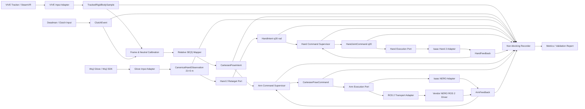
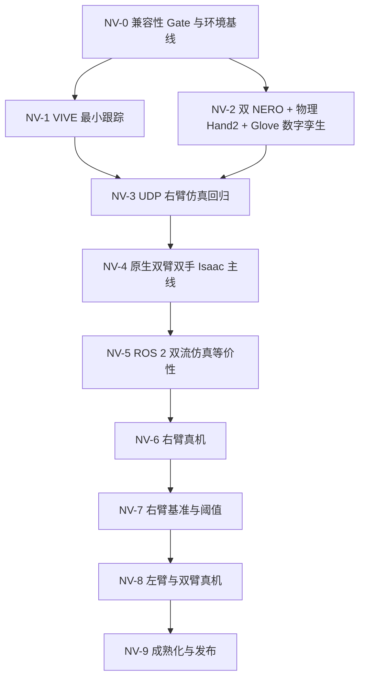

# 001：NERO—VIVE 单/双臂数字孪生与真机遥操作版本计划

| 字段 | 值 |
|---|---|
| 文档编号 | 001 |
| 迭代代号 | NERO-VIVE R1 |
| 状态 | 实施中（NV-0～NV-3；NV-4 已启动，Deployment/mapping 基础通过） |
| 建立日期 | 2026-07-28 |
| 原始需求 | 本地动态需求 [`plans/nero_vive_sim.md`](../plans/nero_vive_sim.md) |
| 目标环境 | `lenovo-piper2`，Ubuntu 24.04、Isaac Sim 6.0.1、RTX 5090；CUDA 版本以 NV-0 实测矩阵为准 |
| ROS 2 基线 | Jazzy |
| 首个受控对象 | 右侧 NERO |
| 文档性质 | 正式、版本化；作为本次大版本开发、验收和范围变更的主大纲 |

## 0. 如何使用本计划

本计划不是“实现已经完成”的组件文档，而是本次版本从环境验收到双臂真机遥操作的
范围合同和执行大纲。维护规则收敛为：

1. 每个里程碑只有在对应 Gate 通过并链接到验证证据后，才能标记完成。
2. `docs/components/` 只描述已实现能力；本计划中的未来项不得提前写成“当前支持”。
3. 任何改变控制语义、安全状态机、坐标事实源、ROS 2 接口、真机控制模式或验收阈值
   的决定，必须先形成 ADR 或计划变更记录，并与项目负责人对齐。
4. 环境缺失、硬件未连接或人工检查未执行时，相关 Gate 记为“未执行”。
5. 每个阶段结束时执行“材料与工具评审”，主动提出缺失的官方资料、模型、CAD、
   固件信息、标定治具、测试夹具或知识工具需求。
   新资料按复用性和必要性选择承载形式：一次性结论进入正式文档和 source lock；
   可重复工程流程可建设项目 skill；持续更新、适合权威检索的资料源可建设只读 MCP。

## 1. 版本目标

本版本要建立一条从 VIVE Tracker 3.0 刚体位姿，到 NERO 数字孪生，再到 NERO 真机的
可观察、可回放、可监督、可逐级放行的遥操作链路。开发顺序固定为：

```text
第 0 步：Isaac Sim 6.0.1 + Python 3.12 当前代码兼容性快速验证
  -> 通过后补齐目标机环境基线
  -> VIVE 最小跟踪
  -> 双 NERO + 双物理 Hand 2 + Wuji Glove 手部遥操作数字孪生
  -> 本机最小 server-client 右臂仿真回归基线
  -> 原生双 Tracker + 双 Glove + 双 NERO/Hand 2 Isaac 主线（无 ROS 2）
  -> ROS 2 双流仿真等价性
  -> ROS 2 右臂真机遥操作
  -> 右臂精度/延迟基线与阈值冻结
  -> 左臂隔离与 ROS 2 双臂真机遥操作
  -> 稳定性、可复现性和发布收口
```

最终交付应做到：

- VIVE 设备身份、位姿、质量、按钮和失联状态以规范化契约进入系统。
- 相同的 canonical Cartesian intent 可由 Isaac 和 NERO 真机 adapter 分别执行。
- 所有运动命令先经过坐标标定、工作空间、速度/加速度、陈旧数据和状态机监督。
- 仿真与真机都能记录输入、意图、监督决定、实际命令、反馈和分段延迟。
- 左右臂拥有显式 stream、namespace、标定和设备绑定，不能依赖数组位置猜测。
- Wuji Glove 的左右手骨架以 canonical `21×3 m` 观测进入系统，经锁定的 Hand 2
  retargeting 产生显式 layout 的 `q20 rad`，驱动对应侧物理 Hand 2，不能把 Glove
  的 21 DoF 人手角直接透传为机器人 20 关节命令。
- 版本结束时产生可复现配置、正式运行指南、验证报告和性能基线。

## 2. 已确认范围与前提

### 2.1 目标机与共享环境

- 目标机别名为 `lenovo-piper2`，是共享设备。
- NV-0 实测目标机为 Ubuntu 24.04.4、Isaac Sim 6.0.1.0 / Python 3.12.3、
  RTX 5090 / driver 595.58.03。`nvidia-smi` 的 CUDA 13.2 是驱动兼容上限；
  系统 toolkit 为 12.8.61，Isaac Warp 报告 toolkit 12.9。
- SteamVR/OpenVR 和设备运行态由 NV-0/NV-1 补齐，不根据硬件齐全直接推定软件已安装
  或设备已连接。ROS 2 Jazzy 仍是未来真机/transport 基线，但安装、bridge 和 graph
  资格验证推迟到 NV-5，不阻断 NV-0～NV-4。
- 后续项目 checkout、缓存、派生 USD、运行 artifact 和临时工具原则上均位于
  `~/swy/` 下；ROS workspace 到 NV-5 再建立。
- 实施前记录 Ubuntu point release、kernel、NVIDIA driver、GPU、Isaac build、
  Python、SteamVR/OpenVR、USB/CAN 设备和固件版本；ROS 2/RMW 在 NV-5 记录。
- 本计划不依赖当前设备能够访问目标机；远端盘点属于里程碑 NV-0。

### 2.2 工作台、机械臂和末端

- 工作台标称尺寸为 `1.2 m × 1.2 m`。
- 两台 NERO 位于工作台同一侧，端口侧朝桌外、工作方向朝桌内；NV-2 已建立明确标记为
  `simulation_nominal` 的桌沿姿态。精确台高、底座中心、底座 yaw、两臂间距、安装孔位
  和可达空间仍必须现场测量，不由仿真示意反推。
- 本体二维码页《机械臂PIPER NERO（7F）》标称 7 自由度、1.5 kg 负载、580 mm
  工作半径；公开《NERO用户手册》则写 3 kg，二者不得拼成同一产品参数集。具体固件、
  序列号、CAN 口、零位和当前限位仍需逐臂只读获取。
- 本版本 NERO 真机保持裸法兰，不安装、供电或控制 Wuji Hand 2 真机。
- 数字孪生包含：
  - 左 NERO + 左 Wuji Hand 2；
  - 右 NERO + 右 Wuji Hand 2。
- 两只虚拟 Hand 2 使用官方完整物理 USD，保留 articulation、rigid body、collision
  和 20 个主动关节；由对应侧 Wuji Glove 手骨架经 Hand 2 retargeting 后进行
  position target 控制。
- NV-2 只验收自由空间手型、逐指、左右隔离和基础接触稳定性，不包含 Hand 2 真机、
  力控、触觉闭环或抓取任务。
- 遥操作控制 frame 固定为 NERO `tool_flange`/经确认的 TCP，而不是虚拟 Hand 2 掌心；
  手臂链与手部链分别形成 `ArmIntent` 和 `HandIntent`，在仿真 Session 执行边界合并。

### 2.3 VIVE 硬件

- 当前可用硬件为 VIVE Tracker 3.0、SteamVR Tracking Base Station 2.0、Watchman
  dongle 及连接附件；没有 HMD 或控制器。SteamVR 的 HMD requirement 已关闭，
  NV-1 不以 HMD/控制器为前提。
- NV-4 使用两台 Base Station 2.0 和两枚操作 Tracker。两台 Base 是同一 Lighthouse
  raw tracking space 中的共享光学参考；SteamVR/Chaperone 把该空间映射到一个活动的
  Standing universe，应用层只保留一个 `vive_tracking`。Tracker 与 Watchman dongle
  配对，不建立“左 Base 专属左 Tracker、右 Base 专属右 Tracker”的控制链。
- 工作台左右两侧、略有高低差且近似共线是首个 Base 安装候选。它只描述视场布置，
  不定义左右坐标系；最终位置由双 Tracker 重叠视场、遮挡和交叉轨迹 HIL 结果决定。
- 首个单臂闭环默认使用一枚操作 Tracker；独立精度评估优先再在真机法兰安装一枚
  测量 Tracker。
- NV-4 起默认仿真主线一臂一枚操作 Tracker；双臂独立外部精度评估需要额外两枚法兰测量
  Tracker；实际数量决定外部精度测试范围。
- Tracker pogo/button 可作为调试输入候选；若当前 Tracker 附件不提供可靠按钮，
  不阻断 NV-3/NV-4 自动 reference 仿真。NV-6 真机前必须选定独立 deadman/clutch
  输入；真机还必须有独立、可触达的机械臂急停手段。

### 2.4 控制与验收策略

- NV-3 首个受控对象为右侧 NERO；NV-4 起默认仿真对象为左右 NERO 与左右 Hand 2。
- 操作语义为 reference-relative SE(3)，平移比例默认 `1.0`、可配置。NV-3/NV-4
  仿真沿用已通过的自动 reference：对应 Tracker 连续 `running` 后，以当前 Tracker /
  当前 link7 建立 epoch，不要求回车、按钮或伪 deadman。
- Workstation2 只保留一个 simulation-only canonical mapping，采用 proper 轴映射与
  1:1 scale，X/Y/Z mapping clamp 分别为 `±0.4 m`。约 `0.693 m` 的最大角点位移
  不代表完整可达或安全
  包络，超出可达空间时继续由现有 IK hold/reference rebuild 逻辑处理。
- XYZ-only 与 RPY-only 的分离测试不能替代组合控制资格；NV-4 必须单独通过
  XYZ+RPY relative SE(3) 真人复合轨迹。
- VIVE 失联、质量不足、数据陈旧或 calibration epoch 异常时，仿真先 hold，再撤销
  对应 reference，恢复后按当前 link7 自动重建；NV-6 以后真机则必须经显式
  clutch/deadman 重新 arm。
- NERO 真机首次运动通过官方 ROS 2 Cartesian `move_p` 路径，以低速、小范围方式验证。
- CPV 不是本版本完成条件；仅在 `move_p` 无法达到已冻结指标时另行评审。
- 性能采用“先建立基线、再冻结阈值”：安全与数据完整性从一开始就是硬 Gate；
  p50/p95/p99 延迟、误差、抖动和掉帧阈值在 NV-4 双臂仿真和初始真机基线后确认。
- NV-4 纯仿真计划推荐 side-local fault isolation：单侧 Tracker/IK/Glove 故障只
  hold/disarm 对应链；SteamVR universe、mapping、Session 或 Isaac 共享故障才全局
  暂停。该策略已经项目负责人确认并交由 ADR-0007 冻结；真机双臂仍在 NV-8 使用
  coupled deadman。

## 3. 当前项目基线与架构差距

### 3.1 可复用能力

当前仓库已经具备：

- backend-neutral 的关节布局、四元数、frame ID、单调时间戳和标定 ID 校验。
- rotation-only 的 `PoseIntent`、clutch epoch 和 fail-closed `PoseSupervisor`。
- q20 与 q20+rotation 的严格 JSON/UDP loopback transport，包含 session、sequence、
  timestamp、layout 和 calibration 校验。
- `JointCommandSupervisor` 及陈旧输入、限位和速率监督的基础模式。
- `Asset Manifest → Backend Binding → Assembly → Workcell → Session` 五层配置、
  strict YAML、source lock、artifact hash 和稳定 `session_hash`。
- multi-root forest、namespace prefix 和跨层碰撞检查的配置表达能力。
- Wuji Hand 2 Beta 1 right 的固定 Asset/Isaac Binding，以及左手上游模型可用性依据。
- MediaPipe `21×3 m` → Hand 2 `q20 rad` 的 canonical observation、retargeting、
  supervision、Isaac execution 先例，可复用于 Glove 输入而不改变核心契约。
- Isaac、MuJoCo、MediaPipe 和 UDP 的分层 adapter 先例及 fast/contract/integration
  测试组织方式。

### 3.2 待补能力

- 当前 `PoseIntent` 只表达旋转，不表达 NERO 末端平移、TCP、twist 或 Cartesian feedback。
- 机械臂需要独立的 hold/disarm 失联策略，不能沿用手指回 rest 行为。
- 当前 UDP q20/v2 协议只面向一只右手，没有 arm ID、side、stream route 或双臂 bundle。
- 当前 Session v1 的 backend 只有 `isaac`/`mujoco`，runtime role 也没有硬件执行、
  shadow、recorder 或部署图语义。
- 五层 schema 与 NV-2 专用 Isaac runner 已实现双 root / 双 q27 materialization；这只
  证明当前 NERO—Hand 2 组合，不代表已支持任意双臂 topology。
- Isaac 5.1.0 / Python 3.11 仍是原有完整回归基线；NV-0 已新增 Isaac 6.0.1 /
  Python 3.12 的固定 Hand 2 Session 最小兼容证据。
- NV-1 已建立 VIVE input adapter；NV-2 已建立 NERO/Hand 2 Asset 与 Binding、固定导入
  recipe、双根 Assembly、`simulation_nominal` Workcell、Session v1、canonical
  Glove/retarget/supervision 链和双 q27 runner。inward-port tabletop v15 已在
  Workstation2 通过 90/90，覆盖原 68 项 scripted physical Gate，以及桌沿安装、
  左右分侧 q7 准备位、`link6` 圆柱—小臂轴、FixedJoint anchor、Hand 2 基座盘心/
  平行度、`link4 → link5` 小臂近水平、掌面向下和接电侧朝桌内；左右实际 Glove
  已分别完成 live，尚未在同一 Session 内同时连接和控制。旧
  corrected-J7 rotation/SE(3) 报告已降为历史证据。仍需关闭当前定义的 Tracker
  rotation 人工复验、Glove 可复现实验材料、deliberate contact/异常穿透、合并 q27
  self-collision 最终决策，以及后续 measured Workcell/attachment。
- 当前仍没有 ROS 2 package、真机 robot adapter、通用 recorder、延迟分解或独立
  精度评估。
- 当前 3540 行 NV-2 runner 仍以完整 scripted、单侧 Glove live、右 Tracker live
  三个互斥分支运行，Tracker stream/role、IK 和报告硬编码为右侧。NV-4 将其收敛为
  side-neutral 双侧 tick；详细边界见
  [002：NV-4 原生双臂双手 Isaac 主线迭代计划](002-nv4-native-dual-arm-dual-hand-simulation-mainline-plan.md)。
- 当前右臂真人证据只分别覆盖 XYZ-only 和冻结平移的 RPY-only；同时开启平移与旋转的
  relative SE(3) 路径虽已存在，但尚未通过真人复合轨迹 Gate。
- 两枚 Tracker 与两只 Glove 已配置，但这只关闭设备完整性待决项。两枚 Tracker 是否
  来自同一个 OpenVR runtime、Standing universe、setup revision 与 `vive_tracking`
  仍由 NV-4B 实测；两只 Glove 的 q20 路径不要求共享空间原点，但左右 identity、
  frame、layout 与 calibration 必须独立可追溯。

### 3.3 已知资料冲突

本体二维码页、公开《NERO用户手册》、官方 URDF 和 `pyAgxArm` 的参数属于至少两组
互相冲突的资料：二维码页为 1.5 kg、J2 `±102°`，公开手册为 3 kg、J2
`-15°～190°`。锁定 URDF/SDK 接近对称 `±100°`，且当前 URDF 对二维码页 J1～J6
每端约内缩 2～3°、J7 内缩 7°，因此 NV-2 继续使用 URDF 作为严格保守的临时仿真
范围，不再把两份产品资料任意拼接。该结论不替代逐臂固件、零位、方向和当前限位的
只读回读；真机不兼容时必须暂停并修订 ADR/profile。

## 4. 本版本不做

- 不安装、供电或控制 Wuji Hand 2 真机；Hand 2 只在 Isaac 中按位置目标进行物理仿真。
- 不把 Glove 21 DoF 人手角直接映射为 Hand 2 q20，不做力控、触觉闭环或抓取任务。
- 不安装相机，不实现视觉、自主避障或自主抓取。
- 不做力控、MIT、接触任务、直接 CAN 运动控制或 CPV 主线。
- 不启用 NERO 内建主从联动作为双臂实现；两臂由本项目显式独立 stream 编排。
- 不承诺现有通用 Isaac compiler 已支持任意机器人。

## 5. 需求追踪

| 原始需求 | 本计划工作包 | 主要退出证据 |
|---|---|---|
| Isaac 6.0.1 / Python 3.12 起始兼容性确认 | NV-0 第 0 步 | 最小测试记录与继续/暂停结论 |
| Tracking 工具套装最小测试 | NV-1 | 设备清单、位姿日志、静止/运动/遮挡报告 |
| 双 NERO + 物理 Hand 2 数字孪生 | NV-2 | source lock、Session、结构/物理/运动验证 |
| Wuji Glove 遥控仿真 Hand 2 | NV-2 | Glove fixture/live contract、retarget q20、左右隔离验证 |
| server-client 右臂数字孪生回归 | NV-3 | loopback contract、右臂 XYZ/GUI 生命周期与 IK 分类诊断交接基线 |
| 默认双臂双手数字孪生主线 | NV-4 | 双 Tracker/双 Glove、四流统一 tick、隔离/故障/轻量化报告 |
| ROS 2 双流数字孪生等价性 | NV-5 | ROS graph、QoS/namespace contract、无 ROS ↔ ROS 等价性报告 |
| ROS 2 右侧 NERO 真机遥操作 | NV-6 | 安全清单、shadow、小范围真人操作证据 |
| 右臂真机精度与延迟统计 | NV-7 | 原始记录、分析产物、基线与阈值审批 |
| 左臂隔离和双臂真机验证 | NV-8 | 双流、双标定、同步/碰撞/失联验证 |
| 成熟 pipeline 与效率分析 | NV-9 | 一键部署、soak/fault suite、最终验证报告 |
| 新材料、skill、MCP 需求 | NV-X5，贯穿 NV-0～NV-9 | 材料缺口登记与工具形态评审记录 |

## 6. 目标架构

### 6.1 总体数据流



NV-4 将 Tracker→Arm 与 Glove→Hand 两条链按 `left`/`right` 各实例化一次，在同一个
simulation tick 计算四路 decision、组合左右 q27，并在一次 physics step 前提交。
Base Station 只参与共享 `vive_tracking`，不进入左右 application route。

ROS 2 是 NV-5 之后的 transport/deployment 边界，不是 domain 类型，也不作为伪造的
simulator backend。Isaac 和 NERO 真机分别实现同一个执行 port；外部 SDK/ROS 消息
不能越过 adapter 边界进入 application。

### 6.2 依赖方向

现有依赖方向继续成立，并增加设备/ROS adapter：

```text
specs / compat / integrity -> Python standard library
domain                     -> no simulator/device/middleware dependency
ports                      -> domain
application                -> domain + ports
adapters/input             -> domain + external tracking runtime
adapters/retargeting       -> domain + ports + external retarget runtime
adapters/simulation        -> specs + domain + ports + Isaac
adapters/robot             -> specs + domain + ports + vendor SDK/ROS boundary
adapters/transport         -> domain + ports + UDP/ROS serialization
runtime                    -> specs + compat + integrity + application + adapters
```

ROS 2 node package 可依赖稳定的 wire/domain contract，但不得把 `rclpy`、ROS message、
SteamVR 或 `pyAgxArm` 类型放进核心 domain。

### 6.3 五层配置与部署层演进

五层继续拥有机器人身份、表示、装配、工作空间和单次执行合同：

- Asset Manifest：NERO 产品身份、q7 layout、`base`/`tool_flange` 等语义 frame。
- Isaac Backend Binding：锁定 NERO URDF 来源、派生 USD、frame/joint map 和导入配方。
- Assembly：`left_arm -> left_hand`、`right_arm -> right_hand`，两个 NERO root。
- Workcell：1.2 m × 1.2 m 桌面、左右 mount 和安全区；NV-2 可使用明确标记为
  `simulation_nominal` 的 bring-up revision，实测 revision 留给物理对应与真机阶段。
- Simulation Session：Isaac 6.0.1、两 root placement，以及四个显式 commanded control
  group：`left_arm.q7`、`right_arm.q7`、`left_hand.q20`、`right_hand.q20`。
- Session runtime 的 typed qualification compatibility profile：仅保存本次仿真的左右
  q7 准备位、Isaac q7 drive gain 和几何验收轴/阈值；不得改写共享 Asset 的机械零位，
  也不得把 gain 描述为真机控制器参数。

五层配置负责“什么资产、如何绑定、怎样装配、位于哪个工作台、一次运行控制哪些
group”；Glove 设备连接与 `21×3 → q20` 算法仍位于 input/retargeting adapter，
通过 canonical `HandIntent` 接入 Session runner。设备 SDK 类型或 21 DoF 原始数组
不进入五层 schema，因此新增手部遥操作不改变五层职责和依赖方向。

Isaac 物理实现不会把四个逻辑 command group 误建成四棵 articulation。专用 simulation
adapter 在 PhysX 初始化前根据已解析的 Assembly transform 放置 Hand 2，禁用 Hand 2
USD 原有的 world-fixed `root_joint`、移除其 `ArticulationRootAPI`，再 author
`NERO link7 → Hand 2 base` FixedJoint。固定上游 USD 保持只读。运行时恰好形成左右
两棵 articulation，每棵为 `NERO q7 + 同侧 Hand 2 q20 = q27`；adapter 按 canonical
joint name 与 USD joint path 验证 q7/q20 分区。四个逻辑 route 与两棵物理
articulation 是两个不同层次的事实。

当前 Session v1 不足以表达跨进程输入编排、ROS graph 和真实设备。Session 继续作为
五层场景与资产的唯一组合根；默认采用兼容性加法演进：

1. 保留 Session v1 解析和现有 golden。
2. NV-4 增加 middleware-neutral 的 `DeploymentSpec v1`，恰好引用一个
   ResolvedSession，只声明 process/producer lifecycle、本机 Tracker/Glove
   binding、stream endpoint、tracking setup、calibration artifact 和输出位置。
   Session v1 的 `runtime.control_layouts` 继续拥有 route/layout，
   `runtime.transport_contract` 独立选择 composite wire contract；唯一的
   `runtime.compatibility_profile` 升为 native-dual-teleop composite leaf，通过引用
   复用现有 tabletop qualification profile，并引用 relative mapping/retarget、
   IK/supervisor、freshness 和 recorder policy；
   DeploymentSpec 只能把本机事实绑定到已声明的 logical role/policy ID，不能复制
   或重定义五层数值。
   默认提交一个 `native_dual_live` 以及 `left_single_live`、`right_single_live`
   两个诊断 spec；单侧 spec 仍引用同一个双侧 Session，非活动侧绑定显式 hold/rest
   fixture，不遗漏 route，也不把 `side` 重新做成 runner 分支。
3. ADR-0007 显式修订 ADR-0003 第 4 节：多进程 live run 从 DeploymentSpec 启动，
   process instance/local binding 不再由 Session 定义；Session 仍是场景/资产组合根并
   拥有五层运行、传输和控制合同。这是第五层与部署编排边界的显式修订，不是隐藏的
   第六资产层。
4. NV-5 发布 `DeploymentSpec v2`，以加法方式增加：
   - ROS node/executable binding；
   - ROS namespace/domain/remap/QoS；
   - ROS command ownership 与 recorder transport binding；
   - shared-host ROS domain ownership。
   同时提供 v1→v2 migration/hash 兼容测试，不向 strict v1 原地增加未知字段。
5. NV-6 真机前增加独立、版本化的 local `DeviceExecutionBinding`，表达 NERO
   序列号、CAN interface、固件、adapter 和反馈能力；DeploymentSpec v2 只引用其
   logical binding ID，不为这些本机字段原地扩 schema。
6. 多臂配置以 instance/stream ID 显式映射。

### 6.4 Python 版本方案

NV-0 第 0 步已选择并验证以下方案：

- 基础 package、五层解析、domain 和 transport 支持 Python 3.11/3.12。
- Python 3.11 保留为最低版本静态检查和现有 perception/retarget worker 回归基线。
- Isaac Sim 6.0.1 与系统 ROS 2 Jazzy 使用 Python 3.12。
- Isaac vendor environment 不安装项目依赖；runner 从受控 checkout 加载项目源码，
  避免用项目的 NumPy/SciPy 约束覆盖 Isaac 自带 ABI。
- 跨进程能力仍通过版本化 contract/DeploymentSpec family 编排，不共享环境内 SDK 对象。

## 7. Canonical 契约预案

字段在实现前由 ADR/schema 固定；下表规定必须表达的语义。

| 契约 | 最低内容 |
|---|---|
| `TrackedRigidBodySample v2` | schema、stream/device/serial/role、producer instance、transport epoch、tracking setup revision、sequence、tracking frame、position m、active quaternion wxyz、tracking state/quality、device/host time、clock domain |
| `TrackingLifecycleEvent` | stream/producer instance、old/new transport epoch、tracking setup revision、start/rebind/reset/stop 原因、host monotonic time |
| `ClutchEvent`（NV-6+） | source、button/deadman identity、press/release edge、host time、target stream、epoch request |
| `CalibrationSnapshot` | calibration ID、tracker serial、operator anchor、robot TCP anchor、axis map、translation scale、frame chain、采样窗口、残差、配置 hash |
| `CartesianPoseIntent` | stream/side、target frame、position、quaternion、source time、calibration ID、quality、mapping version |
| `CartesianPoseCommand` | 监督后的 TCP target、可选 twist/acceleration limits、sequence、deadline、safety profile、target instance |
| `ArmFeedback` | stream/instance、q7/dq7/effort、flange/TCP pose、mode/status/error、enabled、sample time、adapter time |
| `ArmSafetyDecision` | accept/limit/hold/reject/disarm/stop、输入与输出摘要、规则/原因、时间、是否要求新 clutch |
| `CanonicalHandObservation` | side、MediaPipe 21 点顺序、`(21,3)`、米、frame、逐点 confidence、Glove frame header、标定引用 |
| `HandIntent` | side、Hand 2 q20 layout、20 维弧度、retarget model/config、输入时间、求解状态 |
| `HandSafetyDecision` | accept/clamp/hold/reject、原 q20、执行 q20、规则/原因、freshness 和 layout 结果 |
| `HandFeedback` | side/instance、Hand 2 q20 position/velocity、simulation time、fault/status |
| `BimanualCommandEnvelope` | group sequence、左右 stream command、最大允许 skew、coupling policy、deadline |
| `TimingTrace` | acquire、map、supervise、publish、receive、send-to-backend、feedback 各阶段单调时间 |
| `RunManifest` | source/config/session/deployment/local-binding hash、环境与启用能力版本、设备 identity hash、tracking setup、标定、阈值、endpoint/channel 和 artifact checksum |

`RunManifest` 字段按启用能力出现：NV-4 至少记录 OS/GPU/driver/Isaac/SteamVR、
DeploymentSpec、设备 identity、tracking setup/calibration 与 artifact；ROS/RMW
只在 NV-5 以后必填，NERO firmware/CAN 只在 NV-6 以后必填。未启用能力保持显式
`null/not-applicable`，不得伪造版本值。

### 7.1 契约不变量

- 内部位置单位一律为米，角度为弧度，四元数为 active `wxyz`；ROS `xyzw` 只在 adapter
  内转换。
- 内部姿态不以 Euler 角持久化；NERO `move_p` 所需 RPY 由 robot adapter 在边界转换，
  并明确 ZYX convention 和奇异区处理。
- `source_time`、host monotonic time、ROS time、simulation time 和 wall clock 不混用。
- 同一 calibration ID 只对应一个 tracker anchor、robot anchor 和 axis/scale mapping。
- 新 calibration epoch 的首个仿真 intent 必须由连续 `running` 后的 identity-relative
  自动 reference 产生；NV-6+ 真机必须由显式 clutch 建立。旧 epoch 数据拒绝。
- sequence 必须在 stream/transport epoch 内单调。只有受 Deployment launcher 管理的
  lifecycle event 可建立新 epoch 并重置 receiver sequence；未管理的 sequence 回退
  fail closed。
- receiver 只接受与当前授权 `transport_epoch` 和 `tracking_setup_revision` 一致的
  sample；新 epoch/revision 建立后迟到的旧 datagram 必须拒绝。
- stale command 不排队补发；command deadline 过期即拒绝。
- `ArmFeedback.effort` 的含义按 NERO/ROS 原始合同记录，不能推断为外部接触力。
- Glove 的 `hand_joint_angles` 是 21 DoF 人手模型结果，不是 Hand 2 q20；NV-2 使用
  `hand_skeleton` 的 MediaPipe 21 点、米制位置，经目标为 `WujiHand2` 且 side 匹配的
  retargeter 生成 q20。
- 四个 Session control group 均显式 commanded；不存在遗漏 route、runner 特判或
  “默认全零手指命令”暗中驱动。
- Glove/retarget 数据 stale、错误 side、错误 layout 或非 finite 时，对应手进入
  hold/reject；低置信度按冻结的 confidence policy 标记 degraded/hold/reject，不把
  官方 `0.90` 说明静默解释成所有 skeleton 帧的统一硬拒绝阈值。该侧手部故障不会
  影响未配置为 coupled 的 NERO q7。
- 当前实现/live 报告的 `<0.90 → DEGRADED` 与已接受 ADR-0006 的 `<0.90 → reject`
  存在明确冲突。项目负责人已确认保留当前 live 语义；ADR-0007 必须显式
  supersede ADR-0006 的 confidence 阈值段落。

### 7.2 原生双侧运行与后续 ROS 2 映射

- NV-3 首选 strict JSON + IPv4 loopback UDP，延续现有小型、可测、无 broker 的模式。
- 新协议使用独立 schema 名，不扩写 `wujihand.hand_command.v2`。
- datagram 设严格字段集合、大小上限、finite/unit/frame/layout/sequence/time 校验。
- NV-4 继续使用 canonical contract 和 loopback UDP，不建立 ROS graph。双 Tracker
  使用显式的左右 serial/stream/role/endpoint；双 Glove 保持 side-specific canonical
  observation 和 q20 layout。
- NV-5 将相同语义映射为 ROS 2 IDL；标准 `PoseStamped` 可作为观察接口，但不能单独
  承载 quality、calibration、deadline 和 safety state。
- raw pose/高频 command 使用 `KEEP_LAST(1)`、有界 lifespan/deadline，并基于实测决定
  best-effort 或 reliable；不得因 reliable backlog 执行陈旧命令。
- safety event、mode change、enable/disable 和 run metadata 使用可靠通道。
- 任一执行目标同一时刻只能有一个 command owner。RViz、测试发布器、teleop 和
  vendor demo 不得同时发布控制话题。

## 8. 坐标、标定与控制语义

### 8.1 Frame 树

最低 frame 集合：

```text
vive_tracking
├── operator_tracker_left
├── operator_tracker_right
├── measurement_tracker_left        optional
└── measurement_tracker_right       optional

workcell_world
├── nero_base_left
│   └── nero_tool_flange_left
│       └── hand2_base_left
└── nero_base_right
    └── nero_tool_flange_right
        └── hand2_base_right
```

虚拟 Hand 2 的 `hand_base` 是法兰下的物理 attachment；手臂 target frame 仍为
NERO flange/TCP，手部 target 则是独立 q20 layout。两个 target 不互相冒充。

### 8.2 Reference-relative SE(3)

建立 reference 时记录；NV-3/NV-4 由连续 `running` 自动触发，NV-6+ 真机由显式
clutch/deadman 触发：

- 操作 Tracker anchor `T_tracking_tracker_anchor`；
- 当前安全 TCP anchor `T_base_tcp_anchor`；
- calibration ID；
- tracker-to-control-handle 固定变换；
- tracking 到 robot 语义轴的 rotation map；
- translation scale。

运行中：

```text
delta_tracker = inverse(T_tracking_tracker_anchor) * T_tracking_tracker_current
delta_robot   = map_axes_and_scale(delta_tracker)
T_base_tcp_intent = T_base_tcp_anchor * delta_robot
```

随后 supervisor 再应用：

- Cartesian workspace/keep-out zone；
- translation/orientation step；
- linear/angular velocity；
- acceleration/jerk；
- reachable/IK/singularity；
- tracker quality、age，以及 NV-6+ 真机 deadman；
- robot status、mode 和 feedback freshness。

NV-4 对 self/inter-arm/external-collider 只做 scene-adapter detection/report 与
qualification Gate，不在 live tick 中主动改写 q7 或进行避碰规划。NV-6 对 measured
workcell 的静态 keep-out 启用 supervisor，NV-8 再冻结双臂 active clearance/coupled
执行策略。

### 8.3 真机安全状态机（NV-6+）

真机建议状态：

```text
DISARMED
  -> CLUTCH_PENDING
  -> ARMED_HOLD
  -> TRACKING
  -> DEGRADED_HOLD
  -> DISARMED
  -> ESTOP_LATCHED
```

- 启动永远进入 `DISARMED`。
- clutch 必须在 Tracker 稳定、机器人反馈新鲜、目标位于安全包络且 deadman 有效时建立。
- `DEGRADED_HOLD` 只短暂保持最后安全目标，不做“自动回零”。
- 超过失联阈值、按钮释放、calibration 改变或 robot fault 后进入 `DISARMED`。
- SteamVR reset 或 Base/room setup 变化使当前 tracking setup revision、全局 mapping
  calibration ID 和左右 reference epoch 一起失效；重新验证 mapping 后才能重新
  clutch。
- 急停、碰撞、通信异常或控制模式异常进入 `ESTOP_LATCHED`；恢复需要人工检查，
  不能由新数据包自动清除。
- 数值阈值在 NV-4C/E 左右独立与四流并发基线后冻结；首次真机前必须写入显式
  safety profile。

NV-3/NV-4 仿真不伪造上述 deadman 状态机，沿用
`WAITING_REFERENCE → TRACKING → HOLD → WAITING_REFERENCE`：GUI 生命周期独立，
稳定恢复后以当前 link7 自动建立新 reference。NV-5 ROS 仿真必须保持同一语义。

### 8.4 双臂默认安全语义

- 左右臂各自拥有 supervisor、calibration、feedback watchdog 和 workspace。
- NV-4 纯仿真已冻结 side-local isolation：单侧 Tracker/IK 故障只 hold/disarm
  对应臂，单侧 Glove 故障只影响对应 Hand 2；SteamVR universe、全局 mapping、
  Session 或 Isaac fault 才共同暂停。ADR-0007 负责正式记录该决策。
- NV-4 每个 physics tick 记录左右与 arm/hand command skew，但不为了仿真新增 ROS
  bundle 或网络原子消息。
- NV-8 双臂真机默认使用 coupled deadman：任一操作流丢失或任一机器人重大 fault，
  两臂先 hold 并共同 disarm；恢复必须重新 arm。
- NV-4 先以 detection/report-only 验证 inter-arm contact/penetration；NV-8 真机前再
  把批准的 inter-arm keep-out 和最小间距提升为 runtime supervision。无相机版本不得
  声称具备动态障碍避让。

## 9. 配置、来源与 artifact 计划

### 9.1 NERO 资产

- 锁定 `agilexrobotics/agx_arm_urdf` 的精确 commit、license、NERO URDF、visual mesh、
  collision mesh 和 tree hash。
- Isaac 6.0.1 通过固定导入 recipe 将 URDF 派生为 USD；记录 importer 版本、参数、
  drive、density/inertia 处理和产物 hash。
- URDF 的 joint name、axis、limit、inertial、collision 和 tool frame 必须与手册、
  SDK 和实机反馈逐项对照。
- 派生 USD 属于 Backend Binding；collision、inertia 或 drive 调整保留 derivation 记录。

### 9.2 Hand 2 资产

- 继续固定现有 `wuji-description v2026.6.27` 作为本轮起点，新增相同 revision 的左手
  Asset/Isaac Binding。
- 左右 Binding 直接引用该 revision 的官方完整物理 USD，保留 articulation、rigid
  body、collision 和 revolute joint；不再制作 visual-only 派生 USD。
- Isaac 6.0.1 迁移或上游模型升级形成独立 Binding revision；20 个主动关节必须按
  Asset canonical q20 layout 显式映射。
- 左右手 attachment transform 在取得法兰/适配器 CAD 前标记为
  `simulation_nominal`，不得升级为真实机械装配事实。
- Glove 侧固定 Wuji SDK/Retargeting 版本、设备 side、SDK user/标定引用、21 点
  frame/layout 和 Hand 2 retarget config/hash。

### 9.3 Workcell

- NV-2 功能仿真 Gate 可使用显式 `simulation_nominal` 桌面和 mount，仅用于装配、
  命令隔离与基础物理 bring-up，不支持物理精度、间隙或安全包络结论。
- 桌面尺寸、台高、两底座位姿、安全边界和观察视角/相机语义 frame 的正式 revision
  均来自现场测量表，并在 NV-6 真机前替换 nominal revision；这不表示本版本安装
  视觉传感器。
- 测量原始记录、工具、单位、测量人和日期进入 provenance。
- 标称场景用于资产 bring-up 与 NV-4 双臂功能仿真；NV-7 精度结论和 NV-8 双臂真机
  使用现场 measured workcell revision。

### 9.4 本地敏感配置

- Tracker serial、NERO serial、CAN interface、ROS_DOMAIN_ID、个人路径和现场 IP 放入
  `configs/local/` 或环境变量。
- 提交内容使用占位 schema、匿名化映射或设备 identity hash。
- NV-4 的 committed DeploymentSpec 只保存 logical side/role、process/endpoint
  binding、tracking setup/calibration 引用和输出位置；完整 Tracker/Glove identity
  由 local binding 提供。relative mapping、retarget、IK/supervisor、freshness 和
  recorder policy 由 Session 唯一 native-dual-teleop compatibility leaf 引用；
  transport contract 仍是 Session 独立字段。DeploymentSpec 只引用 logical
  role/policy ID。各内容 hash 进入 RunManifest，且不复制到前四层。

## 10. 里程碑与 Gate

### NV-0：第 0 步兼容性 Gate 与目标机基线

**目标**

先用最小成本判断 Isaac Sim 6.0.1、Python 3.12 与当前代码是否兼容。只有通过后，
才补齐目标机环境和设备基线。

#### 0A：开始前兼容性快速验证

这是整个版本实施的第 0 步，先于 ROS 2、VIVE、NERO、资产导入和新功能开发：

1. 固定当前仓库 commit、`pyproject.toml` Python 约束、Isaac Sim 6.0.1 build 和其
   Python 3.12 版本。
2. 在干净 Python 3.12 环境中尝试安装和导入当前项目，运行最小 fast 测试集合，至少
   覆盖 domain、spec/session 解析和现有 transport contract。
3. 在 Isaac Sim 6.0.1 中运行一个现有 Hand 2 固定资产/Session 的最小 headless smoke，
   验证项目导入、场景启动和基础 stepping。
4. 保存命令、完整输出、退出码和版本信息，形成一页兼容性记录。

判定规则：

- 两项都通过：记录 `PROCEED`，进入 0B。
- 任一项不通过：记录 `PAUSED`，立即停止 NV-0 后续工作及 NV-1～NV-9；把失败证据、
  影响范围和少量可选路线提交给项目负责人，对齐后再更新计划。此时不直接修改
  Python 版本约束、兼容代码或环境架构。

#### 0B：通过后补齐目标机基线

1. 盘点 Ubuntu、kernel、NVIDIA driver、GPU、CUDA、Isaac、磁盘、USB 和显示会话。
2. 运行 Isaac Compatibility Checker 和空场景 GUI/headless 自检。
3. 在 `~/swy/` 下建立经 0A 确认的项目环境、派生资产和 artifact 目录。ROS 2 Jazzy
   workspace、RMW 和 DDS 推迟到 NV-5。
4. 盘点 SteamVR/OpenVR、VIVE 设备、两台 NERO、USB-CAN、固件和连接状态；NERO
   盘点保持只读，不验证 Isaac ROS bridge。
5. 恢复 source lock，执行商定的 fast、ruff、mypy 基线。

**输出**

- `docs/validation/<date>-isaac-6.0.1-python-3.12-compatibility.md`，明确
  `PROCEED` 或 `PAUSED`。
- 环境清单和版本矩阵。
- 共享机目录、非 ROS 端口和 artifact 约定。
- NERO/VIVE 只读设备清单。
- `docs/validation/<date>-lenovo-piper2-baseline.md`。

**Gate NV-0**

- 0A 明确为 `PROCEED`。
- 经确认的项目和 Isaac 环境可分别启动，fast 基线无未解释失败。
- 关键环境、设备和外部来源已有版本记录。

**材料与工具评审**

优先请求目标机安装记录、Isaac 安装来源、两台 NERO 固件、USB-CAN 型号和工作台资料。
若环境核验会重复执行，再评估 `isaac6-environment-check` skill；ROS/Jazzy 检查到
NV-5 再决定是否扩展。

### NV-1：VIVE 最小跟踪垂直切片

**目标**

在不启动 Isaac、ROS 控制或 NERO 的情况下，证明指定 Tracker 能稳定产生可解释的
6-DoF 位姿和按钮事件。

**工作**

1. 安装并固定 SteamVR/OpenVR 版本，在关闭 HMD requirement 的模式下完成
   Tracker 与 Watchman dongle 配对，并确认 Base Station 2.0 作为共享 tracking
   reference 出现在同一个 SteamVR Standing universe。
2. 记录 Base Station 布局、反光源、遮挡区和 SteamVR room/tracking origin。
3. 以 serial 为设备主键、role 为可变配置，禁止依赖 OpenVR 临时 device index。
4. 实现/验证 read-only VIVE input adapter，输出 `TrackedRigidBodySample`。
5. 采集静止、慢速平移、绕三轴转动、快速运动、部分遮挡、完全丢失和重新捕获样例。
6. 核对 HTC Tracker frame、OpenVR frame 与项目 active `wxyz` 约定。
7. 验证可用的 controller/pogo/button 事件并记录能力；它只作为调试输入和 NV-6
   真机 deadman 候选，缺失不阻断 NV-3/NV-4 自动 reference。
8. 统计采样频率、stationary jitter、短期 drift、dropout、reacquisition、timestamp
   monotonicity 和 CPU 占用。
9. 保存脱敏 fixture 和 golden，后续无硬件测试使用录制数据。

**输出**

- VIVE input component 设计及正式来源记录。
- 原始/规范化位姿样例、设备映射和质量报告。
- Tracker 安装方向、视场和附件 transform 说明。
- VIVE 故障/遮挡测试报告。

**Gate NV-1**

- 指定 serial 在重启后仍能确定性映射到同一 logical stream。
- position/quaternion finite、单位/frame/时间域明确。
- 三轴方向人工检查通过。
- 丢失和重捕获被显式报告，不产生伪造的连续姿态。
- 可用按钮事件可与 pose stream 对齐；无按钮配置被明确记录且不伪装为 deadman。

**材料与工具评审**

可能需要：Tracker 3D 模型、固定座 CAD、防转定位销、减振件、Base Station 布局夹具、
反光处理材料。若调试步骤会跨多个项目复用，评估 `validate-vive-tracker-pose` skill；
只有在需要持续检索 HTC/SteamVR 权威资料且现有公开源不足时再评估只读 MCP。

### NV-2：双 NERO + 双 Hand 2 数字孪生

**目标**

在 Isaac Sim 6.0.1 中建立可复现的双根工作台场景；NERO 可独立关节运动，两只
物理 Hand 2 具有显式 q20 命令入口，并可由对应侧 Wuji Glove 经 canonical
observation 与 Hand 2 retargeting 驱动。

**执行状态（2026-07-29，PARTIAL / 实施中）**

- NERO 来源、固定导入 recipe、q7 profile 与 NERO-only pre-composition smoke 已完成；
  固定派生 USD 连续两次导入得到相同 package/report hash。
- 左右 Hand 2 来源、Asset 和完整物理 Backend Binding 已建立；原始物理 USD 正是目标
  表示，不再等待 visual-only 资产。
- 双根 Assembly、nominal Workcell、Session v1 四个 logical route、canonical Glove
  observation/HandIntent 契约、supervision composition 及 q27 simulation adapter 已建立。
- Workstation2 / Isaac Sim 6.0.1 上的 inward-port tabletop v15 已通过 90/90：
  保留 scripted
  physical v2 的左右 q7、双侧五指/组合手型、隔离、finite/limits、reset/recovery
  68 项检查，并新增左右显式 q7 初态、reset 后回到该初态、`link6` 圆柱—小臂轴、
  FixedJoint anchor、Hand 2 基座盘心和盘面平行度、
  `link4 → link5` 小臂近水平、手向桌内、掌面向下和接电侧朝桌内等 Gate。
- prim 隔离确认目标圆柱属于 NERO `link6`，不是 Hand 2 根刚体或直角转接结构。
  NERO Binding profile 只在 live stage 中将 `link6` visual/collision/mass 由局部
  `+Y` 轴以 `Rz(-90°)` 对齐到小臂 local `+X`；J7/`link7` 与 Tracker Lula 均恢复
  固定来源定义。Assembly 使用 `[0.023, 0, -0.0235] m + Ry(+90°)` 抵消固定 J7
  origin 偏置并把 Hand 2 基座盘心耦合到 mesh-derived `link6 +X` 端面中心，同时
  保持手部工作朝向和盘面平行；该 simulation-nominal 映射不表示物理转接件。
  Workcell 将两底座放到同一近侧桌沿 `x=±0.32 m, y=-0.52 m`，yaw 均为 `-90°`，
  使接电侧朝桌内。
  Session 引用的 typed
  qualification profile 保存左右 q7
  `[∓10°, +45°, 0°, +45°, +90°, 0°, 0°]` 及 Isaac-only q7 drive gain
  `stiffness=6500, damping=220.79402165819616`，没有修改通用 NERO profile 的全零机械初态或固定
  来源 URDF/USD。
- v15 运行测得左右 `link6` 圆柱轴与小臂轴点积为
  `0.999083/0.999097`，Hand 2 基座盘面平行点积为
  `0.99999926/0.99999958`，盘心误差为 `28.0/21.2 µm`，FixedJoint anchor 误差
  最大 `69.5 nm`；`link4 → link5` 小臂轴竖直分量绝对值为
  `0.01966/0.01931`，左右手纵轴朝桌内点积约 `0.983277/0.983282`、掌面朝下
  点积约 `0.998035/0.998048`。接电侧朝桌内由项目负责人实物确认；
  `base local -X` 仍是固定 mesh 的表示轴，朝桌内点积为 `1.0`，不能写成接口轴实测。
- 固定外部工作台 collider 已保留；每个 scripted hand baseline 与 reset 后均在
  `0.005 rad` 容差内有界收敛。该证据没有引入 deliberate unknown
  penetration/contact probe，不能替代后续接触与近景资格验证。
- Wuji SDK 2026.7.21 已在 Python 3.12 环境验证左右 `21×3 → q20` 求解；专用网口
  `enx6c1ff7cd0e76` 已配置 `192.168.1.10/24`。左右 live Glove→Isaac 已分别现场
  执行，各 9000 帧中接收 8999 帧、拒绝 0 帧；同时连接/控制、identity、正式
  calibration revision 与脱敏 replay 仍待冻结。
- 当前 link6 Binding 表示对齐和 Hand 2 基座同轴装配已通过 profile、五层 Session、
  全仓测试与 Workstation2 Isaac tabletop v15；Workcell-owned 接口近景已冻结。旧
  corrected-J7 Lula 上的 rotation/SE(3) 结果不再代表当前定义，需使用固定来源
  Lula 重新人工验证 Tracker rotation。
- 真机对应仍需 `link6`/法兰螺孔 clocking 近景或接口图，以及两台设备 J7 轴、零位、
  符号只读回读；
  不要求本轮提供不存在的直角转接件 CAD。

**本阶段冻结的两点架构决策**

1. Hand 2 Backend Binding 使用官方完整物理 USD，不做 visual-only 派生。Asset 保持
   后端无关 q20 身份，Binding 负责物理 artifact 与 joint map，Assembly 只表达
   NERO flange → Hand2 base attachment。
2. 沿用向后兼容的 Session v1，左右 NERO q7 与左右 Hand 2 q20 全部是显式 commanded
   group；不新增 `inactive`/Session v2。Glove input adapter 输出 canonical
   `21×3 m` observation，Hand 2 retarget adapter 输出带 layout 的 q20 `HandIntent`，
   runner 只消费 canonical command，不直接依赖 Wuji SDK 对象。

**工作**

1. 锁定并审计 NERO URDF/mesh、NERO 手册和 SDK 来源；ROS driver 精确来源推迟到
   NV-5/NV-6，不作为 NV-2 功能仿真 Gate。
2. 通过固定 recipe 导入 NERO USD，验证 scale、link/joint、axis、limit、inertia、
   collision、articulation root 和 tool flange。
3. 固定本体二维码页、手册、URDF、SDK 来源；把 1.5 kg/J2 `±102°` 与
   3 kg/J2 `-15°～190°` 记录为不同修订资料，验证当前 URDF 是二维码范围的严格
   保守子集，建立 canonical NERO q7 layout/profile。
4. 新增 NERO Asset、Isaac Binding；同一 Asset 复用为左右两个实例。
5. 新增 Hand 2 left Asset/Binding，并复用现有 right Asset/Binding。
6. 建立双根 Assembly：左右 NERO 为 root，对应完整物理 Hand 2 为 child；Assembly
   用 `Ry(+90°)` 映射两个固定资产的接口坐标。NERO Binding profile 只对齐 `link6`
   visual/collision/mass 表示；J7 frame 与 Lula IK 保持固定来源定义。adapter 在
   初始化前将每个 NERO+Hand 2 组合为一棵 q27 articulation，且不修改来源 URDF/USD。
7. NV-2 功能仿真使用明确标记的 `simulation_nominal` Workcell/mount；它可关闭
   软件装配与运动 Gate，但不得升级为现场机械事实。当前 nominal mount 位于同一
   桌沿并使 mesh 推断的端口轴朝外；精确 Workcell revision 留待实物端口朝向确认和
   现场测量后替换。
8. 为所有 backend symbol 应用稳定 namespace，避免两套 `joint1`/`base_link` 冲突。
9. 在 Session v1 中建立四条显式 command route：左右 NERO q7、左右 Hand 2 q20；
   resolver 必须验证 Asset/Binding/layout/backend/source lock 闭合。左右不同的桌面
   q7 初态和 Isaac-only drive gain 由 Session 唯一引用的 typed qualification profile
   持有，不写入共享 Asset home，也不硬编码进 runner。
10. 新增 Wuji Glove input adapter：保留 header、sequence、timestamp、frame、side、
    21 点名称/位置/置信度与 calibration provenance；提供 SDK-independent canonical
    JSONL、有界 replay 和 fake-SDK fixture，使默认测试不依赖实体 Glove。首次 live
    后再保存脱敏 `hand_skeleton` fixture 与 q20/rejection 记录。
11. 包装官方 Hand 2 retargeting：`21×3 m → q20 rad`，固定 `WujiHand2`、side、
    joint name/order 和 config/version；禁止 21 DoF hand angles 直接透传。
12. 建立专用 Isaac twin adapter/runner，组合 q7 scripted command 与 q20
    fixture/live command，不绕开 Session resolver。
13. 执行 author-only、headless、GUI、逐关节方向/限位、reset、基础接触、错误
    side/layout、stale/low-confidence 和双实例隔离验证。

**输出**

- NERO source lock、派生 USD 和 import manifest。
- NERO q7 canonical profile。
- 左/右物理 Hand 2 + 双 NERO Assembly、workcell、Session v1。
- Glove input/fixture、Hand 2 retarget adapter 和 q20 command route。
- 数字孪生 runner、结构/物理/输入隔离和人工视觉验证报告。
- ADR：NERO 模型来源与限位事实源。
- ADR：NV-2 物理 Hand 2 与 Glove q20 命令边界。

**Gate NV-2**

- Session 恰好解析四个显式 control group：`2 × q7` NERO 与 `2 × q20` Hand 2，
  共 54 logical DoF；左右命名、layout 和 command route 无碰撞。历史 scripted
  physical v2、tabletop v6 与 corrected-J7 tabletop v11 只作为历史基线；当前以
  inward-port tabletop v15 的 90/90 为准。
- Isaac stage 恰好形成两棵 q27 articulation；Hand 2 world root 不再生效，
  FixedJoint body targets 正确，且每侧 q7/q20 分区完整、互斥。命令后 reset 已重验
  两棵 q27 与稳定分区。
- 两只 Hand 2 可见、侧别正确、随对应法兰运动；20 个主动关节、drive、collision、
  rigid body 与 articulation 在 Isaac 6.0.1 中可解释。
- 两臂可分别执行小幅 scripted q7，另一臂不受影响；inward-port tabletop v15
  已通过。
- 左右 q20 fixture 可分别完成逐指/手型小幅运动，另一只手与两臂 q7 不受影响；
  feedback finite 且在 Hand 2 canonical limits 内。历史 scripted physical v2 已覆盖
  双侧五指、双侧组合手型和 post-reset recovery；当前定义已由 tabletop v15 重验。
- Wuji Glove 的 `hand_skeleton` live 流已分别完成左右
  `Glove → canonical 21×3 → Hand2 retarget q20 → Isaac` 自由空间 smoke；
  两次运行各接收 8999/9000 帧、拒绝 0 帧。该证据只证明单侧分别运行，不证明两只
  Glove 同时连接或四流联合控制；同时运行进入 NV-4 Gate。设备 identity、正式
  calibration revision 和脱敏 replay 仍待冻结。
- stale、错误 side/layout、NaN 或 retarget 失败不得产生新 q20 command。低 confidence
  的 finite 完整帧按当前行为记录为 degraded，`0.90` 作为 success 阈值；是否进一步
  hold/reject 在 NV-4A 对齐后冻结。该实现事实尚未 supersede ADR-0006 的旧 reject
  条款；最后有效命令只可在 supervisor freshness 窗内 hold，超时后渐进回 rest；
  真人 live failure injection 随 live Gate 补验。
- 全部 feedback finite 且在批准后的 canonical limits 内；tabletop v15 已通过。
- 两底座位于同一桌沿，左右 `link6` 圆柱轴沿 `link4 → link5` 小臂方向，Hand 2
  指向桌内且掌面朝下；
  `link4 → link5` 小臂近水平，显式 q7 初态与 reset 后反馈分别满足 qualification
  threshold。tabletop v15 的 90/90 已通过，包含圆柱—小臂轴、FixedJoint anchor、
  Hand 2 基座盘心与盘面平行度 Gate。
- nominal 工作台的固定外部 collider 存在，初始状态、各 scripted baseline 与 reset 后
  均有界静置收敛；该部分已通过。接口近景已执行，但 deliberate
  contact/unknown penetration 与异常穿透量化尚未执行。最终结果只关闭功能仿真
  Gate，不形成现场 clearance 或物理精度结论。
- Session/source/artifact hash 和 Isaac 版本进入报告。

**材料与工具评审**

优先请求：二维码对应 NERO `link6`/末端法兰在已知 q7/零位下的 clocking 近景或接口图、两台
设备 J7 轴/零位/符号/限位只读回读、
底座端口方向照片/图纸、精确底座/工作台测量、固件限位表、左右
Hand 2 装配示意、Glove side/序列号、Wuji SDK 版本和有效标定产物。若 NERO 多源核对
将长期重复，评估 `lookup-nero-docs` skill；若 Glove 接入/标定/fixture 流程会在后续
版本复用，评估 `qualify-wuji-glove-input` skill。只有资料授权、更新和持续检索需求
达到阈值时，再建设对应只读 MCP。

### NV-3：最小 server-client 右臂仿真回归基线

**目标**

在 ROS 2 之前建立最小、可测试的 Tracker producer → loopback transport → Isaac
consumer 右臂闭环，冻结 canonical Cartesian 语义和已验证生命周期；它是 NV-4
双侧化的回归基线，不再扩展成长期单臂模式树。

**执行状态（2026-07-29，HANDOFF_BASELINE / 余项转入 NV-4）**

- 真人 Tracker → 右 NERO 的 x/y/z 方向已在 Workstation2 GUI 人工通过；roll/pitch/yaw
  仍待固定来源 Lula 下复验。
- Workstation2 simulation-only calibration 已收敛为
  `vive_tracker_workcell_workstation2`：平移增益为 `1.0`，X/Y/Z target 限幅各
  `±0.4 m`，同一个 proper rotation 同时映射平移与空间相对旋转。
- GUI consumer 已取消 stdin/回车阻塞，并把窗口生命周期与
  `WAITING_REFERENCE → TRACKING → HOLD → WAITING_REFERENCE` 控制状态解耦。
  持续失联或连续 IK 失败只撤销当前 reference epoch；恢复时以右臂当前 link7 pose
  自动建立新 epoch。合成流已在同一 Isaac Sim 6.0.1 GUI 会话完成两次 epoch。
- headless 资格路径仍使用连续 running 稳定门、有限帧和明确退出码；本次拆分未修改
  五层 Session、simulation-only 坐标映射、rotation opt-in、link6 Binding 或 Lula
  frame。
- 真人 XYZ 日志的 5 次 reference rebuild 已分解为 4 次连续 IK failure 和 1 次
  Tracker calibrating；真人 RPY 日志的 8 次 rebuild 全部来自 calibrating，IK
  failure 和 UDP reject 均为 0。interactive report v2 将继续记录 target step/rate、
  solver candidate/FK residual、canonical 仿真 q7 限位余量和 supervisor
  clamp/rate-limit，以关闭 XYZ 的 reachability/singularity/joint-limit 归因。
- 当前真人 XYZ 与 RPY 是分离测试；未验证平移和旋转同时启用的 relative SE(3)
  复合轨迹，明确转入 NV-4A/C。
- 当前 UDP receiver 在单次生命周期内仍要求 sequence 严格递增。producer restart
  后显式 transport epoch、完整 recorder/feedback contract、RPY 人工测试及其 fault
  matrix 尚未完成，因此 NV-3 不升级为通过。

**工作**

1. 冻结 `TrackedRigidBodySample`、reference lifecycle、`CartesianPoseIntent`、
   `CartesianPoseCommand`、`ArmFeedback` 和 `ArmSafetyDecision` schema；为 NV-6+
   保留 `ClutchEvent`，但不在当前仿真伪造输入。
2. 新建独立于现有 Hand 2 v2 的 arm pose wire contract。
3. 实现 relative SE(3) mapping、axis mapping、translation scale 和 calibration epoch。
4. 建立 Cartesian supervisor：freshness、quality、reference epoch、workspace、step、
   velocity/acceleration、feedback、IK/reachability/singularity 和 hold/disarm；
   deadman Gate 留给 NV-6+。
5. Isaac adapter 消费 canonical Cartesian command，在仿真内求解 NERO q7。
6. 使用录制 Tracker fixture、合成轨迹和真人 Tracker 三种 producer。
7. 建立 non-blocking timing/command/feedback 记录；队列溢出必须计数。
8. 先 headless、后 GUI；先静止自动 reference、后三轴/三向小幅运动，再组合轨迹。
9. 执行 malformed、reordered、duplicate、future、stale、lost-tracking 和 consumer
   restart 故障测试。

**输出**

- ADR：canonical Cartesian contracts、仿真自动 reference 与未来真机 clutch 边界。
- 受测 loopback sender/receiver。
- 右臂 canonical/runtime 回归 artifact，以及形成 NV-4 DeploymentSpec 的输入。
- 合成和真人 Tracker 仿真验证报告。

**NV-3 → NV-4 handoff sub-Gate**

- Tracker 未连续 `running`、尚未建立 reference 时不运动；失联后按规则 hold 并撤销
  reference。
- 已有 stream/identity/sequence/deadline/frame/quaternion 校验保持 fail closed。
- 右侧小幅 x/y/z 方向人工基本通过；reference 生命周期和 GUI persistent 行为可复验。
- tracking、IK、limit 和 supervisor 原因具备分类诊断，不再用 GUI 退出或回 home 恢复。
- roll/pitch/yaw 人工闭环、managed producer restart、完整 recorder/feedback
  contract、XYZ+RPY 组合控制和 IK release threshold 明确转入 NV-4A/B/C/E，不伪装为 NV-3
  已通过。

以上交接子 Gate 有证据后即可进入 NV-4A；NV-3 的转移余项由 NV-4 Gate 关闭，不要求
继续维护一个正式单臂 live 产品入口。

**材料与工具评审**

如 IK/奇异性资料不足，优先请求 NERO 运动学说明、官方 DH/URDF 解释和 Isaac 6
manipulator controller 文档。若 Cartesian contract 的生成/校验会被多个输入设备复用，
评估制作 `scaffold-teleop-contract` skill。

### NV-4：原生双 Tracker + 双 Glove 双臂双手 Isaac 主线

**目标**

以现有双 q27 五层组合为基础，新增专用 live Session 并升级为默认双臂双手数字孪生
主线：两枚 Tracker 分别控制左右 NERO 的 relative SE(3)，两只 Glove 分别控制左右
Hand 2；四条链在一个 simulation tick 汇合。qualification Session 保持不变，两个
Session 复用同一 Assembly、Workcell、实例 Binding 与四 route。整个阶段保持
ROS-free。

详细实施计划、轻量化边界和已确认决策见
[002：NV-4 原生双臂双手 Isaac 主线迭代计划](002-nv4-native-dual-arm-dual-hand-simulation-mainline-plan.md)。

**当前进度（2026-07-29）**

- NV-4B～E 的非人工软件实现已完成：strict Deployment/local binding、native-dual
  live Session/profile、单 OpenVR owner 双 stream、受管 epoch/revision、
  side-neutral 双臂、双 Glove composition 和统一四流 tick 均已落地。
- 默认、左单侧、右单侧三个 Deployment 复用同一个 live Session；单侧 spec 的
  非活动侧仍为显式 hold/rest fixture。
- 本机无硬件回归为 `606 passed, 4 skipped, 11 deselected`；Workstation2 隔离副本
  为 `608 passed, 2 skipped, 11 deselected`，两端 Ruff/mypy 通过。
- Workstation2 已部署到 `/home/lenovo/swy/wujihand_nv4`，原有脏目录未覆盖。右侧
  Deployment 在 `verify_artifacts=True` 下闭合；默认双侧因本机 binding 缺少
  `tracker_left` 明确失败。
- 当前 HIL 阻塞是 SteamVR 仅枚举一枚且状态为 `disconnected` 的 Tracker；两只
  Glove 可同时连接/订阅/关闭，但有界预检未收到 skeleton 帧。未启动 Isaac GUI，
  未生成任何真实机械臂命令。
- NV-4F 的真人四流验证、故障/遮挡/组合 SE(3)、旧分支删除和 runner 轻量化仍未完成。

**进入条件**

- NV-1 中 VIVE canonical contract、`running/calibrating/lost` 语义和单 Tracker
  fixture 可复用。
- NV-2 中两棵 q27、四 route、54 logical DoF 及左右 Glove 单独 live 子 Gate 已通过。
- NV-3 当前右臂 XYZ、reference lifecycle 和 IK 诊断形成回归基线；RPY 与 IK 失败率
  作为 NV-4A 明确未关闭项进入，不伪装为通过。
- 现场已配置两枚 Tracker、各自 Watchman dongle 与两只 Glove；默认主线硬要求
  `2 Tracker + 2 Glove`，但设备配置不替代共同 tracking universe 与双连接资格。

**工作**

1. 固定当前 Session/source/canonical mapping、右臂行为和左右 Glove 单独 live 证据；
   依次重验右臂 XYZ-only、RPY-only、XYZ+RPY
   relative SE(3) 复合轨迹。
2. 用一个 middleware-neutral `DeploymentSpec v1` 恰好引用专用五层 live
   ResolvedSession，只拥有 process/managed producer lifecycle、左右本机 device/
   UDP endpoint、tracking setup/calibration artifact 与输出位置。该 Session 与现有
   qualification Session 复用前四层和四 route，并以单一
   `runtime.compatibility_profile` 引用 native-dual-teleop composite leaf；该 leaf
   再引用既有 tabletop qualification 与 mapping/retarget/IK/supervisor/freshness policy；
   `runtime.transport_contract` 独立选择 composite wire contract。补 strict loader、
   reference closure、stable hash 和 golden，不增加第二 profile 字段，也不与
   DeploymentSpec/local binding 重复数值。
3. 验证两台 BS2 在同一 SteamVR Standing universe、不同 channel 和同一操作体积内
   工作；左右/高低/近共线只作为首个视场候选。两枚 Tracker 同时走过工作区左、
   中央、右侧与交叉轨迹，并分别遮挡每台 Base，记录 dropout/calibrating/reacquisition。
   同时验证两枚 pose 来自同一 runtime owner、setup revision 与规范
   `vive_tracking`；不一致即暂停，不增加双 tracking world 拼接补丁。
4. 主 runner 是唯一 Deployment launcher/owner，通过独立 runtime process supervisor
   启动、监控和关闭 OpenVR producer，日常不要求第二个手工 producer 命令。最终由一个
   producer 建立两条 serial-addressed Tracker stream；NV-4B 可由同一 launcher 暂管
   两个旧 producer 迁移，但不能作为最终 Gate 形态。共享一个
   `vive_tracking` delta axes → `workcell_world` delta axes mapping，左右
   reference/solver/supervisor 独立。当前 canonical mapping 不是绝对世界外参。
   `TrackedRigidBodySample v2` 和 `TrackingLifecycleEvent` 显式携带 transport epoch /
   tracking setup revision，receiver 不靠 sequence 猜测 producer 生命周期。
   canonical mapping 统一持有 proper rotation/rotation policy，translation scale
   为 `1.0`、X/Y/Z 各 `±0.4 m`；其 `simulation_only` scope 和约 `0.693 m`
   最大角点位移进入 manifest。
5. 把右臂 live 提取为 side-neutral arm controller，分别创建左右 Lula solver；
   在 canonical mapping 下分别完成左右 XYZ-only、RPY-only、XYZ+RPY 复合轨迹，
   再验证双 Tracker
   同时运动和 IK 故障归因。
6. 在同一 SDK manager 生命周期内建立左右 Glove adapter/retarget/supervisor；
   完成左右分别及同时 q20 控制。
7. 每个 physics tick 先把四条输入链分别转为有效的 `new/hold/rest/disarm` action，
   再形成左右 q27 target 并在同一 tick 提交，最后执行一次 `world.step()`；单侧坏帧
   不阻断另一侧，记录 sample age、command/feedback skew 和所有 hold/rebuild 原因。
8. 将 scripted geometry/contact/reset/screenshot/headless 资格逻辑移出 live 主线，
   复用同一 scene adapter；为 qualified free-space penetration 与 deliberate contact
   固定 link-pair/time/depth/duration 口径和阈值；删除互斥 live、side 和临时数值
   CLI 分支。
9. 提交 `native_dual_live`、`left_single_live`、`right_single_live`
   DeploymentSpec。左右单侧诊断均为活动侧 Tracker+Glove、非活动侧显式 hold/rest，
   只通过 `--deployment` 切换并复用同一双侧 Session/组件。
10. 执行两 Base 遮挡、交叉手势、单侧 tracking/UDP/IK/Glove 故障、managed/unmanaged
   producer restart、SteamVR reset、四流联合 smoke 和 10 分钟 GUI 短稳定性 smoke。

**输出**

- ADR-0007：默认双侧主线、统一 Standing universe、DeploymentSpec/five-layer 边界和
  仿真故障策略。
- Session-owned native-dual-teleop composite compatibility leaf / transport contract、
  默认双侧及左右单侧诊断 DeploymentSpec/local binding schema、双 Tracker input、
  side-neutral arm controller、双 Glove composition、统一双 q27 tick。
- Workstation2 canonical mapping，以及单一入口、方向与 provenance 回归。
- 默认 live runner、独立 qualification 入口和 before/after CLI/行数报告。
- 双 Base/双 Tracker、双 Glove、双臂双手 GUI/headless/fault/短稳定性验证报告。

**Gate NV-4**

- 同一 resolved Session 仍为两棵 q27、四 route、54 logical DoF，无五层旁路。
- 两枚 Tracker 在同一 OpenVR runtime/Standing universe/setup revision 内以同一个
  `vive_tracking` 稳定输出，serial/stream/role/endpoint 无串线；Base 不按侧绑定
  Tracker。设备已配置本身不作为该项证据。
- 两枚 Tracker 同时覆盖工作区左/中央/右和交叉轨迹；分别遮挡每台 Base 的 continuity、
  dropout、`calibrating` 与 reacquisition 达到 NV-4B/F 后冻结的阈值。
- 每侧仅在连续 `running` 后按当前 Tracker/current link7 自动建 reference；此前不动。
  reference rebuild 不依赖 stdin/button，不退出 GUI、不回初态。
- 左右臂各自的 XYZ-only、RPY-only、XYZ+RPY relative SE(3) 复合轨迹通过；左右
  Glove 分别及同时通过，四流联合 smoke 通过。在其他三路固定的隔离 fixture 中，
  单侧 arm 不改变 hand command；invalid Glove 不产生 input-derived q20、不污染
  对侧，但本侧安全 hold/rest 与对侧有效输入仍可更新。
- 单侧 tracking、UDP、IK 或 Glove 故障不退出 GUI、不回初态、不污染另一侧；共享故障
  按冻结策略暂停。
- IK failure 按侧分类统计；release threshold 使用 NV-4C/E 的左右独立与四流并发
  基线，经人工确认后冻结；孤立失败保持最后有效目标，连续 5 次失败只撤销本侧
  reference 并自动重建，不退出 GUI。
- Session/DeploymentSpec/device/calibration/tracking-setup/source/artifact hash 闭合；
  Deployment/local binding 不复制 Session-owned mapping/IK/supervisor 数值；managed
  producer restart 进入新 transport epoch，未管理的 sequence 回退 fail closed。
- SteamVR reset 或 Base/room setup 变化使旧 setup revision、mapping calibration 与
  两侧 reference 同时失效，重新验证后才可恢复。
- managed restart 或 SteamVR reset 后，旧 epoch/revision 的迟到 datagram 由 fixture
  与 fault test 证明会被拒绝。
- qualified free-space 轨迹无超过冻结阈值的未解释 inter-articulation/external
  penetration；deliberate contact 的 link pair、side、时间、最大深度/持续时间有
  预期边界和证据，不外推为真机 clearance。
- 最终运行图恰好一个 OpenVR runtime owner/producer 输出左右两条 stream；两个 legacy
  producer 只作迁移证据，例外发布必须显式批准和记录。
- 一个日常命令解析 DeploymentSpec/Session、管理 OpenVR producer 并进入 Isaac GUI；
  不要求手工启动第二个 producer 终端。
- 默认入口不要求琐碎 mode/side/scale 参数，旧互斥 live 分支已删除，runner 认知面
  实际下降且正确能力无回归；全仓 production LOC 作为解释性预算指标。
- 默认 live 统一引用 simulation-only canonical mapping，其 1:1、
  X/Y/Z 各 `±0.4 m` 和约 `0.693 m` 角点位移均显式记录，不宣称完整可达或安全。
- `left_single_live`、`right_single_live` 分别完成单臂 + 单手诊断，非活动侧行为
  显式；没有恢复 `--side` 或 live mode 树。
- 运行不 import/start ROS 2、DDS、CAN 或真实机器人 adapter。

**材料与工具评审**

优先确认两枚 Tracker/Watchman dongle identity、两只 Glove 的同时连接能力、Base
channel/安装记录、左右 Tracker-to-handle 外参和当前 Glove confidence 策略。只有
双 Tracker/Glove 资格流程稳定复用后，再决定扩展项目 skill；本阶段不建设 ROS 工具。

### NV-5：ROS 2 Jazzy 双流仿真等价性

**目标**

把 NV-4 的默认双侧 canonical pipeline 映射到 ROS 2 Jazzy，并保持安全语义和可测
行为等价。可先用单流隔离诊断，但最终 Gate 是左右双流。

**工作**

1. 冻结 ROS package/IDL 布局与 `DeploymentSpec v2`；提供 v1→v2 migration、strict
   parse 和 hash 兼容测试，不修改 NV-4 已冻结的 v1 schema。
2. 建立节点：
   - VIVE tracker node；
   - calibration/mapping/supervision node；
   - Isaac execution bridge；
   - feedback bridge；
   - recorder/metrics node；
   - safety/command-owner service。
3. ROS topic/service/action 全部放入版本化 namespace；至少包含
   `/teleop/left/...`、`/teleop/right/...`，vendor 接口通过 adapter/remap 隔离。
4. 根据 NV-3/NV-4 数据冻结 QoS depth、reliability、deadline、lifespan 和 liveliness。
5. 处理 Isaac 6 Python 3.12 与系统 Jazzy Python 3.12 的 ROS library/RMW 选择。
6. 使用同一录制 fixture 分别跑 UDP 和 ROS 2 pipeline，比较 command 结果和新增开销。
7. 验证 ROS graph 中只有一个 command owner；测试 RViz/demo/测试发布器冲突拒绝。
8. 测试 node restart、DDS discovery delay、subscriber loss、clock jump 和 stale queue。
9. 形成一键仿真 launch，但每个底层命令和配置仍可单独执行/诊断。

**输出**

- ROS 2 message/package、launch 和 DeploymentSpec v2 ROS binding/migration。
- UDP ↔ ROS 语义对照和 golden contract。
- ROS 2 双流仿真指南、组件文档和验证报告。

**Gate NV-5**

- DeploymentSpec v1→v2 migration 结果确定、可重复；v1 与 v2 均 strict parse，
  source hash、migrated hash 和 local-binding hash 可追溯。
- 与 NV-4 相同双侧输入产生等价、受限的 TCP intent/command。
- ROS 2 不执行陈旧 backlog；NV-5 仿真 loss/restart 后建立新自动 reference epoch，
  NV-6+ 真机才要求显式重新 clutch。
- namespace、QoS、domain 和 command owner contract 有自动测试。
- ROS 增量延迟、jitter、CPU 和 drop 指标完整。
- 真机前 safety profile、速度/范围和初始性能阈值经人工批准。

**材料与工具评审**

可能需要：IsaacSim-ros_workspaces 对应 commit、ROS 2 Jazzy QoS/clock 文档、vendor
message 定义、RMW/FastDDS 配置。若同类 Jazzy/Isaac 环境排障重复出现，扩展 NV-0
环境 skill。

### NV-6：ROS 2 右侧 NERO 真机遥操作

**目标**

在裸法兰、低速、小范围、人工监护条件下，让 NV-5 的 canonical command 经 vendor
ROS 2 adapter 控制右侧 NERO。

**进入条件**

- NV-0/NV-1/NV-4/NV-5 Gate 已通过；NV-2/NV-3 中影响真机的转移债务已关闭。
- 右臂固定牢固，工作区风险评估完成，现场清空。
- 独立急停/断能手段可触达，并有第二人观察。
- 固件、limits、CAN、ROS namespace 和 robot status 已只读核验。
- 速度/加速度/工作空间/staleness/deadman profile 已审批。
- 未满足任一项时只能运行 shadow mode。

**工作**

1. 锁定 `pyAgxArm`、`agx_arm_ros`、`agx_arm_urdf` commit 和 NERO firmware mapping。
2. 建立 robot adapter，把 quaternion/TCP command 转为 vendor `move_p` 所需表示。
3. 订阅并规范化 joint、TCP、arm status、enable、limit、communication 和 collision 反馈。
4. 先运行 shadow：完整接收 Tracker、生成/监督命令、记录预测，但不创建控制 publisher。
5. 验证 vendor namespace/remap 和唯一 command owner。
6. 使能前比对仿真与真机初始 q7/TCP；差异超限则拒绝 clutch。
7. 真机按“单轴微小位移 → 单轴小角度 → 组合小范围”的顺序递增。
8. 每一步验证 deadman release、Tracker 遮挡、ROS node stop、CAN feedback stale、
   unreachable target、vendor fault 和人工急停。
9. 评估连续 `move_p` 的 overwrite、平滑性、反馈频率和实际 command age。

**输出**

- NERO robot adapter、device binding 和右臂 hardware Deployment。
- 现场安全清单、shadow 记录、小范围真机运行记录。
- ADR：NERO 真机控制模式、急停/恢复和 command ownership。
- 右臂真机组件文档、操作指南和验证报告。

**Gate NV-6**

- 未 clutch/deadman、失联、越界、fault 或 stale feedback 时均无新运动命令。
- 人工急停和软件 stop 行为经原厂说明约束下验证，恢复不会自动重新 arm。
- 右臂可完成批准包络内的六个方向小幅运动。
- command、vendor send、joint/TCP feedback 和 safety event 完整记录。
- 真机保持裸法兰。

**安全约束**

真实机械臂操作遵循原厂《NERO用户手册》，由现场人员确认工作区、急停、观察员和
恢复条件；当前无视觉避障，软件 supervisor 不替代实体隔离。

**材料与工具评审**

优先请求：逐臂固件对照、CAN 接线/适配器资料、实体急停说明、底座安装确认、现场风险
评估模板、TCP/法兰定义。若真机检查会重复执行，制作只读/检查型
`prepare-nero-teleop-session` skill。

### NV-7：右臂精度、延迟与执行效率基线

**目标**

用可重复实验拆分输入、软件、ROS、执行和反馈误差，形成最终发布阈值。

**测量设计**

1. 操作 Tracker 继续产生意图；另一枚 Tracker 固定到裸法兰作为独立测量。
2. 标定 `vive_tracking -> nero_base_right` 和
   `measurement_tracker -> tool_flange` 固定变换。
3. 同时记录：
   - operator pose；
   - mapped intent；
   - supervised command；
   - ROS publish/receive；
   - vendor send；
   - q7/TCP feedback；
   - flange measurement Tracker；
   - safety/clutch/event。
4. 所有阶段使用 host monotonic timestamp；需要跨机时再引入 PTP/chrony 并记录误差。

**实验集合**

- 静止保持：不同工作区位置和姿态。
- 轴向阶跃：x/y/z 与 roll/pitch/yaw。
- 低频正弦和三维闭合轨迹。
- 不同 translation scale。
- 正常速度、接近限制速度。
- 短遮挡、长遮挡和重新 clutch。
- 至少多次冷启动/重连，避免只报告一次最佳结果。

**指标**

| 类别 | 指标 |
|---|---|
| VIVE 输入 | rate、valid ratio、stationary jitter、drift、dropout、reacquisition |
| 软件 | map/supervisor/serialization p50/p95/p99、queue depth、drop count |
| ROS 2 | publish-to-receive p50/p95/p99、jitter、deadline/liveliness miss |
| 执行 | command-to-feedback、settling time、overshoot、steady-state error |
| 精度 | position RMSE/max（mm）、SO(3) geodesic error（deg）、path error |
| 双证据差异 | vendor TCP feedback 与独立 flange Tracker 的偏差 |
| 操作效率 | clutch 次数、有效 tracking 占比、完成时间、被 supervisor 限制比例 |
| 稳定性 | fault、disarm、reconnect、rejected command 和 dropped sample |

**输出**

- 原始不可变 run artifacts、manifest 和 checksum。
- 可重复分析工具，不手工复制表格数字。
- 单臂基线报告，明确测量不确定度和独立 ground truth 限制。
- 经项目负责人确认的最终单臂/双臂 release thresholds。

**Gate NV-7**

- 每个报告数值可回溯到 run ID、配置、设备、标定和原始通道。
- p50/p95/p99 不从平均值推断。
- vendor feedback 与外部 Tracker measurement 明确区分。
- 未达标项形成优化工作包或范围决策，不能删除失败 run。
- 双臂实施使用已批准阈值和安全 profile。

**材料与工具评审**

可能需要：Tracker 法兰夹具/CAD、测量标定板、刚性防转安装件、独立时间基准、统计分析
模板。若基准可复用于其他机械臂，评估 `benchmark-pose-teleoperation` skill；若需持续
聚合多机 run 数据，再评估只读实验结果 MCP，而不是先建服务。

### NV-8：左臂隔离与双臂 ROS 2 真机遥操作

**目标**

复用 NV-4/NV-5 已通过的显式左右双流，先让左臂独立重复右臂真机 Gate，再逐步进入
双臂同时真机。双臂数字孪生不再在本阶段重复建设。

**工作**

1. 复用 NV-4 已验证的 Standing universe 拓扑、relative mapping schema 与左右独立
   serial/reference/solver/supervisor，不直接复用 simulation-only v2 数值作为真机
   标定；真机前建立 measured tracking/workcell calibration revision，并按侧测量
   robot base/TCP 外参。
2. 引入真机 `BimanualCommandEnvelope`、最大 skew 和 coupled deadman。
3. 左右各自具有独立 workspace、feedback watchdog、hardware binding 和 safety
   profile。
4. ROS namespace 至少包含 `/teleop/left`、`/teleop/right`；两套 vendor driver 使用
   独立 node namespace、CAN interface、service/topic remap。
5. 审计 vendor driver 是否使用绝对 `/control/*`/`/feedback/*` 名称；通过 launch
   remap 或薄 adapter 消除冲突，并用 graph contract 测试保证只有一个 owner。
6. 真机先只接左臂重复 NV-6 的 shadow、单轴和 fault Gate，再连接两臂但只使能一臂。
7. 两臂都通过独立 Gate 后，执行最小同时运动；逐步扩大但不超过 NV-7 批准包络。
8. 记录左右 command skew、feedback skew、DDS/CPU/GPU 负载和 coupled disarm 行为。
9. 使用额外测量 Tracker 时分别统计左右精度，并注明实际测量覆盖范围。

**输出**

- 双臂 Deployment、stream/namespace/device mapping。
- 左臂真机隔离验证和双臂真机验证。
- 双臂安全/同步/故障矩阵及性能报告。

**Gate NV-8**

- 左右命令、反馈、标定和日志无串线。
- 任一重大 fault/丢流按默认 coupled policy 使两臂 hold/disarm。
- 超过 command skew 或 clearance 阈值时不执行半组新命令。
- 双臂同时运动不出现 topic/service/CAN/instance 名称冲突。
- 真机满足 NV-7 冻结的最终阈值，或有明确批准的差异解释。

**材料与工具评审**

可能需要：双臂底座精确图纸、双 Tracker 操作支架、两套法兰测量夹具、USB/CAN 隔离、
双臂安全区标识。若 vendor ROS 双实例 remap 需要长期维护，优先做项目 skill/launch
模板；持续查询需求成熟后再评估设备 MCP。

### NV-9：成熟化、soak、故障注入与版本发布

**目标**

把实验链路收口为可重复启动、可诊断、可回滚的版本能力。

**工作**

1. 对 NV-5 已完成的 DeploymentSpec v1/v2 migration 做兼容性 soak/发布复验，并完成
   Session、local config schema 和 source/artifact locks。
2. 正式一键入口收敛为默认双臂仿真、右臂真机分阶段放行、双臂真机；单侧仿真只保留
   diagnostic/fixture，不再作为并列产品部署入口。仍保留分节点诊断。
3. 建立 preflight：环境、source hash、设备、serial、CAN、ROS graph、mode、feedback、
   safety profile、workcell 和 recorder。
4. 建立 postflight：安全停止、失能、artifact flush、manifest/checksum 和 summary。
5. 执行长时间 soak、反复 clutch、Tracker 电量低、遮挡、node crash、DDS 重连、
   consumer restart、CAN stale、robot fault 和磁盘压力测试。
6. 对 recorder backpressure、drop、磁盘空间和异常退出进行故障注入。
7. 对共享机 GPU/CPU/USB/ROS domain 占用建立运行礼仪和冲突检查。
8. 更新 component、guide、reference、ADR、validation 和正式文档索引。
9. 完成材料/skill/MCP 复盘，只保留确有复用价值且有维护责任人的工具。
10. 进行最终范围、证据和安全评审。

**Gate NV-9 / 版本完成**

- NV-0～NV-8 Gate 全部有正式证据。
- 三类正式部署入口可从干净 shell 按指南复现；单侧仿真 fixture 可独立诊断复验。
- source/config/session/deployment/calibration/run hash 闭合。
- 快速、contract、integration、Isaac、ROS、hardware、soak 和 fault matrix 均有结果。
- 所有未执行或未达标项在发布边界中明确列出。
- 无凭据、个人路径、完整序列号或大体积运行产物误入 Git。
- 真实机械臂最终操作经人工安全确认。

## 11. 横向工作包

### NV-X1：安全与 command ownership

- 真机运动前完成现场风险评估，确认人员职责、实体急停和恢复流程。
- 每个执行目标同一时刻恰好一个 command owner；start/restart/reconnect 不自动 arm。
- 速度、加速度、workspace、keep-out、stale 和 fault 策略配置化并进入 hash。
- 原厂 reset/失能风险进入操作 checklist；永久参数修改另立审批。

### NV-X2：记录、回放与数据完整性

- recorder 旁路订阅 raw、intent、decision、command、feedback 和 timing，不阻塞控制环。
- 每通道保存 schema、rate、clock、drop、first/last sequence 和 checksum。
- 回放默认只进入离线/仿真；真机回放需要独立批准和重新 supervision。
- artifact 按 run ID 保存，报告由分析工具从原始记录生成。

### NV-X3：测试层级

| 层级 | 重点 |
|---|---|
| unit | SE(3)、quaternion、frame、calibration、scale、limits、state machine、metrics |
| property | finite/unit、round-trip、quaternion sign、随机乱序/陈旧输入、边界包络 |
| contract | UDP/ROS IDL、NERO q7 layout、VIVE sample、vendor message、stream mapping |
| architecture | domain/ports 不依赖 ROS/SteamVR/Isaac/vendor SDK；adapter 不反向依赖 runtime |
| integration | OpenVR fixture、loopback UDP、ROS graph、Isaac headless、vendor adapter shadow |
| HIL | VIVE 实物、Isaac GPU、单 NERO、双 NERO |
| e2e | 真人 Tracker → 仿真/真机 feedback 与 recorder |
| fault | loss、stale、reorder、restart、DDS/CAN fault、disk pressure、bad calibration |
| soak | 单/双臂长时间运行、反复 clutch/reconnect、资源增长 |

每个硬件测试应有 marker/能力探测；skip 原因写入结果，不能将 skip 合并为 pass。

### NV-X4：共享机运行纪律

- 所有项目文件和可控缓存位于 `~/swy/`。
- 使用唯一 ROS_DOMAIN_ID、端口和 Tracker/NERO local binding；启动前检查资源占用。
- GUI/HMD 测试协调显示会话，其他测试优先 headless。
- 全局驱动/CUDA/SteamVR 变更及大型 artifact 清理单独记录和协调。

### NV-X5：材料、skill 与 MCP 治理

每个里程碑维护一条“材料缺口登记”，至少包含：

| 字段 | 内容 |
|---|---|
| 问题 | 当前无法可靠回答或验证的具体问题 |
| 所需材料 | 手册、API、CAD、模型、固件矩阵、日志、夹具、标定数据等 |
| 权威来源/所有者 | 厂商、项目负责人、现场设备、公开仓库 |
| 使用阶段 | 被哪个 Gate 阻断 |
| 版本与许可 | 期望版本、能否提交/镜像/派生 |
| 复用频率 | 一次、每次发布、跨项目 |
| 推荐承载 | docs/source lock、skill、只读 MCP、普通工具 |
| 决策与责任人 | 接受、延期、替代及维护人 |

选择规则：

1. **正式文档/source lock**：静态、项目专用、需要版本和 hash 的资料或结论。
2. **Skill**：多次重复、步骤稳定、需要工程判断但不适合远程服务的工作流，例如环境
   盘点、VIVE frame 验证、NERO source reconciliation、遥操作基准生成。
3. **只读 MCP**：资料持续更新、体量较大、需要检索原文且具备权威来源/许可/维护方时
   才建设；机械臂资料 MCP 保持只读。
4. **普通项目工具**：确定性的本地转换、检查、统计和报告生成。
5. 优先复用现有工具；新建 skill/MCP 时记录复用价值、来源、权限、验收和维护责任。

优先候选但尚未自动立项：

- `isaac6-ros2-jazzy-environment-check` skill；
- `validate-vive-tracker-pose` skill；
- `lookup-nero-docs` skill；
- `benchmark-pose-teleoperation` skill；
- NERO 公开资料只读 MCP（仅在资料授权、更新和复用需求达到阈值时）。

## 12. 里程碑依赖



NV-0 的 0A 失败时整条路径暂停。NV-0 通过后，NV-1 与 NV-2 可并行。图中箭头表示
下游所需 artifact/子 Gate，不要求上游所有无关项目先整体标为完成：满足 NV-4 明列的
进入条件后即可启动 NV-4A，即使 NV-2 的 deliberate contact/self-collision/measured
hardware 等非入口项仍为 `PARTIAL`。所有转移债务必须在 NV-9 发布前关闭或形成明确
批准的发布边界。

## 13. 计划中的正式文档交付

实现过程中至少产生：

- 已有 `docs/decisions/0004-...`：VIVE input component qualification。
- 已有 `docs/decisions/0005-...`：NERO 模型、限位和 source-of-truth。
- 已有 `docs/decisions/0006-...`：NV-2 物理 Hand 2、Glove retarget 与 Session v1
  命令边界。
- 计划 `docs/decisions/0007-...`：原生双侧主线、统一 Standing universe、
  DeploymentSpec/five-layer 修订与仿真故障策略。
- 计划 `docs/decisions/0008-...`：Cartesian/VIVE frame、relative SE(3)、reference、
  标定和 producer lifecycle。
- 计划 `docs/decisions/0009-...`：ROS DeploymentSpec v2/migration、IDL、namespace 与 QoS。
- 计划 `docs/decisions/0010-...`：NERO 真机控制模式、安全状态机和恢复。
- `docs/architecture/`：单/双臂进程、ROS graph、clock 和部署视图。
- `docs/reference/`：NERO q7、frame tree、wire/ROS schema、QoS、安全 profile。
- `docs/components/`：VIVE input、NERO Isaac twin、ROS teleop、
  NERO robot adapter、recorder/metrics。
- `docs/guides/`：环境准备、数字孪生、单臂、双臂、标定、基准、排障和安全停机。
- `docs/validation/`：NV-0～NV-9 各阶段证据。

## 14. 风险登记

| 风险 | 影响 | 处理方式 |
|---|---|---|
| Isaac 6.0.1 vendor 依赖与项目 worker ABI 漂移 | 后续功能可能在 vendor 环境触发新兼容问题 | 环境隔离；每个 Isaac runner 做版本化 smoke，不向 vendor venv 安装项目依赖 |
| Tracker 遮挡、反光、安装松动 | 抖动、跳变、误指令 | 视场/附件/减振评审、quality gate、hold/disarm |
| 把两台 Base 错当成左右 Tracker 专属坐标源 | 双臂坐标不一致、错误标定 | 固定为一个 Standing universe 和一个全局 mapping；Base 布局只由覆盖测试放行 |
| 两只 Glove 只分别通过、同时连接未验证 | 默认四流主线启动或关闭异常 | NV-4 单独执行 SDK manager 双连接、双订阅、双 retarget 和关闭顺序 Gate |
| 双 IK 放大当前右臂失败问题 | 频繁 reference rebuild、操作中断 | 保留按侧 target/FK/limit 诊断；先基线再冻结 release threshold |
| NERO 资料限位冲突 | 模型与真机方向/范围错误 | NV-2 仿真只采用固定 URDF；真机资料或只读回读不兼容时暂停对齐，不计算跨修订“保守交集” |
| NERO URDF 派生 USD 质量不足 | IK/碰撞结果失真 | 固定 import recipe，验证关节、惯量和碰撞 |
| Glove 21 DoF 与 Hand 2 q20 混用 | 错指、错方向或越界命令 | 只使用 named 21 点 canonical observation，经目标为 Hand2/side 的 retargeter 和 layout Gate |
| Hand 2 完整物理 USD 接触不稳定 | 仿真发散或影响臂链 | 小幅自由空间 bring-up、drive/碰撞审计、基础接触 smoke、独立 reset |
| vendor ROS topic 使用绝对名称 | 双臂串线/多 owner | NV-5/NV-8 graph contract、namespace/remap、薄 adapter |
| `move_p` 高频覆盖不平滑 | 延迟、振荡、跟随差 | 低速 bring-up、实测；不达标再评审其他模式 |
| 真机缺少视觉避障 | 无法识别人和动态障碍 | 隔离工作区、低速、keep-out、实体急停和观察员 |
| 双臂物理碰撞 | 设备损坏 | 仿真先行、inter-arm margin、逐臂放行、coupled disarm |
| 单机时钟/ROS time 混淆 | 延迟数据失真 | monotonic stage trace；sim time 与 wall time 分离 |
| 共享机资源或版本漂移 | 不可复现、影响他人 | `~/swy`、唯一 domain/port、preflight、固定 source |
| recorder 堵塞/磁盘满 | 控制受阻或证据丢失 | 非阻塞队列、drop counter、disk preflight、fault test |

## 15. 决策登记

### 15.1 已冻结

| 决策 | 结论 |
|---|---|
| OS / ROS 2 | Ubuntu 24.04；Jazzy 推迟到 NV-5，不阻断 NV-4 |
| VIVE inventory | Tracker 3.0、Base Station 2.0、Watchman dongle；无 HMD/controller，HMD requirement 已关闭。NV-4 VIVE HIL 明确需要 `2×Base + 2×Tracker + 2×Watchman dongle` |
| 双 Base 拓扑 | 两台 BS2 共同服务一个 SteamVR Standing universe；不按侧绑定 Tracker |
| 第 0 步 | 先验证 Isaac 6.0.1 / Python 3.12；失败即暂停并对齐 |
| Python runtime | 基础包 3.11/3.12；worker 保留 3.11 基线；Isaac/ROS 使用 3.12 隔离环境 |
| 控制对象演进 | NV-3 以右 NERO 建回归；NV-4 默认双 NERO + 双 Hand 2 |
| 控制语义 | reference-relative SE(3)；NV-3/NV-4 自动 reference，NV-6+ 真机显式 clutch/deadman；translation scale 1.0、配置化 |
| NV-4 主线 | `run_isaac_nero_hand2_dual_twin.py` 默认升级为双 Tracker + 双 Glove 四流控制；无 ROS 2 |
| NV-4 设备完整性 | 默认主线硬要求 2 Tracker + 2 Glove；已配置不等于 runtime/坐标/双连接 Gate 已通过 |
| NV-4 mapping | v2 保持 1:1、逐轴 `±0.08 m` 回归；新 simulation-only v3 为 1:1、X/Y/Z 各 `±0.4 m`，约 `0.693 m` 最大角点位移由现有 IK 故障逻辑承接 |
| NV-4 单侧诊断 | `left_single_live` / `right_single_live` DeploymentSpec 复用双侧 Session；活动侧 live、非活动侧显式 hold/rest，不增加 runner side/mode 分支 |
| NV-4 组合控制 Gate | XYZ-only、RPY-only、XYZ+RPY relative SE(3) 分别验收，不用两个单项替代组合测试 |
| NV-4 仿真故障 | 单侧 Tracker/IK/Glove 故障只影响对应侧；共享 universe/mapping/Session/Isaac 故障共同暂停 |
| Glove confidence | finite 完整低置信度帧可标为 degraded，`0.90` 为 success 阈值；ADR-0007 显式 supersede ADR-0006 的旧硬拒绝条款 |
| Hand 2 仿真表示 | 左右均使用官方完整物理 USD；保留 articulation/rigid body/collision/q20 drive |
| Hand 2 命令 | NV-2 沿用 Session v1，左右 q20 与左右 NERO q7 均显式 commanded；不新增 inactive/Session v2 |
| Glove→Hand2 | `hand_skeleton` canonical 21×3 m → Hand2/side retarget → q20 rad；不直通 21 DoF 人手角 |
| Hand 2 真机 | 本版本不安装、供电或控制；NERO 真机仍为裸法兰 |
| 真机末端 | 裸法兰 |
| ROS 2 架构 | transport/adapter，不作为 domain 或伪 backend |
| 首次真机控制 | vendor ROS 2 `move_p`，低速、小范围 |
| CPV | 非必需、默认不进入；需要独立 Gate |
| 性能阈值 | 基线后冻结，安全/完整性从一开始为硬 Gate |
| 材料治理 | 每阶段主动提出；按复用/必要性选择 docs、skill 或只读 MCP |

### 15.2 由明确 Gate 决定

两项 Hand 2 产品架构决策已经冻结。下表只保留依赖目标机、设备或实验事实的事项；
到达对应 Gate 时必须带证据再次与项目负责人对齐。

| 待决项 | 决定时间 | 所需证据 |
|---|---|---|
| Ubuntu point release、driver、Isaac build 细节 | NV-0 | 目标机盘点 |
| NERO URDF/mesh/manual/SDK 精确 revision | NV-2 | source audit、license、可复现性 |
| ROS driver 精确 commit 与 vendor interface | NV-5/NV-6 | ROS source lock、IDL/topic/service、真机 firmware mapping |
| NV-4 DeploymentSpec v1 与五层边界 | NV-4 实现前 | 002 对齐、ADR、session/deployment/local hash 测试 |
| DeploymentSpec v2 ROS schema/migration | NV-5 前 | v1→v2 migration、IDL/namespace/QoS/launch 与 hash 兼容测试 |
| Local DeviceExecutionBinding schema | NV-6 前 | NERO serial/CAN/firmware/adapter/feedback capability 与 local-binding hash |
| 双 VIVE serial/role/endpoint 映射 | NV-4 | 两 Tracker inventory、同一 Standing universe 与同时采集 |
| Glove device identity、SDK user 与标定 revision | NV-4 | 双连接 inventory、side 核对、SDK/标定 manifest |
| 合并 q27 articulation 的 self-collision policy | NV-2 最终 Gate | 默认关闭的 headless/GUI/contact 结果；若启用则需 NERO collision filtering 与重新资格验证 |
| NERO canonical limits/zero/direction | NV-2 | 二维码页、手册、URDF、SDK、固件、实机反馈；仿真限位已冻结为保守 URDF，真机结论待逐臂回读 |
| 精确左右 mount 与安全包络 | NV-2/NV-6 | 现场测量和风险评估 |
| Isaac IK/controller 与 failure threshold | NV-4C/E | NERO 模型、左右独立与四流并发诊断、可达性和稳定性基准 |
| 真机 tracking/workcell mapping revision | NV-6 前 | measured workcell、tracking setup、base/TCP 外参及残差 |
| QoS 与 ROS stale/hold/disarm 数值 | NV-5 前 | NV-3/NV-4 延迟、双流 skew 和掉帧数据 |
| 首次真机速度/加速度/范围 | NV-6 前 | 双臂仿真基线、原厂限制、人工审批 |
| 最终 latency/accuracy thresholds | NV-8 前 | NV-7 多次运行基线 |
| 是否需要 CPV 子迭代 | NV-7 后 | `move_p` 指标与风险评审 |
| 新 skill/MCP 是否立项 | 每个阶段 Gate | 材料缺口、复用频率、维护与权限评审 |

## 16. 整体 Definition of Done

只有同时满足下列条件，才能宣布 NERO-VIVE R1 完成：

1. NV-0 记录为 `PROCEED`，NV-1～NV-9 均有 Gate 证据。
2. 两台 NERO 与左右 Tracker 的 identity、stream、namespace、标定和日志可追溯且无串线。
3. 失联、通信/机器人 fault、node restart 和急停恢复均按批准的状态机 fail closed。
4. 默认双臂仿真、右臂真机分阶段放行和双臂真机满足批准后的安全、延迟、精度与
   稳定性阈值；单侧仿真 fixture 保持可诊断复验。
5. NERO 真机保持裸法兰；Isaac 中左右物理 Hand 2 均可由正确 side/layout 的
   Glove q20 路径分别和同时驱动，且未接入 Hand 2 真机。
6. 来源、模型、配置、标定、环境和运行 artifact 已版本化，可从干净 shell 复现。
7. 测试矩阵无未解释失败，正式文档与实现一致。
8. 材料缺口已关闭或明确延期；新增 skill/MCP 有复用依据和维护责任。
9. 真实机械臂运行遵循原厂安全说明并由现场人员人工确认。

## 17. 权威资料与项目依据

查阅日期：2026-07-27 至 2026-07-28。滚动页面只用于计划依据；实施时固定精确
release/commit/hash。

### 17.1 松灵 / NERO

- 机身二维码落地页，《机械臂PIPER NERO（7F）》，“有效负载”“关节运动范围”：
  [https://qr61.cn/oMm9uo/q4oW6ZW](https://qr61.cn/oMm9uo/q4oW6ZW)。
  本轮固定其 2026-07-17 更新版 Markdown 快照 SHA-256
  `67663ff94a05e642a43162c2ff4a1a95d1926a6236114f9904d1544b66e9c700`。
- 《NERO用户手册》V1.0.0：
  - “重要安全信息”；
  - “1.2 性能参数”；
  - “2.1.3 末端连接电器说明”；
  - “2.2 机械臂工作空间及负载”；
  - “6.1 运动控制”；
  - “6.8 系统设置”；
  - “9 二次开发”；
  - “11.3 紧急情况处理”。
  Source URL：
  [https://agilexsupport.yuque.com/staff-hso6mo/alxgtf/air57k7k3nhgeuxb](https://agilexsupport.yuque.com/staff-hso6mo/alxgtf/air57k7k3nhgeuxb)
- 《Nero-7轴机械臂使用资料》，“结构模型”“二次开发链接”。
  Source URL：
  [https://agilexsupport.yuque.com/staff-hso6mo/alxgtf/hf8x32y0tevqyi3g](https://agilexsupport.yuque.com/staff-hso6mo/alxgtf/hf8x32y0tevqyi3g)
- `pyAgxArm`，《Nero API Documentation》，“Firmware Version”“Data Reading”
  “Kinematics Related”“Motion Control”“CPV Motion and Parameters”“Advanced Parameter
  Reading and Configuration”：
  [https://github.com/agilexrobotics/pyAgxArm/blob/master/docs/nero/nero_api.md](https://github.com/agilexrobotics/pyAgxArm/blob/master/docs/nero/nero_api.md)
- `agx_arm_ros`，《AgileX 机械臂 ROS2 驱动》，“启动驱动”“Nero 机械臂”
  “服务调用”“反馈话题”：
  [https://github.com/agilexrobotics/agx_arm_ros/tree/ros2](https://github.com/agilexrobotics/agx_arm_ros/tree/ros2)
- `agx_arm_urdf`，《AgileX 机械臂 URDF 模型》及 NERO URDF：
  [https://github.com/agilexrobotics/agx_arm_urdf](https://github.com/agilexrobotics/agx_arm_urdf)

### 17.2 Wuji Hand 2

- 《产品介绍》，“1. 产品概述”“2. 产品参数”“3.5 通信与电源接口示意图”：
  [https://docs.wuji.tech/docs/zh/wuji-hand/latest/overview](https://docs.wuji.tech/docs/zh/wuji-hand/latest/overview)
- `wuji-description`《概述》，“Wuji Hand 2（Beta 1）”：
  [https://docs.wuji.tech/docs/zh/wuji-description/latest/overview](https://docs.wuji.tech/docs/zh/wuji-description/latest/overview)
- Wuji Glove《EMF 与手部追踪》，“手部追踪产物”“HandJointAngles”
  “HandSkeleton”“输出率调节”：
  [https://docs.wuji.tech/docs/zh/wuji-glove/latest/sdk-data-reference/hand-tracking](https://docs.wuji.tech/docs/zh/wuji-glove/latest/sdk-data-reference/hand-tracking)
- Wuji Glove《手型标定》，“何时需要标定”“SDK 用户前提”“URDF 查找顺序”：
  [https://docs.wuji.tech/docs/zh/wuji-glove/latest/sdk-data-reference/calibration](https://docs.wuji.tech/docs/zh/wuji-glove/latest/sdk-data-reference/calibration)
- Wuji SDK《手部重定向（Retargeting）》，“快速开始”“输入格式”“实时遥操作示例”：
  [https://docs.wuji.tech/docs/zh/wuji-sdk/latest/retargeting](https://docs.wuji.tech/docs/zh/wuji-sdk/latest/retargeting)
- Wuji Retargeting《API 介绍》，“输入格式”“输出格式”“不同输入模式的配置”：
  [https://docs.wuji.tech/docs/zh/wuji-retargeting/latest/api](https://docs.wuji.tech/docs/zh/wuji-retargeting/latest/api)

### 17.3 VIVE

- 《VIVE Tracker (3.0) For Developers》，“Tracker Specs”：
  [https://developer.vive.com/eu/hardware/tracker3/](https://developer.vive.com/eu/hardware/tracker3/)
- 《VIVE Tracker (3.0) Developer Guidelines》V1.0，“Mechanical Consideration”
  “Coordinate System”“Software Components”“SteamVR Integration”：
  [https://developer.vive.com/documents/824/HTC_Vive_Tracker_3.0_Developer_Guidelines_v1.0_01182021.pdf](https://developer.vive.com/documents/824/HTC_Vive_Tracker_3.0_Developer_Guidelines_v1.0_01182021.pdf)
- Valve OpenVR Driver API，“Chaperone”：
  [https://github.com/ValveSoftware/openvr/blob/master/docs/Driver_API_Documentation.md#chaperone](https://github.com/ValveSoftware/openvr/blob/master/docs/Driver_API_Documentation.md#chaperone)
- HTC，“Tips for setting up the base stations”：
  [https://www.vive.com/us/support/vive-pro-eye/category_howto/tips-for-setting-up-the-base-stations.html](https://www.vive.com/us/support/vive-pro-eye/category_howto/tips-for-setting-up-the-base-stations.html)
- HTC，“Configuring the base station channels”：
  [https://www.vive.com/au/support/vive-pro/category_howto/configuring-the-base-station-channels.html](https://www.vive.com/au/support/vive-pro/category_howto/configuring-the-base-station-channels.html)

### 17.4 NVIDIA / ROS 2

- 《ROS 2 — Isaac Sim Documentation 6.0.1》：
  [https://docs.isaacsim.omniverse.nvidia.com/6.0.1/ros2_tutorials/ros2_landing_page.html](https://docs.isaacsim.omniverse.nvidia.com/6.0.1/ros2_tutorials/ros2_landing_page.html)
- 《ROS 2 Installation (Default)》：
  [https://docs.isaacsim.omniverse.nvidia.com/latest/installation/install_ros.html](https://docs.isaacsim.omniverse.nvidia.com/latest/installation/install_ros.html)
- 《Isaac Sim Requirements》：
  [https://docs.isaacsim.omniverse.nvidia.com/latest/installation/requirements.html](https://docs.isaacsim.omniverse.nvidia.com/latest/installation/requirements.html)

### 17.5 当前仓库

- [000：项目章程、执行预演与全局架构](000-project-charter-and-architecture.md)
- [五层 Session 组合](components/five-layer-session-composition.md)
- [ADR-0003：以五层配置构建仿真资产与运行 Session](decisions/0003-five-layer-session-composition.md)
- [2026-07-23 五层架构与既有仿真链路验证](validation/2026-07-23-five-layer-architecture.md)
