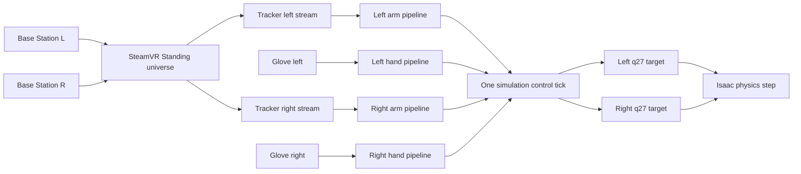

# 002：NV-4 原生双臂双手 Isaac 主线迭代计划

| 字段 | 值 |
|---|---|
| 文档编号 | 002 |
| 所属版本 | NERO-VIVE R1 / NV-4 |
| 状态 | 实施中（2026-07-29 完成 NV-4B～E 非人工实现与 Workstation2 隔离部署，等待 HIL） |
| 目标环境 | Workstation2 / Ubuntu 24.04 / Isaac Sim 6.0.1 / Python 3.12 |
| 默认对象 | 双 VIVE Tracker + 双 Wuji Glove → 双 NERO + 双 Hand 2 Isaac 数字孪生 |
| 中间件边界 | NV-4 不安装、不启动、不依赖 ROS 2、DDS、ROS graph、IDL 或 launch |
| 上位计划 | [001：NERO—VIVE 单/双臂数字孪生与真机遥操作版本计划](001-nero-vive-dual-arm-teleoperation-version-plan.md) |

## 0. 结论

认可将
[`tools/run_isaac_nero_hand2_dual_twin.py`](../tools/run_isaac_nero_hand2_dual_twin.py)
升级为默认双臂、双手 live 控制主线，并把双臂数字孪生遥操作从原 NV-7 中拆出，
前移到所有真机运动之前。

这一调整能够同时解决三个问题：

1. 当前五层 Session 本来就是双 NERO、双 Hand 2、四条显式 command route；继续以
   “单手 live”“右臂 live”“scripted qualification”三个互斥分支作为日常入口，
   已经落后于场景结构。
2. 左右共用一套按 `side` 索引的 application pipeline，比复制右臂代码、增加更多
   CLI 开关更容易保持隔离和减少重复。
3. 在 Isaac 中先闭环双 Tracker、双 Glove、双 IK、故障隔离与记录，再进入 ROS 或
   真机，风险和归因边界更清楚。

本迭代的“默认双臂双手”不是把四路输入混成一个控制器，而是保留两条臂链和两条手链，
仅在同一 simulation tick 的 q27 提交边界汇合。

### 0.1 实施进度（2026-07-29）

已完成：

- [ADR-0007](decisions/0007-nv4-native-dual-teleoperation-deployment.md) 已接受；
- Workstation2 mapping v3 已落地，v2 保持不变；
- relative mapper 已增加同帧 translation+rotation 的纯单元回归；
- `DeploymentSpec v1`、`LocalDeviceBinding v1`、strict repository 和
  `DeploymentResolver` 已实现；
- 新增专用 native-dual live Session；默认双侧、左单侧、右单侧三个
  DeploymentSpec 均解析到该 Session，并复用 NV-2 qualification Session 的同一
  Assembly、Workcell、实例 Binding 与四 route 拓扑；
- 一个 OpenVR owner/producer 可按 serial 生成左右两条 canonical stream，受管启动、
  重启、transport epoch/revision 和迟到旧包拒绝已实现；
- 左右共用 side-neutral arm application pipeline，分别拥有 readiness、reference、
  Lula FK/IK、q7 supervisor 和故障状态；
- 双 Glove composition 已实现确定性的连接/关闭顺序和单侧坏帧隔离；
- 默认 runner 已能从 DeploymentSpec 构造四路 plan，并在一个 simulation tick 中
  形成左右 q27 target；左右单侧诊断只更换 DeploymentSpec；
- 已同步到 Workstation2 的隔离目录 `/home/lenovo/swy/wujihand_nv4`，保留原
  `/home/lenovo/swy/wujihand` 不变；
- 本机全套回归为 `606 passed, 4 skipped, 11 deselected`；Workstation2 隔离副本为
  `608 passed, 2 skipped, 11 deselected`；两端 Ruff/mypy 均通过。

仍未完成：

- Workstation2 的 SteamVR 当前只枚举到一枚已知 Tracker，且该 Tracker 为
  `disconnected`；第二枚 Tracker 尚未形成可写入本机 binding 的稳定 identity；
- 两只 Glove 可按左右 identity 同时连接、订阅并逆序关闭，但 5 秒有界预检内没有
  收到 `hand_skeleton` 帧；需要佩戴/标定后的真人输入确认；
- 三个 spec 的 tracking setup 仍为 `pending`；共同 OpenVR universe、左右
  XYZ-only/RPY-only/组合 SE(3)、四流 GUI 与故障 HIL 均未验收；
- runner 仍保留显式 `--session` 的 NV-2 qualification 兼容路径和旧 live 分支。
  这些删除与独立 qualification 入口迁移属于 NV-4F，必须在新主线 HIL 证明后进行，
  不能把当前 `4129` 行 runner 宣称为轻量化完成。

阶段证据见：

- [2026-07-29 NV-4 Deployment 与 mapping v3 基础验证](validation/2026-07-29-nv4-deployment-foundation.md)；
- [2026-07-29 NV-4 原生双侧实现与 Workstation2 预检](validation/2026-07-29-nv4-native-dual-preflight.md)。

## 1. 当前基线与必须保留的能力

| 能力 | 当前证据 | NV-4 处理 |
|---|---|---|
| 双 NERO + 双物理 Hand 2 | 五层 Session 已解析 2 root、4 route、54 logical DoF；Isaac 中为 2 棵 q27 articulation | 原样保留，不重做资产架构 |
| 装配与桌面姿态 | coaxial-mount tabletop v14 为 90/90 | 保留为 live 启动前结构回归 |
| 右 Tracker 平移 | XYZ 方向人工基本通过；mapping v2 为 1:1、逐轴 `±0.08 m` | 保留 v2 为不可变回归基线；NV-4 新增 v3 |
| 右 Tracker 旋转 | 旧修正 J7 证据已失效；当前固定 Lula 上 RPY 仍待复验 | NV-4 必须重验 |
| 右 Tracker 组合 SE(3) | 当前代码可同时启用平移与旋转，但真人测试只分别覆盖 XYZ-only、RPY-only | NV-4 必须新增 XYZ+RPY 复合轨迹 Gate，不得记为已通过 |
| Tracker 生命周期 | `running` 才可建立 reference；短暂异常 hold，持续异常后以当前 link7 重建；GUI 不退出、不回 home | 左右复用同一状态机 |
| IK 诊断 | 已能区分 tracking、IK、限位与 supervisor 原因；当前 IK 失败仍偏多 | 保留诊断，先基线后冻结阈值 |
| 左右 Glove | 左右分别 live 通过，各 8999/9000 帧、拒绝 0 帧 | 保留单侧回归；新增同时连接与同时控制 |
| Hand 2 命令链 | canonical `21×3 m` → side-specific retarget → q20 → supervisor | 左右各实例化一次，不复制算法 |
| 来源与配置 | source lock、Session hash、mapping profile、q7/q20 layout 已版本化 | 所有新 deployment/device/calibration 输入继续进入 manifest/hash |

以下行为不得因轻量化回归：

- backend 初始化前解析五层 Session 并核对来源、artifact、layout 和 route；
- `link6` 表示对齐、Hand 2 attachment 与两棵 q27 articulation 保持不变；
- q7/q20 通过 canonical joint name 和 USD path 分区，不依赖运行时数组位置；
- 准备位和 Isaac-only gain 继续来自 Session 引用的 qualification profile；
- Workstation2 mapping v2 的 proper rotation、1:1 scale、逐轴 `±0.08 m` 保持不可变，
  只作为历史回归基线；NV-4 live 使用新的 versioned v3，不原地覆盖 v2；
- Tracker `calibrating/out_of_range/lost` 不得伪装为 actionable pose；
- 连续 IK 失败只撤销对应侧 reference，不关闭 GUI、不重置 articulation；
- 错误 side/layout、stale、NaN 或 retarget 失败不产生新的 q20 input intent。

## 2. NV-4 范围

### 2.1 本阶段实现

- 两枚 Tracker 以稳定 serial 映射到 `operator_left`、`operator_right`。
- 两个 Tracker stream 分别驱动左、右 NERO 的 XYZ + RPY relative SE(3)。
- 新增 simulation-only Workstation2 mapping v3：沿用 v2 proper `3×3` 轴旋转，
  translation scale 为 `1.0`，X/Y/Z 分别限幅 `±0.4 m`。该立方包络的参考点到角点
  最大位移约 `0.693 m`，只限制映射输出，不声明机械臂全包络可达或真机安全。
- NV-4 仿真沿用已通过的自动 reference：仅在对应 Tracker 连续 `running` 后，以
  Tracker 当前 pose 与该侧当前 link7 pose 建立 epoch；不引入回车、按钮或伪 deadman。
- 左右 Glove 分别驱动对应 Hand 2，并支持两只 Glove 同时连接、订阅、retarget 和关闭。
- 一个默认 GUI live 主循环在每个 physics tick 计算四路候选，统一提交左右 q27 target。
- 默认入口不再要求选择 `tracker-live`、`glove-live`、`side`、translation/rotation
  模式或临时数值 override。
- 单侧故障隔离、共享故障暂停、双侧记录和 HIL 资格验证。
- scripted、headless、几何、截图和单侧诊断仍可执行，但退出默认 live 主线。
- 提供 `left_single_live`、`right_single_live` 两个 committed diagnostic
  DeploymentSpec：活动侧使用对应 Tracker + Glove，非活动侧由显式 hold/rest fixture
  接管；两者复用同一个双侧 Session 和相同 pipeline，不增加 `--side` 分支。
- 对主线代码做实际删除和去重，不以机械搬文件冒充轻量化。

### 2.2 本阶段不做

- 不控制真实 NERO 或真实 Hand 2，不连接 CAN，不创建硬件 command publisher。
- 不引入 ROS 2、DDS、ROS message、namespace、QoS、bridge 或 launch。
- 不把两台 Base Station 分配给左右 Tracker，也不建立两套 tracking world。
- 不新增视觉、自主避障、抓取策略、力控、触觉或训练数据生产任务。
- inter-arm/external collision 在 NV-4 只做 detection/report 与 qualification，不在
  live tick 内增加主动避碰、重规划或临时 q7 修正。
- 不在 NV-4 内解决真机 deadman、急停、`move_p`、CPV 或双臂真机 coupled control。
- 不把 simulation-nominal Workcell、attachment 或 URDF 限位升级为真机测量事实。

## 3. 目标运行形态



目标日常启动面为：

1. SteamVR 已运行，两台 Base 与两枚 Tracker 可见。
2. 只启动 `run_isaac_nero_hand2_dual_twin.py`；它是本次 Deployment 的唯一 launcher/
   owner，先解析 DeploymentSpec/Session，再通过独立 runtime process supervisor
   启动和监控共享 OpenVR producer，最后进入 GUI 双臂双手主线。

Glove manager 和 Isaac consumer 位于主进程；OpenVR producer 使用 local binding
声明的受控解释器/环境作为子进程。日常不要求用户另开一个 producer 终端。

主 runner 最终只保留少量稳定入口：

| 参数 | 用途 |
|---|---|
| `--deployment` | 唯一语义入口；覆盖默认 NV-4 DeploymentSpec，Session 只能由该 spec 引用 |
| `--report` | 覆盖自动 run artifact 位置 |

默认 `native_dual_live`、`left_single_live`、`right_single_live` 都通过
`--deployment` 选择。后两者只是左右隔离和现场诊断入口，不与默认双侧主线并列为产品
模式。headless、frames、amplitude、截图、freeze translation 和临时 scale/limit 等
资格参数转移到独立 qualification 入口。`verify_artifacts` 在 live 主线固定开启。

## 4. 五层架构与 DeploymentSpec

现有五层不变：

| 层 | NV-4 中拥有的事实 |
|---|---|
| Asset Manifest | NERO/Hand 2 身份、side、frame、q7/q20 layout |
| Backend Binding | 固定 Isaac artifact、joint/frame map、NERO `link6` 表示对齐 |
| Assembly | 左右 `NERO → Hand 2` attachment 与两个 root |
| Workcell | 桌面、左右 NERO mount、相机语义 frame 和固定 collider |
| Session | Isaac backend、四个实例、两 root placement、四条 commanded route |

Tracker/Glove serial、UDP 端口、calibration、freshness 和运行故障策略不是产品、表示、
装配或工作台事实，不写入前四层。Session 仍是五层场景与资产的唯一组合根。
NV-4 在其外增加一个最小、middleware-neutral 的运行部署根 `DeploymentSpec v1`：

```text
DeploymentSpec v1
  -> resolved five-layer Session
       -> runtime.control_layouts / commanded routes
       -> runtime.transport_contract
       -> one runtime.compatibility_profile
            -> frozen tabletop qualification profile reference
            -> relative mapping / retarget / IK / supervisor / freshness policy references
  -> process graph and managed producer lifecycle
  -> tracking setup revision
  -> left/right Tracker local binding and UDP endpoint
  -> left/right Glove local binding and calibration
  -> report/artifact destination
```

它不是第六个资产组合层，而是多进程 live run 的显式运行根：

- 不拥有或复制 Asset、Binding、Assembly、Workcell 数值；
- 恰好引用一个 ResolvedSession，五层 resolver 仍是所有 scene/asset 事实的唯一入口；
- Session 的 `runtime.control_layouts` 继续拥有 route/layout，
  `runtime.transport_contract` 单独选择 composite wire contract；Session 唯一的
  `runtime.compatibility_profile` 升为 native-dual-teleop composite leaf，按引用复用
  已冻结 tabletop qualification profile，并引用 relative mapping/retarget、
  IK/supervisor 和 freshness policy；
- DeploymentSpec 只把 process lifecycle、本机 device/endpoint、tracking setup、
  calibration artifact 与输出位置绑定到 Session 已声明的 logical role/policy ID，
  不重新定义数值策略；
- 设备 serial/address 放 `configs/local/`，提交的 spec 只保存 schema、logical role
  和非敏感 binding 默认值；
- `session_hash`、`deployment_hash`、`local_binding_hash` 分别进入 RunManifest；
- runner 不再通过大量 CLI 参数构造另一套隐式运行事实。

ADR-0007 明确修订 ADR-0003 第 4 节中“runner 只从 Session 启动、producer/consumer
进程由 Session 定义”的限定：多进程 live run 从 DeploymentSpec 启动，进程实例和
本机 binding 改由 DeploymentSpec 拥有；Session 仍拥有五层运行/传输/控制合同，场景
解析也只从它引用的 ResolvedSession 进入。这是对第五层与部署编排边界的显式修订，
不是对前四层事实所有权的暗中迁移。

NV-4 冻结 middleware-neutral `DeploymentSpec v1`。NV-5 发布 `DeploymentSpec v2`，
加入 ROS-specific node/executable、namespace/domain/remap/QoS、command ownership
和 recorder transport binding，并提供 v1→v2 migration/hash 兼容测试；不得向已冻结
的 v1 strict schema 原地加字段。

DeploymentSpec 的 schema 和所有权在 NV-4 实现前形成 ADR。若设计不能做到单点事实源
和稳定 hash，则暂停该 schema，不用隐藏默认值绕过五层 resolver。

## 5. 双 Base、双 Tracker 与标定

### 5.1 Tracking 拓扑

NV-4 的目标拓扑是：两台 Base Station 2.0 作为共享光学参考，两枚 Tracker 由同一个
OpenVR runtime、同一个活动 `TrackingUniverseStanding` 输出到一个规范
`vive_tracking`。Tracker 与 Watchman dongle 建立主机连接，Base Station 不与某枚
Tracker 建立应用层“左/右专属”控制链。

`2 Tracker + 2 Glove` 已配置只证明设备完整性，不证明两枚 Tracker 当前坐标已经一致。
NV-4B 必须实测 runtime owner、tracking universe、setup revision、两枚 pose 的 frame
和交叉运动方向；任一项不一致时停止双侧 Gate，不用 tracker-specific 轴补丁拼成两套
tracking world。

正确关系是：

```text
Base L + Base R
    -> one SteamVR Standing universe
        -> Tracker left pose in vive_tracking
        -> Tracker right pose in vive_tracking
```

依据：

- [Valve OpenVR Tracker 与 Tracking Reference 运行时语义，“设备类别”“追踪状态”](https://github.com/ValveSoftware/openvr/blob/0924064316de3effbcd1acf1e309182a2deb1c05/docs/Driver_API_Documentation.md)
- [Valve SteamVR Tracking 原理与定位器职责，“定位器与被追踪物”](https://partner.steamgames.com/vrlicensing)
- [Valve Index Base Station / SteamVR Base Station 2.0，“系统配置”](https://store.steampowered.com/app/1059570/Valve_Index_Base_Station/)
- [HTC VIVE Tracker (3.0) Developer Guidelines v1.0，“Optics”“Coordinate system”](https://developer.vive.com/documents/824/HTC_Vive_Tracker_3.0_Developer_Guidelines_v1.0_01182021.pdf)
- [HTC：Base Station 设置建议](https://www.vive.com/us/support/vive-pro-eye/category_howto/tips-for-setting-up-the-base-stations.html)
- [HTC：Base Station channel 配置](https://www.vive.com/au/support/vive-pro/category_howto/configuring-the-base-station-channels.html)

### 5.2 当前候选安装

项目负责人提出：

- 两台 Base 位于人工工作台左右两侧；
- 有轻微高低差；
- 物理位置近似在一条直线上；
- 同时开启两枚 Tracker。

NV-4 将其作为首个 HIL 候选，不把“共线/高差”写成控制坐标定义。安装需记录 Base
serial、channel、固定位置、朝向和 SteamVR setup revision，并满足：

- 两台 BS2 使用不同可用 channel；
- 两台均朝向同一个双手操作体积；
- 左右、中心和交叉轨迹区域有足够重叠视场；
- Base 或 room setup 改变后，当前 `tracking_setup_revision`、全局 mapping calibration
  ID 与左右 reference epoch 一起失效。

若双手交叉、桌沿或人体遮挡时 dropout/calibrating 不合格，优先调整 Base 位置和朝向，
不通过增加 tracker-specific 坐标补丁掩盖。

Base 安装 HIL 是正式 Gate：两枚 Tracker 必须同时覆盖工作区左、中央、右侧及双手交叉
轨迹；分别遮挡每一台 Base，记录 continuity、dropout、`calibrating` 和 reacquisition。
NV-4B 先建立候选布局基线，NV-4F 联合 HIL 后再冻结可接受阈值；未达到阈值时调整安装，
不能用代码补丁放行。

### 5.3 标定层级

| 层级 | 共享或独立 |
|---|---|
| SteamVR Standing universe / setup revision | 目标为全局共享；NV-4B 实测后才取得资格 |
| `vive_tracking` delta axes → `workcell_world` delta axes mapping | 共同 universe 通过后全局共享 |
| Tracker serial → stream/role/UDP endpoint | 左右独立 |
| Tracker → control handle 固定外参 | 左右独立；若实际安装一致也要显式证明 |
| Tracker anchor + 当前 link7 anchor + reference epoch | 左右独立 |
| Lula solver base pose、IK、q7 supervisor、诊断 | 左右独立 |

当前 Workstation2 mapping v2 是 relative delta mapping：包含 proper `3×3` 轴旋转、
1:1 translation scale 和逐轴限幅，不包含测得的绝对平移，也不是完整
`T_workcell_world_vive_tracking` 外参。它可作为共享相对映射基线；左侧 XYZ/RPY
人工验证通过前，不能仅凭右侧结果宣布共享 mapping 已完成双侧资格。完整世界外参留给
后续测量标定，不在 NV-4 伪造。

mapping v2 保持 `±0.08 m` 不变以保留历史证据。NV-4 新建 mapping v3，沿用相同 proper
rotation、rotation policy 和 `1.0` translation scale，仅把 X/Y/Z 的 mapping clamp
改为各 `±0.4 m`。超过该值仍是 component-wise clamp；包络内的不可达目标继续交给
现有 IK 路径处理：孤立 IK 失败保持最后有效目标，连续 5 次失败只撤销对应侧
reference，下一帧合格输入按当前 link7 自动重建，GUI 不退出、不回初态。v3 是
simulation-only 控制包络，不是 measured Workcell、安全区或可达性保证。

DeploymentSpec/preflight 必须引用 `tracking_setup_revision`。`TrackedRigidBodySample
v2` 显式携带 `producer_instance`、`transport_epoch` 和
`tracking_setup_revision`；producer 另发 `TrackingLifecycleEvent`，至少包含 stream、
old/new epoch、setup revision、start/rebind/reset/stop 原因和 host monotonic time。
receiver 只接受与当前授权 epoch/revision 一致的 sample。
SteamVR reset 或 Base/room setup 变化时，先全局暂停，重新验证或加载 mapping、更新
setup revision 和 calibration ID，再分别重建两侧 reference，不能直接沿用旧 anchor。

### 5.4 Wuji Glove 输入事实

- 官方 `hand_skeleton` 是 MediaPipe 顺序的 21 个关键点，canonical 输入继续使用
  `(21,3)` 米制位置，而不是把 `hand_joint_angles` 的 21 DoF 人手结果当作机器人命令：
  [Wuji Glove：EMF 与手部追踪](https://docs.wuji.tech/docs/zh/wuji-glove/latest/sdk-data-reference/hand-tracking/)。
- Hand 2 retarget 固定为 `RetargetSession.for_hand(...)`，输入 `(21,3) m`，输出
  `(20,) rad`；切换输入源或长时间暂停后调用 `reset()`，并采用 drain-to-latest：
  [Wuji SDK：重定向](https://docs.wuji.tech/docs/zh/wuji-sdk/latest/retargeting.md)。
- 左右手标定相互独立；当前 teleop 首选 SDK 默认用户的内置模型，若后续需要持久化
  个体标定再引入 named user：
  [Wuji Glove：手型标定](https://docs.wuji.tech/docs/zh/wuji-glove/latest/sdk-data-reference/calibration.md)。
- 官方说明 EMF pose confidence 低于 `0.9` 可视为不可靠，但没有据此定义所有 skeleton
  帧的统一硬拒绝规则。NV-4 保留“低于成功阈值但结构完整的帧标为 degraded”的现状，
  不从这一条 EMF 说明静默推导所有 skeleton 帧的统一硬拒绝规则。
- Glove 路径只产生 side-specific canonical skeleton 与 q20，不参与臂的笛卡尔定位；
  两只 Glove 不要求共享空间坐标原点，但 device side、frame、layout、SDK user/
  calibration revision 必须分别可追溯。

这里存在一项已知治理冲突：当前实现/live 报告允许 finite 完整低置信度帧作为
`DEGRADED` intent，而已接受 ADR-0006 写的是 `<0.90` 拒绝。项目负责人已经确认保留
当前 live 语义；ADR-0007 必须明确 supersede ADR-0006 的 confidence 三段阈值，
不能只改计划或代码注释。

## 6. Application 主线

### 6.1 边界与四条独立链

```text
Tracker left  -> left reference/mapping -> CartesianPoseIntent
              -> left Isaac Lula adapter -> q7 candidate/diagnostics -> left q7 supervision
Tracker right -> right reference/mapping -> CartesianPoseIntent
              -> right Isaac Lula adapter -> q7 candidate/diagnostics -> right q7 supervision

Glove left  -> left canonical observation -> left retarget -> left q20 supervision
Glove right -> right canonical observation -> right retarget -> right q20 supervision
```

边界固定为：

| 边界 | 所有权 |
|---|---|
| Input adapter | 产生 canonical Tracker sample / Glove observation 与 lifecycle event |
| Application | reference、relative mapping、canonical Cartesian/Hand intent、按侧策略与监督决定 |
| Isaac kinematics adapter | 持有 Lula solver，返回 q7 candidate、FK residual、limit margin 和失败诊断 |
| Application `JointCommandSupervisor` | 对 q7 candidate 作 limit/rate/freshness 监督，形成可执行 q7 action |
| Isaac scene adapter | 按 canonical joint name 分区并组合 q7+q20 为左右 q27，提交并读取 feedback |

应用层以相同的 per-side controller 类型实例化两次。左右 Lula solver 位于 Isaac
kinematics adapter，且必须是两个独立实例，因为 solver 的 robot base pose 是实例状态。
不得以 `if side == right` 复制一套主循环，也不得让同一 solver 每帧切换 base pose。

### 6.2 同一 physics tick 提交

每个 tick 固定顺序：

1. drain 左右 Tracker 到各自 latest canonical sample；
2. poll 左右 Glove 到各自 latest canonical observation；
3. 每条输入链先独立转成监督后的 `new/hold/rest/disarm` action，不让无效原始输入
   直接进入 scene adapter；
4. 分别形成有效的左 q27 与右 q27 target；一侧的无效输入只改变该侧 action；
5. 左右 target 在同一个 physics tick 提交；只有 Session/layout/backend 等共享
   invariant 失败才阻断两侧；
6. 只执行一次 `world.step()`；
7. 记录本 tick 实际采用的 sample sequence、age、decision、command 和 feedback。

“同一 tick”不要求四个传感器时间戳完全相同，但必须记录 arm/hand 和左右 skew，并拒绝
超过各自 freshness policy 的样本。NV-4 不新增 ROS bundle 或网络原子消息。

### 6.3 仿真故障策略

项目负责人已冻结：

| 故障 | NV-4 默认行为 |
|---|---|
| 单侧 Tracker 短暂 calibrating/out-of-range | 该臂 hold；不刷新 freshness |
| 单侧 Tracker stale、断开或 IK 连续失败 | 只撤销该臂 reference；恢复后以当前 link7 重建 |
| 单侧 Glove stale/retarget 失败 | 只处理对应 Hand 2 的 hold/return-to-rest；不撤销 arm reference |
| 受 Deployment launcher 管理的 producer 重启 | 对该 producer 所属 stream 发新 transport epoch/rebind；receiver 仅在此事件重置 sequence，并撤销相关 reference；GUI 保持 |
| 未受管理的 producer 重启/sequence 回退 | fail closed，不自动接纳为同一 stream |
| SteamVR universe/reset、global mapping 变化 | 两臂共同暂停；使旧 setup revision、calibration 与 reference 失效，重新验证后再建 reference |
| Isaac/backend/Session invariant 故障 | 全局停止本次 control run |

纯仿真阶段采用 side-local 隔离，能直接验证左右串线和恢复行为；未来真机双臂阶段默认
coupled deadman，不从 NV-4 的隔离策略外推。

## 7. 轻量化设计

当前 runner 为 3540 行，主要重复来自：

- 单手 live 与单手资格报告；
- 右臂 GUI/headless 两套循环；
- 默认 scripted 双 q27 资格流程；
- 大量 mode/side/数值 CLI 分支；
- scene materialization、live orchestration、资格报告和截图职责混在同一文件。

NV-4 按以下顺序收敛：

1. 抽出一个可复用的双 q27 Isaac scene adapter，负责 stage、attachment、partition、
   gains、target 提交、feedback 和 reset；它不读取 Tracker/Glove。
2. 抽出 side-neutral arm tick，复用现有 mapper、interactive controller、IK supervisor
   和诊断。
3. 复用现有 side-neutral hand controller，增加双连接的 composition。
4. runner 只从 DeploymentSpec 进入其引用的 ResolvedSession；进程管理由独立 runtime
   supervisor 提供，runner 保留高层生命周期和统一 tick，不内嵌 subprocess 补丁。
5. scripted geometry/contact/reset 和 screenshot 进入独立 qualification 入口，调用同一
   scene adapter。
6. 旧单侧行为转为 fixture/HIL regression；通过后删除 live-only 互斥分支和兼容空参数。
   左右单侧现场诊断由 committed `left_single_live` / `right_single_live`
   DeploymentSpec 承担，不回流为 runner 内的 mode/side 分支。

轻量化验收同时看两个指标：

- 主 runner 的日常认知面目标从 3540 行显著降到约 1200～1600 行；
- 统计全仓 production code 净增减，说明删除、复用和新增验证各自来源。

硬 Gate 是删除旧的重复 live 分支、降低 runner 认知面且正确能力不回归；全仓净 LOC
是 NV-4A 后冻结的预算指标，不作为删除必要 validation 的理由。测试、canonical
validation、故障诊断和来源校验不因行数目标删除。

## 8. 工作包

### NV-4A：冻结回归基线

**当前状态：部分完成。** 无硬件 fixture、mapping v2/v3 与旧正确能力回归已冻结；
右臂/左臂真人组合 SE(3) 和 contact 基线仍待 HIL。

- 固定当前 commit、Session/source/mapping hash 和两侧 Glove 独立报告。
- 保持 mapping v2 不变，用当前固定 Lula 依次重验右臂 XYZ-only、RPY-only 和
  XYZ+RPY relative SE(3) 复合轨迹，保存 mapping clamp、target step/rate、
  IK success/failure、reference rebuild 和 supervisor 结果；组合 SE(3) 在本次
  人工 Gate 通过前明确记为未验证。
- 保存短小的左右 Tracker、左右 Glove canonical fixture。
- 固定 contact/penetration 报告口径，并从现有 qualification 形成 simulation-only
  provisional threshold；最终值由 NV-4F 的 qualified trajectory/contact fixture 冻结。

**退出条件**：已有正确能力有可自动或人工复验的证据；未知项没有被记为通过。

### NV-4B：DeploymentSpec 与双 Tracker 输入

**当前状态：软件实现完成，硬件 Gate 未通过。** Deployment/Session/profile、单
OpenVR owner 双流 producer、process supervisor、epoch/revision 合同和隔离部署均已
完成。当前 SteamVR 设备 inventory 不满足两枚 Tracker 同时连接，因此不得关闭本阶段
退出条件。

- 保持 Session v1 只有一个 `runtime.compatibility_profile`：定义
  native-dual-teleop composite leaf，引用已冻结 tabletop qualification profile 和
  relative mapping/retarget、IK/supervisor、freshness policy，不复制其数值。
- `runtime.transport_contract` 仍由 Session 独立选择新的 composite wire contract，
  不写入 compatibility leaf。
- 为 composite leaf 与 transport contract 增加 strict loader、reference closure、
  stable hash 和 golden；不增加临时第二 profile 字段。
- 定义 middleware-neutral `DeploymentSpec v1` 和本地 device binding。
- 新建 versioned、simulation-only mapping v3：沿用 v2 proper rotation 与 rotation
  policy，translation scale `1.0`，X/Y/Z 各 `±0.4 m`；保留 v2 文件与历史 hash。
- 提交默认 `native_dual_live` 以及 `left_single_live`、`right_single_live` 三个
  DeploymentSpec。单侧 spec 使用同一双侧 Session，非活动侧绑定显式 hold/rest
  fixture，不遗漏 Session route、不发送隐藏全零命令。
- 主 runner 是唯一 Deployment launcher/owner，通过 runtime process supervisor
  启动、监控和关闭 OpenVR producer；用户不手动启动 producer。
- 最终采用一个 OpenVR producer，一次读取 pose array，按两枚 serial 产生两条
  canonical stream；若该重构风险高于收益，允许同一个主 runner launcher 先通过
  runtime supervisor 编排两个现有 producer，但对外仍只暴露一个 DeploymentSpec。
  后者只是 NV-4B 迁移态，不能作为最终 Gate 形态，除非项目负责人另行批准。
- 左右使用不同 UDP endpoint，receiver 继续严格检查 serial/stream/role/frame。
- 由 launcher 管理 producer lifecycle 与 transport epoch；测试受管重启和非受管
  sequence 回退的不同结果，以及新 epoch/revision 建立后迟到旧 datagram 的拒绝。
- 完成两 Base、两 Tracker 的 Standing universe、channel、静止、XYZ/RPY、遮挡和
  reacquisition 资格验证；设备 inventory 与坐标资格分开记录。

**退出条件**：一个日常命令可管理完整进程图；两枚 Tracker 同时稳定输出且无 identity
串线，producer 生命周期可解释。

### NV-4C：双臂 side-neutral control

**当前状态：软件实现完成，真人轨迹未验证。** 左右复用同一 application controller
类型，各自拥有 mapper/reference/Lula/supervisor；XYZ-only、RPY-only、XYZ+RPY 和
双 Tracker 同动仍待 GUI/HIL。

- 从右臂实现提取通用 per-side arm pipeline。
- 为左、右分别创建 mapper、reference controller、Lula solver、supervisor 和诊断。
- 在 mapping v3 下先右臂、后左臂分别完成 XYZ-only、RPY-only、XYZ+RPY 复合轨迹，
  再进行双 Tracker 同时控制；各项 arm 资格期间 Hands 保持。
- 保留当前 GUI persistent 生命周期和 current-pose reference rebuild。
- NV-4C 完成后形成左右独立 IK 基线；阈值仍待四流并发数据，不在右侧数据上提前冻结。

**退出条件**：左右 XYZ-only、RPY-only 与 XYZ+RPY 复合轨迹均通过；一侧异常不退出
GUI、不命令另一侧。

### NV-4D：双手同时 control

**当前状态：软件实现完成，连续帧 HIL 未验证。** 同一 SDK manager 可管理两个唯一
device name，左右 adapter 可同时连接和订阅；本次有界预检未收到 skeleton 帧，不能
把连接成功记为双手控制通过。

- 在同一 SDK manager 生命周期内连接左右 Glove，使用唯一 device name/identity。
- 左右各自 subscription、canonical observation、retarget session 和 q20 supervisor。
- 先逐手复验，再双手同时动作；Arms 保持。
- 固定双连接 start/close 顺序和一侧丢流行为。

**退出条件**：左右 q20 无串线，双手同时运行不降低为单手 fallback。

### NV-4E：默认四流主线

**当前状态：主线路径已实现，联合 smoke 未执行。** 省略 `--session` 时默认解析
native-dual DeploymentSpec，四路 decision 在一个 tick 后按侧合并为两个 q27 command；
当前因 Tracker 前置条件不满足，尚未启动 Isaac GUI。

- 实现一个统一 simulation tick，同时计算四路 decision 并提交左右 q27。
- `run_isaac_nero_hand2_dual_twin.py` 默认进入 GUI 双臂双手 live。
- 删除 Tracker/Glove 互斥、side、translation-only/rotation-only 和临时数值模式。
- 报告按 side/chain 保存 input、intent、decision、command、feedback、age 和 skew。
- 复验 `left_single_live`、`right_single_live`：活动侧 arm+hand 同时 live，非活动侧
  保持显式 hold/rest；切换诊断对象只更换 DeploymentSpec。
- 结合 NV-4C/E 的左、右和并发数据，与项目负责人冻结 per-side 与 concurrent IK
  release threshold。

**退出条件**：默认入口无需琐碎 mode 参数；四流联合 smoke 通过。

### NV-4F：资格迁移、删除与发布 Gate

**当前状态：未开始。** 必须先取得 NV-4B～E 的真人 HIL 证据，再删除旧 live 分支、
拆出 qualification 入口和完成 LOC/CLI 轻量化验收。

- 独立 scripted/geometry/contact/headless qualification 入口复用同一 scene adapter。
- 覆盖 wrong serial/side/role/frame、重复端口、stale、producer restart、IK 连败、
  Glove stale、SteamVR reset 和 Isaac fault。
- 执行 qualified free-space inter-arm/external-collider penetration 检查与 deliberate
  contact fixture，冻结可判定阈值和预期 link-pair/duration 边界。
- 完成双 Base 遮挡、交叉手势、双臂双手同时操作与 10 分钟 GUI 短稳定性 smoke；
  长时间 soak 留在 NV-9。
- 输出 before/after CLI、行数、依赖和测试清单，删除已被新主线覆盖的旧分支。

**退出条件**：第 9 节 Gate 全部有证据；组件/指南/验证文档与实现同步。

## 9. Gate NV-4

只有同时满足以下条件才标记 NV-4 完成：

1. 同一个 resolved Session 仍解析 2 root、4 route、54 logical DoF，Isaac 中仍为
   两棵 q27 articulation；没有五层旁路。
2. 两台 Base 和两枚 Tracker 属于同一个 Standing universe；两枚 serial 唯一绑定
   左右 stream。两台 Base 的 BS2 channel 不冲突；两个 Tracker stream 的 UDP endpoint
   另行验证不冲突，二者不是同一种通道。设备数量已配置不作为坐标一致证据；无法证明
   同一 runtime owner、universe、setup revision 和 `vive_tracking` frame 时暂停 Gate。
3. 两枚 Tracker 同时走过工作区左/中央/右和交叉轨迹；分别遮挡每台 Base 的
   continuity、dropout、`calibrating` 与 reacquisition 达到 NV-4B/F 后冻结的阈值，
   并保存 Base 布局/setup revision 证据。
4. 每侧在连续 `running` 前不产生新 arm intent；自动 reference/rebuild 使用该侧当前
   link7，不依赖 stdin/button，不退出 GUI、不回初态。显式 deadman/clutch 留到 NV-6
   真机 Gate。
5. 右臂和左臂各自完成 XYZ-only、RPY-only、XYZ+RPY relative SE(3) 复合轨迹；
   不以两个单项测试替代组合测试。在其他三路输入固定的隔离 fixture 中，单侧 arm
   动作不改变另一侧 q7，也不改变左右 hand command。
6. 左右 Glove 分别和同时控制通过；错误 side/layout 不产生 input-derived q20，
   不污染对侧。对应侧 supervisor 的合法 hold/return-to-rest 及对侧有效 Glove 输入
   仍可更新各自 q20。
7. 四流同时运行时，每个 tick 的 sample、intent、decision、command 和 feedback
   可按 side 追溯，command/feedback skew 有报告。
8. 单侧 tracking、UDP、IK 或 Glove 异常不导致 GUI 退出、articulation 回初态或
   另一侧串线；共享故障按已冻结矩阵共同暂停。
9. IK failure 按侧记录 target step/rate、solver/FK residual、limit margin 和 reference
   rebuild 原因；使用 NV-4C/E 的左右与并发基线，经项目负责人确认后冻结 per-side /
   concurrent release threshold。孤立失败保持最后有效目标，连续 5 次失败只撤销本侧
   reference 并自动重建，不退出 GUI。
10. qualified free-space 轨迹中不存在超过 NV-4A/F 冻结阈值的未解释
    inter-articulation 或 external-collider penetration；deliberate contact fixture
    的预期 link pair、side、时间、最大深度/持续时间有界并进入报告。该
    simulation-nominal 结论不外推为真机 clearance；merged q27 internal
    self-collision 保持关闭时继续明确这一边界。此项验收 detection/report，不宣称
    NV-4 已实现 active collision avoidance。
11. Session、DeploymentSpec、local binding、calibration、tracking setup、source 和
    run artifact 的 hash 闭合；DeploymentSpec/local binding 只绑定 Session-declared
    role/policy ID，不复制 mapping/IK/supervisor 数值；报告不泄漏完整设备 serial。
12. managed producer restart 通过 lifecycle event/新 transport epoch 恢复；未管理的
    sequence 回退 fail closed。SteamVR reset 使旧 setup/calibration/reference 全部
    失效；重启/reset 后旧 epoch/revision 的迟到 datagram 必须被拒绝。
13. live 运行不 import/start `rclpy`、ROS graph、DDS、ROS IDL、ROS launch、CAN 或
    NERO hardware adapter。
14. 最终运行图恰好有一个 OpenVR runtime owner/producer 输出左右两条 stream；两个
    legacy producer 只能是 NV-4B 迁移证据，若要作为发布形态必须由项目负责人显式批准
    并记录差异。
15. 一个日常命令解析 DeploymentSpec/Session、管理 OpenVR producer 并进入 Isaac
    GUI；默认主线 CLI 已收敛，旧互斥 live 分支删除。before/after 报告证明 runner
    认知面实际下降且正确能力无回归，production LOC 作为已解释的预算指标记录。
16. mapping v2 文件和历史 hash 保持不变；默认 NV-4 live 引用 v3，v3 明确记录
    `1.0` scale、X/Y/Z 各 `±0.4 m`、约 `0.693 m` 最大角点位移和
    `simulation_only` scope，不被描述为完整可达或安全包络。
17. `left_single_live`、`right_single_live` 可分别完成单臂 + 单手诊断；两者与默认
    `native_dual_live` 共用同一个双侧 Session/组件，非活动侧行为显式且没有
    `--side`/模式分支。

## 10. 交付物

- Session-owned native-dual-teleop composite compatibility leaf / transport contract，
  以及 `DeploymentSpec v1` schema、默认双侧/左右单侧诊断模板和 local binding 示例。
- 保持 v2 不变的 Workstation2 mapping v3，以及 v2/v3 回归与 provenance 记录。
- 双 Tracker OpenVR producer/launcher 与双流 component 更新。
- side-neutral arm application controller、双 Glove composition 和双 q27 scene adapter。
- 默认双臂双手 runner、独立 qualification 入口。
- ADR-0007：默认双侧主线、统一 Standing universe、DeploymentSpec/five-layer 边界及
  仿真故障策略。
- `docs/components/`：NERO twin、VIVE input、五层 composition 当前能力更新。
- 双侧运行指南、Base/Tracker/Glove preflight、故障排查。
- NV-4 fixture、headless、HIL、GUI、fault 和短稳定性验证报告。
- 主线 CLI 与 production line-count before/after 报告。

## 11. 已对齐并交由 ADR-0007 冻结的决策

项目负责人已于 2026-07-29 确认以下内容。NV-4 实施先形成 ADR-0007，再按该 ADR
修改 schema 和运行代码：

| 决策 | 已冻结结论 | 执行约束 |
|---|---|---|
| 默认设备完整性 | 默认主线要求 2 Tracker + 2 Glove 全部就绪；单侧只留 diagnostic/fixture | 避免默认主线继续积累单侧模式分支 |
| 仿真单侧故障 | 只 hold/disarm 对应侧；共享 tracking/backend/config 故障才全局暂停 | 保留当前 GUI 恢复逻辑并直接验证隔离 |
| Glove confidence | 保留当前 live 证据采用的“finite 完整帧可 degraded，`0.90` 为 success 阈值”行为；ADR-0007 显式 supersede ADR-0006 的旧 `<0.90` reject 条款 | 当前左右 live 的最低置信度不足以支持静默改成 `<0.90` 全拒绝 |
| Tracker 坐标资格 | 两枚 Tracker 必须证明来自同一 OpenVR runtime / Standing universe / setup revision / `vive_tracking`；各侧 handle 外参、anchor、reference 独立 | 当前已配置不等于坐标已一致；不支持两套 tracking world 的隐式拼接 |
| Workstation2 live mapping | v2 保持 1:1、逐轴 `±0.08 m` 作为回归；新 v3 为 1:1、X/Y/Z 各 `±0.4 m`，接受约 `0.693 m` 角点位移 | v3 只负责 mapping clamp，IK 失败沿用当前逻辑，不宣称全包络可达或适用于真机 |
| 单侧 arm+hand 诊断 | 提供左右两个 committed DeploymentSpec；活动侧 live、非活动侧显式 hold/rest | 共用双侧 Session 与组件，只切换 `--deployment`，不增加 `--side` 分支 |
| 组合 SE(3) | XYZ-only、RPY-only、XYZ+RPY 必须分别验收 | 当前只有前两类的分离测试，组合路径不得提前记为通过 |

另有一项数值待 NV-4C/E 左右独立与四流并发实测后对齐：IK failure/rebuild 的
per-side / concurrent release threshold。当前先冻结记录口径和“不得退出 GUI、
不得回初态、不得污染另一侧”三个硬条件。

## 12. 计划变更规则

以下变化需要先回到本计划对齐：

- 把 ROS 2、CAN 或真实机器人接入 NV-4；
- 改变五层事实所有权或复制 Session/Workcell/Assembly 数值到 DeploymentSpec；
- 从一个 Standing universe 改成两套独立 tracking world；
- 将仿真 side-local fault policy 改为默认 coupled；
- 取消双 Tracker、双 Glove 的默认完整性要求；
- 改写 mapping v2，或改变 v3 的 1:1 / 逐轴 `±0.4 m` / simulation-only 语义；
- 删除左右单侧 diagnostic DeploymentSpec，或将其改回 runner 内 side/mode 分支；
- 为减少行数而删除 canonical validation、source verification 或 IK/故障诊断。
