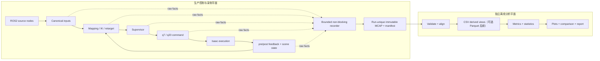

# 003：双臂双手遥操作质量分析架构、ROS2 Jazzy 主线与 Sim→Real 计划

- 状态：全因果链录制、关闭、置信度标签和 fixture 修复已通过 Workstation2 pilot；
  60 Hz 控制见 005 迷你版本计划
- 日期：2026-07-31
- 适用对象：双 NERO q7、双 Wuji Hand 2 q20、双 VIVE Tracker (3.0)、
  双 Wuji Glove、Isaac Sim、ROS2 Jazzy，以及后续真机执行后端
- 当前入口：
  [`isaac_nero_hand2_native_dual_live_v1.yaml`](../configs/deployments/isaac_nero_hand2_native_dual_live_v1.yaml)
- ROS2 当前仿真主线：
  [`isaac_nero_hand2_ros_dual_live_v2.yaml`](../configs/deployments/isaac_nero_hand2_ros_dual_live_v2.yaml)
- ROS2 当前 rich-scene 入口：
  [`isaac_nero_hand2_ros_dual_robolab_banana_bowl_live_v2.yaml`](../configs/deployments/isaac_nero_hand2_ros_dual_robolab_banana_bowl_live_v2.yaml)
- 上位文档：
  [000：项目章程与全局架构](000-project-charter-and-architecture.md)、
  [001：NERO—VIVE 版本计划](001-nero-vive-dual-arm-teleoperation-version-plan.md)、
  [002：NV-4 原生双侧仿真主线计划](002-nv4-native-dual-arm-dual-hand-simulation-mainline-plan.md)、
  [004：RoboLab 静态 Isaac 场景丰富化分析](004-robolab-static-isaac-scene-enrichment-analysis.md)
- 当前验证：
  [NV-5 ROS2 Jazzy Workstation2 HIL](validation/2026-07-31-nv5-ros2-jazzy-hil.md)、
  [RoboLab banana-in-bowl ROS Deployment](validation/2026-07-31-robolab-banana-bowl-ros.md)、
  [全因果链录制离线验证](validation/2026-07-31-ros2-full-recording-offline.md)、
  [banana grasp pilot -02 审计](validation/2026-08-03-ros2-banana-grasp-pilot-02.md)、
  [banana grasp pilot -05 关闭复验](validation/2026-08-03-ros2-banana-grasp-pilot-05.md)
- 相关决策：
  [ADR-0005：NERO 模型来源与临时仿真限位](decisions/0005-nero-model-source-and-provisional-limits.md)、
  [ADR-0007：NV-4 原生双侧遥操作与 Deployment 边界](decisions/0007-nv4-native-dual-teleoperation-deployment.md)、
  [ADR-0008：ROS2 Jazzy 双侧遥操作边界](decisions/0008-ros2-jazzy-dual-teleoperation-boundary.md)、
  [ADR-0009：ROS2 全因果链录制边界](decisions/0009-ros2-full-causal-recording-boundary.md)

## 1. 目标与结论

本计划建立一套可同时分析机械臂和机械手、可覆盖原生 UDP 与 ROS2 Jazzy、并能沿同一
证据链迁移到真机的质量分析体系。它不是给现有 runner 再加一组统计打印，而是建立：

```text
原始输入 -> 规范输入 -> intent -> decision -> command -> feedback -> task outcome
```

每一级都可追溯、可回放、可比较、可解释的运行记录。

冻结以下架构方向：

1. ROS2 Jazzy 作为后续常规遥操作主线；原生 UDP 保留为最短链路、隔离诊断和回归基线。
2. 输入 transport、遥操作算法、执行 backend 和离线分析相互解耦。UDP/ROS2 不得改变
   canonical intent、supervisor 和指标定义。
3. 主线负责完整记录控制因果链、场景状态、时间戳、配置事实和 recorder 自身健康；
   除安全控制必需计算外，不在在线进程计算质量指标、统计量或图片。
4. quality analyzer 独立于 `src/wujihand` 生产主线，仅读取不可变原始产物，离线完成
   对齐、指标、统计、比较和绘图。它不能发布控制命令、获取 execution lease 或改变
   hold/stop 策略。
5. 原始多速率通道分别保存，离线对齐；不得在线强行拼成一个无缺失的单频率大表。
6. 仿真与真机通过 Deployment/ExecutionPort 切换，不用隐藏 CLI 分支，也不允许在
   armed 状态下热切换。
7. 当前运行图保持一个执行所有者；未来即使拆成多个硬件 driver，每条 route/每台设备
   也只能有一个 writer，并由一个 backend-wide actuation lease 统一授权。Isaac 与真机
   backend 必须互斥。
8. 背景、静态碰撞环境和任务物体分层管理；视觉背景不得暗中引入碰撞，任务物体必须
   有物理属性、坐标、来源、版本和 hash。
9. 首先冻结记录口径和实验设计，再用基线数据冻结 release threshold。当前 profile
   中的 freshness、IK tolerance、velocity scale 等是控制参数，不自动等于质量门槛。
10. 在有足够数据前不生成一个“总质量分”。主报告保留 arm/hand/transport/task 的
   分项结果和硬 Gate，避免加权平均掩盖安全或串线故障。

本计划不宣称：

- 当前 `record=true` 已经构成完整质量数据集；
- 当前 Isaac q7 限位、drive、碰撞或工作台布局是真机安全事实；
- 仿真接触结果能够证明真机 clearance、碰撞保护或末端负载安全；
- 当前代码已经支持 NERO/Hand 2 真机执行；
- 本文已经冻结任何真机速度、负载、关节范围或 release 数值阈值。

## 2. 当前基线与主要缺口

### 2.1 两条链路的当前定位

| 维度 | 原生 UDP v1 | ROS2 Jazzy v2 当前边界 | 目标状态 |
|---|---|---|---|
| 输入 | OpenVR/Glove producer 经 UDP | VIVE/Glove lifecycle nodes | ROS2 主线，UDP 诊断 |
| 四条 route | 左右 arm + 左右 hand | 左右 arm + 左右 hand | 同一 canonical route 语义 |
| 控制循环 | Isaac runner 进程内 | `isaac_consumer` 进程内 | transport-neutral controller |
| 执行者 | Isaac runner | `isaac_consumer` | Deployment 指定 route writer 与 actuation lease |
| 记录 | 运行后 aggregate JSON | 已验证 run-unique rosbag2/MCAP + typed tick/scene/status trace | 全因果链 raw MCAP + run receipt |
| feedback | Isaac q27 聚合到报告 | route `JointState` topic | 有 run/tick/clock 关联的 typed feedback |
| 场景 | nominal primitive table | nominal 或 RoboLab banana-bowl Workcell | scene condition/动态状态完整留痕 |
| 质量计算 | aggregate counters | aggregate counters | 独立离线 package 计算/绘图 |
| 硬件 | 无 | 无 | shadow 后逐级开放 |

ROS2 v2 已完成双 Tracker、双 Glove、双臂双手 Isaac HIL；左右独立/同时动作、双臂
XYZ/RPY、source deactivate/activate 与 transport epoch 恢复均已人工验证。稳定后四条
command topic 约 `54～60 Hz`，该数字只证明链路持续性，不是性能阈值。当前状态以
[NV-5 ROS2 Jazzy Workstation2 HIL](validation/2026-07-31-nv5-ros2-jazzy-hil.md)
为准。

RoboLab `banana_bowl.usda` 已通过新的 ROS Deployment 接入同一四 route 控制链；
`base_empty`、`banana_bowl`、`workdesk` 使用共享 source-neutral Workcell plan 与
materializer。banana-bowl ROS consumer 120 帧验证通过，但尚未形成正式遥操作数据集。
当前 rich profile 固定引用 ModelScope
`sss225/robolab-assets@377fb4959532d2ee6055d3a874f25c4b327e2894`；
`photo_studio_01_2k.hdr` 只用于照明，`visibleInPrimaryRay=false`，主视线背景为
`[0.12, 0.12, 0.12]` 中性灰。桌面和物体的 authored material/texture/physics 保留。

ROS2 当前 namespace 为 `/wujihand/v1/teleop`，主要话题为：

```text
input/tracker/{left,right}/sample
input/tracker/lifecycle
input/glove/{left,right}/observation
{left,right}/{arm,hand}/command
{left,right}/{arm,hand}/feedback
{left,right}/{arm,hand}/safety
```

当前 QoS profile 对高频 sample/command/feedback 使用 `keep_last(1) + best_effort`，
为 lifecycle/run status 声明 `reliable + transient_local`，为 safety event 声明
`reliable`。录制模式现已发布 transient-local `recording/status`；`deadline_ms` 和
`lifespan_ms` 仍为空，需先测分布再冻结。

### 2.2 当前不能直接回答的问题

现有 aggregate report 或只录输入的 rosbag 无法严谨回答：

- 某一帧 Tracker/Glove 数据最终产生了哪个 intent、decision 和 command；
- hold 是因为 stale、IK failure、retarget failure、clamp，还是执行 backend 未就绪；
- command 到 feedback 的真实跟随延迟、相位滞后和误差分布；
- 左右与 arm/hand 四流是否在同一有效时间窗内共同可用；
- ROS callback、control tick、Isaac apply、physics step 分别消耗了多少时间；
- recorder 是否导致控制循环 jitter，丢的是源数据还是 recorder 自身队列数据；
- 背景或物体变化影响的是视觉反馈、接触动力学，还是输入 transport；
- 仿真与真机差异来自 transport、算法、执行器、时钟还是任务对象。

### 2.3 已知统计陷阱

1. 原生 UDP adapter 的 `accepted` 当前表示“非空 drain 批次”，不是接收到的 UDP
   datagram 数；端到端 discontinuity 需按同一
   `producer_instance + transport_epoch` 内的 sequence gap 估算，但不能在证据不足时
   直接归因为 UDP packet loss。
2. OpenVR `Running_OK` 样本当前写入的 quality 为固定 `1.0`，不能解释为毫米级精度
   概率或置信度。
3. Glove canonical observation 当前可能没有 `source_time_ns`；device clock 与 host
   monotonic clock 未建立映射时，不能计算传感器采样到 host 的绝对延迟。
4. ROS `JointState` feedback 缺少 `run_id/tick_id/trace_id`；仅靠 header timestamp
   不能稳定关联具体 supervisor decision。
5. `max source skew` 不能代表同步质量；至少需要分布、缺失率、连续超限时长和四流
   simultaneous coverage。
6. merged q27 内部 self-collision 当前并非已资格验证能力；接触指标必须在明确的
   fixture、link pair 和 collision 配置下解释。
7. 新录制实现已把 `JointState` feedback 移到 `world.step()` 后，并在 tick trace 同时保存
   pre-apply/post-step q27；历史录包仍是 pre-apply 语义，不得混用。
8. 新 launch 已使用显式或自动生成的 run ID，并生成 manifest/receipt/checksum；
   Workstation2 `-05` 已验证正常 Ctrl+C、terminal status、receipt 和单片 MCAP 闭合，
   非正常 kill/磁盘故障仍需保留 fail-closed 测试。
9. 当前只有 Tracker custom `TrackingLifecycleEvent`；Glove 停用/重启主要通过
   observation 的 producer/transport epoch 或缺帧体现。报告不能把
   “订阅 Tracker lifecycle”扩写成“四个 source 都有 lifecycle event”。
10. 当前 command/feedback 的 `best_effort + depth=1` 是 observation QoS，不是
    真机 actuation 契约；`SafetyEvent` 又是 volatile 且只在状态变化时发布，晚启动
    recorder 可能看不到当前状态。
11. latest inbox 的 `overwritten` 只统计 callback 已收到后的应用层覆盖，不包含 DDS
    depth=1 丢弃或单线程 executor callback 饥饿。ROS 丢失必须同时看 source sequence、
    DDS 状态、callback 调度和 inbox。
12. consumer 仍可在 receipt 保存运行健康 counter，但不再写质量 `passed`；count、ratio
    和质量结论必须由离线 analyzer 从逐 tick/raw topic 重算。
13. 新 manifest 已保存 `workcell_materialization`，并逐 tick 发布 dynamic rigid-body
    post-step pose/可用 velocity；raw contact 与 link7/palm/fingertip pose 仍未接入。

## 3. 生产录制与离线分析架构



粗线边界是硬约束：生产包只生成事实，离线包只消费事实。

### 3.1 两个平面的责任

| 责任面 | 可以做 | 禁止做 |
|---|---|---|
| 在线 source/application/executor | 完成控制本来需要的 mapping、IK、retarget、supervision、apply | 为质量报告额外算 RMSE、lag、coverage、分位数 |
| 在线 trace tap | 复制已存在的输入、内部结果、原因和原始时点 | 在线对齐、重采样、平滑、画图 |
| 在线 recorder | 有界队列、序列化、分片、flush、checksum、drop/incomplete 健康状态 | 发布 command、改变 safety、生成质量 pass |
| run receipt | 配置/hash/时钟/scene 快照、产物闭合状态 | 把 aggregate counter 当作质量结论 |
| 离线 validator/analyzer | 只读校验、对齐、派生、统计、比较、绘图和报告 | import/启动 ROS、Isaac、OpenVR、Wuji SDK 或任何 publisher |

“全部变量细节”定义为：复现或解释一次控制决定所需的全部事实，而不是序列化所有
Python 局部变量、SDK 对象或渲染帧缓存。最低闭包包括：

- 四路 source/canonical input 与 sequence/epoch/clock；
- reference、mapping target、IK/retarget 输出和残差；
- supervisor state/reason/clamp/rate-limit；
- q7/q20 以及合成 q27 command；
- pre-control、pre-apply、post-step feedback；
- dynamic object pose/velocity 与可用的原始 contact facts；
- control/callback/apply/world-step 的原始 start/end timestamp；
- Deployment/Session/QoS/mapping/Workcell/materialization/capability/hash；
- recorder queue/drop/incomplete 与生命周期事件。

静态 USD、材质和背景不逐 tick 重复保存，而是每 run 保存 source/hash/dependency closure
和 materialization snapshot；动态 rigid body 才按 declared recording closure 保存状态。

### 3.2 当前形态到近期目标

当前 `isaac_consumer` 同时拥有 application 和 Isaac execution，先保持这一已通过 HIL
的最小图。近期不以 controller/executor 拆进程为前置条件，只增加：

```text
现有 source + isaac_consumer
  -> typed/companion trace facts
  -> passive rosbag2 MCAP recorder
  -> run receipt
```

[ADR-0008](decisions/0008-ros2-jazzy-dual-teleoperation-boundary.md) 冻结的 command topic
仍然只用于观测，不增加回灌 subscriber。recorder 没有 command publisher，也不是
`execution_owner_process_id`。真机所需 controller/executor/lease 拆分留在远期第 12 节，
不阻塞当前 ROS2 仿真数据采集。

当前 runner 的 aggregate JSON 保留兼容时，应降级为 `run receipt`：只陈述运行是否
闭合、是否 incomplete、recorder health 和事实快照。reason count、input ratio、质量
`passed`、阈值和图片全部由离线工具从 raw artifact 重算。

### 3.3 代码与依赖边界

当前离线分析器已按以下独立目录落地：

```text
src/wujihand/                       # 生产主线
├── domain/recording/
│   ├── event.py                   # versioned raw-fact schema
│   ├── manifest.py                # run/scene/clock provenance
│   └── clock.py
├── ports/trace_sink.py            # try_emit；固定复杂度、非阻塞
└── adapters/storage/
    ├── bounded_recorder.py
    └── mcap_writer.py

ros2/
├── wujihand_interfaces/           # typed facts 或 companion trace IDL
└── wujihand_ros2/
    └── recording/                 # ROS projection / QoS / recorder launch

analysis/teleoperation_quality/    # 独立离线 package / 独立 pyproject + uv.lock
├── src/teleoperation_quality/
│   ├── artifact.py               # immutable artifact/checksum validator
│   ├── ros2_reader.py            # 20-topic typed reader/schema validation
│   ├── metrics.py                # causal align + common/arm/hand/scene metrics
│   ├── statistics.py             # frozen statistics definitions
│   ├── plots.py                  # deterministic PNG
│   ├── report.py                 # presentation-only HTML
│   └── pipeline.py               # atomic/checksummed output
└── tests/                         # synthetic golden tests

tools/analysis/                     # 仅离线薄 CLI
└── analyze_teleoperation_run.py
```

依赖约束：

- `src/wujihand` 和 ROS package 不 import `analysis/teleoperation_quality`。
- NumPy、Matplotlib、CSV/HTML report 依赖只在离线环境安装；后续若增加 pandas/polars、
  Seaborn/Plotly 或 Parquet export，也不得进入生产依赖。生产当前因控制算法已有的 SciPy
  依赖不得承载质量统计代码。
- 离线 package 可以读取稳定 schema，但不得反向成为 control/recorder dependency。
- 在线只记录 `stage_start_ns/stage_end_ns`；duration、percentile 和 jitter 离线相减。
- 旧 schema 不原地改变字段语义；新增字段使用新 schema version 或 companion event。

## 4. Trace 与运行事实契约

### 4.1 每次 run 的身份

`RunManifest` 至少保存：

| 类别 | 必需字段 |
|---|---|
| 运行身份 | `run_id`、`episode_id`、`trial_id`、UTC 起止、operator role |
| 拓扑 | transport、backend、decision owner、actuation owner、host/process graph |
| 配置 | Deployment、Session、mapping、profile、QoS、local binding 的 ID/hash |
| 软件 | Git commit、dirty flag、Python/ROS/Isaac/RMW/driver 版本 |
| 硬件 | 匿名化设备 role、设备/固件 readback hash；完整 serial 不进入正式报告 |
| tracking | universe、setup revision、frame、calibration/transform epoch |
| 场景 | resolved Workcell plan、materialization、USD/HDR closure、初态、完整 physics/render 设置 |
| 时间 | 每个 clock domain、同步方法、offset/drift 估计及不确定度 |
| 数据 | raw container、schema、分片、drop/corruption、checksum |
| 安全 | `simulation_only/shadow/armed_limited/armed`、审批记录和中止原因 |

若工作树含未提交改动，manifest 必须显式记录 `dirty=true` 和受影响文件摘要；不得只写
一个可能无法复现的 commit。

### 4.2 所有事件的公共字段

```text
schema
run_id / episode_id / trial_id
event_id / trace_id / parent_event_id
tick_id（没有归属 control tick 时为空）
stage
side
chain（arm / hand / scene / runtime）
instance_id / group_id / layout_id
source_id / producer_instance / transport_epoch / sequence
reference_epoch / calibration_id / transform_id
host_id / process_id
clock_domain
source_time_ns? / device_time_ns? / receive_time_ns?
stage_start_ns? / stage_end_ns? / produced_time_ns?
ros_time_ns? / simulation_time_ns?
validity / reason / payload_schema
```

`event_id` 全局唯一；`parent_event_id` 建立原始输入到派生结果的有向链。一个 control tick
可消费左右不同 sequence，不能把 `tick_id` 当成 source sequence。

### 4.3 必录事件

| Stage | Arm payload | Hand payload | 公共要求 |
|---|---|---|---|
| source/wire input | UDP datagram/SDK poll 元数据 | UDP datagram/SDK frame 元数据 | 到达时间、长度、parse 结果、原时钟 |
| canonical input | SE(3)、frame、freshness | 21×3、valid/confidence | 单位、layout、转换 ID |
| intent | target pose、reference/delta | q20 retarget intent | status、耗时、残差 |
| decision | q7 supervisor decision | q20 supervisor decision | state/reason、clamp/rate-limit |
| command | 实际 q7 command | 实际 q20 command | layout、owner、apply deadline |
| feedback | q7、link7 pose | q20、fingertip/palm pose | backend 时间和采集时间 |
| task truth | link/contact/object state | contact/grasp/object state | frame、对象 ID、truth 来源 |
| runtime | IK/rebuild/fault | retarget reset/fault | lifecycle、queue、资源、异常 |

对 hold/reject/stop，即使 command 数值没有变化也必须产生 decision event；否则无法区分
“稳定保持”和“控制循环未运行”。

feedback event 必须带 `feedback_phase`，至少区分 `pre_control`、`pre_apply`、
`post_step` 和 `hardware_readback`。只有因果上晚于目标 command 且时钟/事件关联明确的
feedback，才能进入 command-response latency/settling 计算。

“source/wire input”不要求默认永久保存每个原始字节。为了区分 transport、decode 和
application 丢失，至少保存 datagram/frame 长度、arrival、可解析的 sequence/epoch、
parse/validation result 和可选 payload digest；是否保存完整 payload 由数据量、隐私和
回放需求在 profile 中显式决定。

### 4.4 多速率与缺失

raw truth 保持每个 channel 的原始时间序列。派生表必须保存：

- 使用的左右 source sequence 和 command/feedback event ID；
- 对齐基准时钟与最大容差；
- nearest/previous/linear 等 join 方法；
- interpolation/hold/missing mask；
- rejected/clamped/stale/epoch-change mask；
- 原始记录到派生行的索引。

禁止：

- 用 forward-fill 隐藏长时间 stale；
- 跨 transport epoch 对齐；
- 跨不同 clock domain 直接做 timestamp 相减；
- 删除失败帧后只对成功帧报告低延迟；
- 把 Isaac feedback 与 command 数组按行号硬拼。

### 4.5 当前 ROS2 + RoboLab 录制闭包

每个 run 开始时只保存一次静态 snapshot：

- `scene.workcell_materialization.to_mapping()`；
- resolved Workcell plan、scene/HDR identity、import root pose；
- collider、fixed collider、rigid body、PhysicsScene、light、camera prim inventory；
- dependency layer/asset count、runtime module 与 unresolved 状态；
- stage unit/up axis、physics/render dt、gravity、solver、contact/material policy；
- active camera pose/intrinsics/viewport/resolution；
- DomeLight 与 RTX 可见背景实际 readback；
- readiness/settling、capability mask 和已知非阻塞 warning。

每个 control tick 保存原始事实，不计算统计：

| 范围 | 必录事实 |
|---|---|
| identity | `run_id/tick_id/event_id/parent_event_id` 与四路 source sequence/epoch |
| arm | reference、mapped target/delta/clamp、IK candidate/residual/reason、q7 decision |
| hand | selected observation、confidence/status、q20 intent/reject reason、q20 decision |
| execution | 实际 atomic q27 apply、apply time/result、pre-control/pre-apply/post-step q27 |
| kinematic state | link7、palm、fingertip world pose；不可用字段用 capability mask |
| scene | recording inventory 内 dynamic rigid body pose/twist/sleep/kinematic state |
| contact | 可用时保存原始 pair/prim/point/normal/separation/impulse/force，不在线聚合 |
| runtime | callback/control/apply/physics/render start/end、ROS/sim time、异常和 lifecycle |
| recorder | queue depth/drop/bytes/segment/flush/incomplete 原始健康事实 |

velocity、effort、drive target 或 contact API 不可用时保存 `NA + capability`，不得补零。
不盲录所有 USD prim；先冻结 `recording_inventory`，让 banana、bowl 等 dynamic prim 有稳定
logical ID。静态 mesh/纹理通过 revision/hash/dependency closure 引用，不复制进每帧。

## 5. 时钟与延迟口径

### 5.1 可计算的延迟

同一 host monotonic domain 内可直接计算：

```text
input_to_intent    = t_intent_end - t_receive
intent_compute     = t_intent_end - t_intent_start
supervision        = t_decision_end - t_decision_start
decision_to_apply  = t_apply - t_decision_end
apply_to_feedback  = t_feedback_receive - t_apply
host_pipeline      = t_feedback_receive - t_receive
```

ROS 多进程同 host 时，所有节点仍应显式使用同一 monotonic domain 标识；ROS clock、
wall clock、simulation clock 只用于相应语义，不能默认与 `time.monotonic_ns()` 同源。

### 5.2 不能直接计算的延迟

- Glove device timestamp 未映射到 host 时，不计算 sensor acquisition→host receive。
- OpenVR 当前没有可用 device timestamp 时，不声称 sensor exposure→host latency。
- 多主机未做 PTP/chrony/外部同步时，不用 host A 与 host B 的时间戳做单程延迟。
- 仿真 command→feedback 不是实体电机响应延迟，不与真机数值直接混合。

以上场景分别报告：

- host receive→decision/apply/feedback；
- device inter-frame interval；
- observed sequence discontinuity/overwrite；
- clock mapping 的 offset、drift 和不确定度；
- 外部测量的 motion-to-photon 或 command-to-motion latency。

### 5.3 外部真值

真实端到端延迟建议使用至少 120 fps、最好更高帧率的相机，同时看到：

- 可记录时间的屏幕/LED 事件标记；
- 操作者 Tracker/手指动作；
- 仿真画面或真实末端运动。

相机只是独立校验，不替代系统 trace。报告应给出帧率量化误差，例如 120 fps 单帧约
8.3 ms，并标记人工/自动取帧方法。

## 6. 采集方式

### 6.1 原生 UDP

本节保留为后续诊断/等价回归，不再挡住当前 ROS2 仿真采集。实现时仍遵守以下边界。

不得在同一端口上增加第二个 analyzer listener。推荐按优先级实现：

1. 同一个 UDP adapter 在 `recv` 后记录轻量 source/wire metadata，包括 parse reject；
2. canonical 解码成功后，通过 `TraceSink.try_emit()` 复制规范事件；
3. application 的 intent/decision/command/feedback 边界分别 trace；
4. producer 若需保存发送前事实，使用显式 fan-out，而不是两个消费者争用端口。

UDP 传输指标以 sequence/epoch 为准：

```text
inferred_missing = sum(max(0, sequence[i] - sequence[i-1] - 1))
duplicate_or_reordered = count(sequence[i] <= sequence[i-1])
observed_discontinuity_ratio =
    inferred_missing / (unique_received + inferred_missing)
```

transport epoch 改变后重新开始，不把 managed restart 误算成海量 discontinuity。
只有 consumer 侧证据时，上述结果只能称 observed sequence discontinuity，不能直接
命名为 UDP packet loss。

### 6.2 ROS2 Jazzy

这是当前最高优先级。新实现冻结 20-topic allowlist：五个 input、四条 route 的十二个
`command/feedback/safety`，以及 `runtime/tick`、`scene/rigid_body_state`、
`recording/status`。`TeleoperationTickTrace.v1` 保存 selected/active source provenance、
q20/q7、atomic q27、pre/post feedback 和阶段时间；`recorder_process_id` 仍为 `null`。

ROS2 主线使用被动 recorder process/launch sidecar：

- 订阅左右 Tracker、Glove、command、feedback、safety、lifecycle、run status；
- 增加低负载 raw-fact topic，保存 tick/trace 和各阶段 start/end timestamp；duration 和
  分位数离线计算；
- recorder QoS 必须与 publisher 兼容：best-effort publisher 的录制订阅不能要求
  reliable；
- lifecycle/run metadata 使用 transient-local，确保 recorder 晚启动仍能取到当前状态；
- recorder 不提供任何 command publisher，不进入 execution owner 集合；
- recorder ready 后才允许 source activate/control run，结束时写 final/incomplete receipt；
- Tracker custom lifecycle、Glove observation epoch 和 ROS node lifecycle 分开记录；
  后续再决定是否增加统一的 source lifecycle event。

扩展后逻辑覆盖为：

```text
/wujihand/v1/teleop/input/**
/wujihand/v1/teleop/{left,right}/{arm,hand}/{command,feedback,safety}
/wujihand/v1/teleop/runtime/**
/wujihand/v1/teleop/scene/**
/wujihand/v1/teleop/recording/**
```

不要简单使用 `ros2 bag record -a` 作为发布形态；它容易录入无关或敏感 topics，且不能
证明 schema/topic allowlist 已冻结。

当前 ADR-0008 的 production graph 固定为 `vive_source + glove_source +
isaac_consumer`。若把 recorder 纳入受管理 Deployment graph，需同步修订该 ADR；在此
之前，可先把 rosbag2 视为 launch 管理的旁路观测进程，但仍需 manifest 和 topic
allowlist 证明它没有控制能力。

recorder 必须在 run start/actuation 之前 ready，或者 run-start metadata 中携带完整
安全状态快照。否则 volatile、change-only 的 SafetyEvent 不能证明录制开始时的状态。

当前 consumer 每 tick 只调用一次非阻塞 `spin_once`，不等于排空四个 input topics。
首批 pilot 必须同时记录 source sequence、callback accepted time、每 tick 实际选中的
sequence、spin start/end 和 inbox 事件；否则不能区分 DDS depth=1 替换、callback 饥饿、
application overwrite 与 recorder drop。

### 6.3 回放

至少提供三种回放层级：

| 层级 | 输入 | 验证目标 |
|---|---|---|
| source replay | canonical Tracker/Glove event | transport 之后全链确定性 |
| intent replay | arm pose/q20 intent | supervisor 与 executor |
| command replay | supervised command | backend 跟随，仅仿真或真机 shadow |

真机默认禁止 command replay。只有经过单独安全审批、限速限位、deadman 和现场确认后，
才能进入有界 hardware replay。

## 7. 记录格式与产物目录

当前 ROS2 采集阶段固定使用 rosbag2 MCAP 作为 immutable raw truth；若以后改变容器或让
多个格式共同承担 raw truth，必须先写 ADR：

- ROS2 使用 rosbag2 MCAP storage 时，bag metadata 与 MCAP 分片共同构成 raw truth；
- UDP 使用同一事件 schema 写 MCAP；
- CSV（以及后续可选 Parquet）是派生分析表，不与 MCAP 同时宣称原始事实；
- JSON/CSV/PNG/HTML 均由离线工具再生成，不作为不可替代的原始记录。

生产 run 和离线 analysis 使用不同根目录：

```text
artifacts/runs/<program>/<run_id>/
├── manifest.json
├── raw/
│   ├── metadata.yaml
│   └── trace_00000.mcap
├── receipt.json
├── annotations.json
└── checksums.sha256

artifacts/analysis/<analysis_id>/
├── input_runs.json
├── analyzer_manifest.json
├── derived/
│   ├── events.parquet
│   ├── aligned_ticks.parquet
│   ├── metrics.parquet
│   └── exclusions.json
├── plots/
├── summary.json
├── summary.csv
├── report.html
└── checksums.sha256
```

recording 规则：

- 队列有界、`try_emit` 非阻塞；满队列时计数并产生 recorder degradation 事件；
- 大数组预分配或批量复制，写盘/压缩在 recorder thread/process；
- 定时 flush 和原子 final manifest；异常退出保留 `incomplete=true`；
- 每个分片有 schema/version/hash，corrupt 或缺片时 analysis fail closed；
- 离线工具不能修改 `artifacts/runs/**`，其 manifest 必须记录输入 run hash 和 analyzer
  version/config；
- 正式报告不泄漏完整设备 serial、MAC、IP、个人视频或敏感环境画面；
- Tracker raw ROS message 含 device serial，因此 raw bag 属于受控数据，应限制访问并按
  项目策略加密；公开 summary 只保留 pseudonymous role/hash；
- 视频单独加密/授权/保留策略，不默认嵌入 MCAP。

## 8. 指标体系

本节全部属于离线 analyzer。生产主线只录制这些指标所需的原始字段，不实现本节公式、
窗口、聚合、阈值或图表。

### 8.1 共通主指标

| 指标 | 定义 | 主要用途 |
|---|---|---|
| actionable coverage | 可产生有效 intent 的时长 / active trial 时长 | 判断实际可用性 |
| four-stream coverage | 四条 route 同时 actionable 的时长比例 | 双臂双手主线 |
| effective sample rate | 每 epoch 的有效 sample 数 / 有效时长 | 输入吞吐 |
| observed sequence discontinuity | 同 producer/epoch 的 sequence 跳变 | 端到端完整性线索，非直接网络丢包 |
| overwrite ratio | latest-only inbox 被覆盖数 / accepted | 消费跟不上 |
| input age | control tick - 可比时钟下的 input time | freshness |
| stale episode | 连续 stale 的次数、时长、最长值 | 故障影响 |
| latency segments | receive→intent→decision→apply→feedback | 定位瓶颈 |
| jitter | 相邻 interval/latency 的分布，不只标准差 | 稳定性 |
| source skew | 左/右、arm/hand 最新有效输入时间差 | 多流同步 |
| decision state ratio | accept/degraded/hold/clamp/stop 占比 | 控制质量 |
| command-feedback lag | 动态窗内互相关/系统辨识得到的滞后 | backend 跟随 |
| recorder loss/overhead | trace drop、队列深度、CPU/内存/磁盘、tick 差异 | 证明观测不扰动 |

所有连续指标至少输出 `count、missing、p50、p95、p99、max`；稳定性和误差同时输出
median/IQR。均值可保留，但不得作为唯一结果。

仅有 consumer sequence 时，分母定义为
`unique_received + inferred_missing`，并按 `producer_instance + transport_epoch`
独立计算；指标名称保持 `observed_sequence_discontinuity`。只有同时记录
producer-emitted、transport-received、callback-accepted 和 recorder-written sequence，
才能进一步把缺失归因到 source、UDP/DDS、latest-only inbox 或 recorder。

四条 route 的共同 scorecard 固定为：

| side | chain | actionable coverage | p95 input age | normalized error | lag | degraded/hold | clamp/rate-limit |
|---|---|---:|---:|---:|---:|---:|---:|
| left/right | arm/hand | 同口径 | 同时钟口径 | 各自 joint range 归一化 | 动态窗 | 同状态口径 | 同 supervisor 口径 |

这张表用于比较“链路可用性和跟随质量”，不是把 arm 与 hand 排成一个优劣名次。q7 与
q20 的原始 RMSE、不同单位的 task-space/fingertip error 和不同 contact 能力不得直接
比较。task success 作为 run/episode 共同结果列出，除非实验设计隔离了单一 chain，
否则不把成败因果归给某一条 route。

### 8.2 机械臂 q7 指标

#### 输入与映射

- Tracker `running/calibrating/out_of_range/disconnected` 时间比例；
- pose valid ratio、sample gap、reacquisition time；
- reference 建立/撤销/重建次数与原因；
- target translation step/speed、SO(3) rotation step/speed；
- mapping clamp 轴、幅度和持续时间；
- workspace coverage 与不可达区域分布。

Tracker quality 当前固定 `1.0` 时只报告该字段的实现语义，不把它用作精度分层。

#### IK 与 supervisor

- IK attempts/success/failure、连续失败长度；
- solve time p50/p95/p99/max；
- FK position residual 和 orientation residual；
- failure 与 target step/speed/workspace/limit margin 的条件分布；
- position clamp、rate limit、hold、reference rebuild 占比；
- 每个 q7 joint 的最小 limit margin。

当前 position tolerance `0.002 m`、orientation tolerance `0.02 rad` 和连续失败次数
`5` 是现有控制 profile 参数。它们可作为事件分类条件，但不是未经实验冻结的产品
质量阈值。

#### 跟随与运动质量

- 三类误差分开报告：
  `target pose -> IK candidate/FK residual`、
  `supervised q7 command -> encoder/articulation feedback`、
  `target pose -> external end-effector truth`；
- 每关节 command-feedback error；
- q7 normalized RMSE、p95 absolute error、最大误差；
- link7 task-space position error；
- link7 SO(3) geodesic orientation error；
- 动态窗 command-feedback lag、settling time、overshoot；
- path length ratio、闭合路径误差、重复轨迹方差；
- velocity/acceleration/jerk 分布；
- 非活动臂 drift 和跨侧 cross-talk。

由 q7 feedback 经同一 FK/model 算出的 link7 pose 只证明模型内部一致性，不是独立
真机几何精度、柔顺、背隙或 mount 精度真值。第三类误差必须来自经标定的外部相机/
标记系统、量具或 measurement fixture，并记录不确定度。

lag 只在达到预注册最小激励能量、未饱和且没有长 hold 的动态窗估计；冻结去趋势、
搜索窗、正负号约定、estimator 和置信区间。静止段、激励不足或周期轨迹多峰歧义时
输出 `not_estimable`。settling time 和 overshoot 只用于预定义阶跃任务。

velocity/acceleration/jerk 必须先冻结统一分析时基、resample 方法、滤波器、窗口、边界
处理和相位补偿，并分别处理 command 与 feedback；禁止对不规则采样时间序列直接做
相邻差分后跨 run 比较。

SO(3) 误差：

```text
R_error = R_command^T R_feedback
e_R = acos(clamp((trace(R_error) - 1) / 2, -1, 1))
```

关节归一化误差：

```text
e_norm[j] = (q_command[j] - q_feedback[j]) / analysis_range[j]
NRMSE = sqrt(mean(e_norm[j]^2))
```

`analysis_range` 必须记录来源和 scope。仿真可使用固定 profile 范围；Sim→Real 横向比较
应使用双方共同批准的 qualification range，不能把冲突的硬件/URDF 限位混在一起。
关节误差还必须按 layout 冻结角度 wrap、zero、sign 和 capability mask；未知或不可比
关节输出 `NA`，不得补零。

### 8.3 机械手 q20 指标

#### Glove 与 retarget

- skeleton sample rate、observed sequence discontinuity、overwrite、stale episode；
- 21 landmark valid/completeness；
- minimum/median landmark confidence；
- degraded/success/reject 比例；
- retarget solve time、失败/重置原因；
- 左右 side/layout/frame/calibration identity reject；
- device inter-frame interval 和 host receive age；
- 两手串线与非活动手 drift。

Glove device clock 未映射前不输出 sensor→host 单程延迟。

#### q20 与手型

- 每关节 command-feedback absolute/normalized error 和 lag；
- q20 joint-by-time heatmap；
- 每指 flexion/curl 与 abduction/splay 的 intent-feedback 曲线；
- fingertip-to-palm normalized distance；
- thumb-index、thumb-middle pinch aperture；
- 左右同任务的镜像一致性；
- open/close、单指、顺序屈指、pinch 的完成时间与重复性。

距离按掌宽或已冻结的 hand scale 归一化，且必须记录 scale 来源；不能比较未对齐尺寸的
左右 mesh 原始米制距离。

curl/splay、掌宽、pinch 和左右镜像变换必须冻结 joint/landmark 集合、frame、符号和
公式。没有 landmark confidence 的 backend 使用 capability mask 并输出 `NA`，不能
用 `0` 伪装为低置信度。

hand lag 同样遵守最小激励、去趋势、搜索窗和置信区间规则；open/close 的
settling/overshoot 只在预定义阶跃手型任务中报告。

#### 接触与抓取

只有 task fixture 明确时才报告：

- 首次接触时间、接触 link/object pair；
- 接触点数、法向力/冲量（backend 可用时）、penetration depth；
- grasp establish time、保持时长；
- object slip、drop、最终位姿误差；
- 非预期桌面/环境/对侧接触。

Hand 2 internal self-collision 未资格验证时，报告必须带 capability mask，不能把“没有
检测到接触”解释为“没有发生自碰”。

raw contact-point count、瞬时 normal force 和 penetration 高度依赖 backend/solver，
不作为跨 backend 直接比较指标。优先比较按 link-object 聚合的接触区间、固定窗口内
冲量/持续时间和 task outcome；使用力/冲量时同时保存 solver capability 和数值设置。

### 8.4 ROS2 与 runtime 指标

- publisher→subscriber receive latency，仅在时钟可比时；
- callback queue age、callback duration、executor spin gap；
- inbox overwrite、old epoch、old sequence、identity/contract reject；
- DDS offered/requested QoS、deadline miss、liveliness change、lost sample（可用时）；
- serialize/deserialize size 与时间；
- node lifecycle transition、producer restart、transport epoch change；
- control tick period、deadline miss、real-time factor、physics/render step time；
- recorder queue depth/drop、CPU、RSS、disk throughput；
- 每个 host 的 clock offset/drift 与同步状态。

当前 QoS 的 deadline/lifespan 为空时，先报告观测分布和故障注入结果，再通过 ADR 冻结
是否设置以及设置多少；不得用分析脚本偷偷改变线上 QoS。

### 8.5 仿真/任务/真机指标

| 类别 | 仿真 | 真机 |
|---|---|---|
| backend timing | physics/render step、RTF | driver/controller/readback latency |
| state | articulation q27/link pose | 设备 readback q7/q20、状态码 |
| contact | Isaac contact/penetration | 经批准的外部/设备传感器真值 |
| health | NaN、solver divergence | watchdog、deadman、fault、E-stop |
| task | object ground truth、success | 相机/标记/人工审阅 task truth |
| 可选设备量 | drive/solver state | 电流/温度/力矩仅在接口有明确定义时记录 |

真机设备未提供、单位不明或时间戳不可信的字段必须为空并带 capability mask，不得补零。

## 9. 结果表达与统计

### 9.1 问题到最佳图表

| 要回答的问题 | 首选表达 | 补充表达 |
|---|---|---|
| 本次 run 是否可发布 | 数字 Gate 表 | 失败原因列表 |
| 延迟是否有长尾 | ECDF + quantile 表 | 时间序列 |
| 哪里掉帧/stale | 状态色带时间序列 | episode 统计表 |
| 四流是否同步 | skew ECDF/时间序列 | simultaneous coverage 表 |
| Arm 是否跟手 | 3D target/feedback path | error-vs-speed 散点/hexbin |
| Arm 哪里 IK 差 | workspace heatmap | residual/limit-margin 条件箱图 |
| 哪个 q7 joint 最差 | joint×time error heatmap | per-joint quantile 表 |
| Hand 哪个关节/手指最差 | q20 heatmap + finger small multiples | pinch/curl 表 |
| 抓取何时失败 | contact/object/safety timeline | task outcome 表 |
| UDP 与 ROS 谁更稳定 | paired ECDF/violin + CI | 配对差值表 |
| Sim 与 Real 差在哪里 | paired task/trajectory 图 | 分阶段误差表 |
| recorder 是否扰动 | on/off 配对分布 | CPU/RSS/disk 表 |

不建议：

- 只给平均值；
- 用柱状图表达长时间序列；
- 在 arm q7 和 hand q20 原始 RMSE 间直接排名；
- 用雷达图或单一总分掩盖 stale、cross-talk、安全 stop；
- 把一条长 run 的数十万帧当作数十万个独立样本。

### 9.2 统计单元

- 主要统计单元是独立 `episode/trial`，不是 frame；
- 同一场景比较 UDP/ROS、背景或 backend 时优先使用配对 trial；
- condition 顺序随机化或交叉平衡，避免学习、疲劳和温漂与固定顺序混淆；
- 固定 warm-up/cool-down 和有效 active window，规则写入 manifest；
- pilot 建议每条件 3 次用于打通流程，正式基线起步建议每条件至少 10 个有效 episode；
  该数量不够稳定冻结 p99/max，最终样本量按基线方差、目标 effect size、尾部分位数
  精度和功效分析调整；
- 跨天/操作者/设备时采用 block，并在报告中分层；
- 先在每个 episode 内计算指标，再按 operator/day/device block 做分层或配对 cluster
  bootstrap，给 median/p95/paired difference 的 95% CI；
- p99 只有在独立 episode 数和有效动态窗数量达到预注册条件时进入 Gate，否则只作
  描述；sample max 永不脱离样本量解释；
- outlier 不静默删除；保留原始 run，并给出设备故障、时钟故障或任务失败分类；
- 先指定少量 primary metrics，避免事后从大量指标中挑最好结果。

### 9.3 Gate 类型

在线控制/录制 Gate 只包含运行安全和事实完整性：

- 当前运行图恰好一个 actuation owner；未来多 driver 图则每条 route 恰好一个 writer，
  并且只有一个 backend-wide actuation lease；
- recorder 没有 command publisher，且 ready 后才开始 control run；
- stale/invalid input 不产生未解释的 input-derived command；
- 左右和 arm/hand 没有 route 串线；
- epoch 改变后旧数据被拒绝；
- recorder 队列有界、非阻塞，drop/incomplete 原始状态显式；
- 真机模式的安全状态、审批和 command inhibit 可证明。

离线 artifact/data-release Gate 由独立工具执行：

- 每个 command 有对应 input/intent/decision/layout/owner/apply/post-step 链；
- trace schema/hash/manifest 闭合，无未声明缺片；
- raw artifact immutable，分析产物记录输入 hash 与 analyzer version；
- capability/missing/drop/incomplete 未被补零或静默排除；
- 数据达到预注册的 trial、active window 和统计有效性要求。

coverage、lag、RMSE、p95/p99、比较图和 release threshold 都是离线结果，不能成为
在线 recorder 的实现职责。

数值 Gate 的冻结流程：

```text
记录口径冻结 -> pilot -> 重复基线 -> 分析变异来源
-> 提出 threshold -> 独立 holdout 验证 -> ADR/qualification profile
```

## 10. 丰富仿真环境与资产治理

### 10.1 当前已实现的 RoboLab 场景

三套 profile 已通过同一 `ResolvedIsaacWorkcellPlan` 和共享 materializer：

| Scene | 实测 collider | 实测 rigid body | 当前 ROS teleop |
|---|---:|---:|---|
| `base_empty` | 8 | 1 | 否，仅静态/qualification Session |
| `banana_bowl` | 10 | 3 | 是 |
| `workdesk` | 22 | 15 | 否，仅静态/qualification Session |

当前采集入口使用 `banana_bowl.usda` 整体 USD reference；桌面、物体、材质和贴图属于
USD dependency closure，不是 runner 硬编码桌面，也不是 YAML 单独选择“桌面纹理”。
`photo_studio_01_2k.hdr` 继续作为 DomeLight 光源，强度 `800`、曝光 `0`，但不出现在
primary ray；操作者看到的是中性灰纯色背景。

这里的“静态场景”是 scene/layout 选择和初始摆放确定，不表示 USD 内所有物体都 fixed。
上游 authored dynamic/kinematic、collision、material 和 texture 继续保留。

### 10.2 当前事实所有权

| 事实 | 当前所有者 |
|---|---|
| ModelScope commit、manifest、scene/HDR hash | `third_party/sources.lock.yaml` |
| USD import、HDR、背景色、ground/physics/collision policy | `isaac_static_usd_workcell.v1` profile |
| scene anchor、mount、camera frame | Workcell |
| NERO + Hand 2 Assembly 与 Workcell 组合 | Session |
| ROS process、route、namespace、report root | Deployment |
| mesh/material/texture/刚体初态 | 上游 USD dependency closure |
| task role、目标、success、reset、randomization | 尚未实现的 future Scenario/Task |

环境不伪装成 robot Asset/Binding；五层结构不变，也不为当前静态 rich scene 新增第六层。

### 10.3 当前录制和分析边界

- 每 run 记录 source revision/hash、resolved plan、materialization inventory、背景和实际
  physics/render/camera readback；
- 每 tick 只记录 frozen inventory 中的动态状态与原始 contact facts；
- 主线不计算 scene complexity、contact interval、slip/drop 或 task success；
- 离线 analyzer 才按 raw state 计算 RTF/step-time 长尾、接触区间和对象位姿变化；
- 当前没有稳定 Task predicate，不能仅因 prim 名为 banana/bowl 就输出“抓取成功”。

### 10.4 后续场景扩展

第一批数据固定 banana-bowl、当前 HDR 照明、中性灰背景、GUI/render 设置和无随机化。
全量 recorder 闭合后，再为 `base_empty`、`workdesk` 增加 ROS teleop Deployment，做
scene complexity 配对。未来 domain randomization 必须记录每次 draw，不得在同一
scenario ID 下静默改变背景、光照、摩擦、质量或初态。

真实对象 comparison 仍需实测尺寸、质量、表面和初态；RoboLab 物理量只属于当前
source-locked 仿真，不自动成为真机工作台事实。

## 11. 实验矩阵

### 11.1 近期第一批 ROS2 仿真数据

正式采集前必须先在 Workstation2 通过“全量 recorder”Gate；历史五 input topic bag 只能
作为输入录包 smoke，不能进入质量基线。

第一批固定：

- transport：ROS2 Jazzy；
- Deployment：RoboLab banana-bowl rich Workcell；
- background/lighting：当前中性灰 primary background + 固定 HDR 照明；
- GUI/render/physics：同一配置；
- randomization：关闭；
- task：自由空间、无接触，不声明 banana/bowl success；
- operator/tracking setup/calibration：同一 block 内不变。

动作 block：

| Block | 操作 | 主要录制检查 |
|---|---|---|
| P0 | settle 后不建立输入动作 | run/scene snapshot、recorder ready、post-step state |
| P1 | 四路建立 reference 后静止 | noise、drift 所需 raw facts |
| P2 | 左/右臂分别 XYZ、RPY、组合 SE(3) | mapping→IK→decision→q27→post-step 链 |
| P3 | 左/右手分别 open/close、逐指、pinch | observation→retarget→decision→q27 链 |
| P4 | 左、右分别 arm+hand 协同 | 同侧时序和 route isolation |
| P5 | 双臂双手四路并发 | 四流 input selection 与 atomic apply |
| P6 | 安全的 source deactivate/activate | lifecycle、epoch、hold/recovery 留痕 |

先做短时 pilot，仅检查 schema、topic coverage、磁盘、recorder drop/incomplete、可回放和
主线扰动；不冻结阈值。pilot 闭合后再做重复 trial 和 soak，并由离线 analyzer 生成首版
统计与图。

### 11.2 基础动作

| 阶段 | Arm | Hand | 目的 |
|---|---|---|---|
| 静止 | reference 后保持 | 自然手型/静止 | drift、noise、stale |
| 单轴 | XYZ、roll/pitch/yaw | 单指屈伸 | 方向、串线、lag |
| 复合 | XYZ+RPY、闭合路径、正弦 | open/close、顺序屈指 | 动态跟随 |
| 协同 | 单侧 arm+hand | pinch while moving | 同侧同步 |
| 双侧 | 对称、反对称、交叉轨迹 | 双手同时 | 四流覆盖、cross-talk |

### 11.3 任务对象（后续）

当前没有 Task/reset/success predicate，本节不属于第一批数据。

建议按难度递增：

1. 无接触自由空间路径；
2. 指定点触碰大尺寸固定 target；
3. pinch 已知宽度方块；
4. 抓起—保持—放置；
5. 推动物体到目标区；
6. 双手协同搬运；
7. clutter 中选择目标物。

每个任务先使用简单几何和稳定物理参数建立基线，再引入复杂 mesh/材质。不得以复杂
背景掩盖基础控制链尚未稳定。

### 11.4 transport/backend 配对（后续）

ROS2 基线形成后再比较：

```text
同一录制 source replay:
  UDP application path -> Isaac
  ROS2 application path -> Isaac

同一 live scenario:
  UDP live -> Isaac
  ROS2 live -> Isaac

同一 supervised command（先 shadow）:
  Isaac executor
  Hardware executor
```

第一组用于定位 transport/serialization 差异；第二组包含 live 输入差异；第三组用于
执行 backend 差异。三组不能混成一次“UDP vs ROS vs Real”比较。

### 11.5 故障注入

仿真/ROS HIL 必测：

- 单侧 Tracker 遮挡、`calibrating/out_of_range/disconnected`；
- 单侧 Glove 停流、低 confidence、错误 side/layout、NaN；
- sequence gap/duplicate/regression、old epoch late arrival；
- source lifecycle deactivate/activate、producer restart；
- ROS subscriber 慢、latest inbox overwrite、QoS 不兼容；
- control tick overrun、recorder queue overflow、磁盘慢；
- 单侧 IK 孤立失败、连续失败和 reference rebuild；
- Isaac feedback stale/NaN、physics/render 负载尖峰；
- task object 初始 penetration、意外接触、掉落。

真机 fault injection 必须另立安全计划；不能直接复用仿真中“断进程/断网络”的做法。

### 11.6 场景因子（后续）

使用正交的最小矩阵，不一次改变所有内容：

- background：纯色 / 工位照片或纹理 / 复杂远景；
- lighting：固定基线 / 明暗变化；
- static collision：空桌 / 固定夹具；
- object count：0 / 1 / 少量 clutter；
- dynamics：固定基线 / 已记录的摩擦质量 variant；
- render：headless / GUI；
- transport：UDP / ROS2；
- backend：Isaac / hardware shadow / hardware limited。

## 12. ROS2 主线与真机切换设计

本节是远期兼容边界，不是当前数据采集的完成条件。近期只在 recording schema 预留
`backend_id`、`hardware_readback` feedback phase、command ack/lease/TTL 和 capability；
不实现真机 driver，不从仿真 profile 推导任何真机安全参数。

### 12.1 “直接切换”的准确含义

理想的直接切换是：

- 操作者输入、canonical intent、supervisor、route/layout 和 trace schema 不变；
- 通过受版本管理的 Deployment 选择 Isaac 或 hardware executor；
- 运行前 preflight 明确显示 backend 和 actuation owner；
- 切换后重新建立 run/reference/safety epoch；
- 不需要修改算法代码或把 ROS topic 临时重映射到真机。

它不是：

- 在运行中把一个 topic 从 Isaac 热切到真机；
- 同时启动 Isaac 和 hardware subscriber 再靠操作员记住哪个会动；
- 将仿真 command topic 直接 bridge 到 CAN；
- 用 `--real` 绕过真机 supervisor、deadman 或 readback；
- 把当前仿真 hold/recovery policy 原样外推到真实双臂。

当前 `RouteCommand.v1` 只用于观测。真机前必须新增版本化 actuation command/ack
契约，至少包括：

```text
run_id / command_epoch / route sequence
backend_id / config_hash / layout_id
actuation_lease_id / safety_state
produced_time / deadline / TTL
command payload
ack state / applied sequence / applied time / reject reason
```

该契约、QoS、watchdog 和断流策略必须共同冻结；不能只给现有观测消息增加 subscriber。

### 12.2 推荐状态机

```text
DISARMED
  -> CONFIG_VALIDATED
  -> FEEDBACK_ONLY
  -> SHADOW
  -> ARMED_LIMITED
  -> ARMED_TASK
  -> DISARMED
```

任何 identity、clock、feedback、watchdog、deadman、limit、execution lease 或配置 hash
不满足时回到 `DISARMED`。异常路径不得依赖 recorder/analyzer。

### 12.3 真机前置 Gate

在真实 NERO/Hand 2 运动前，至少完成：

1. 两台 NERO 的机身身份、serial/固件只读回读；
2. 当前 q7 关节范围和最大速度只读回读；
3. 零位、正负号、J2/J7 定义逐台对齐；
4. configured payload、工具质量/质心/惯量及其控制器配置逐台确认；
5. `link7 -> hand_base`、安装时钟方向、外参和测量不确定度实物确认；
6. Hand 2 当前限位、供电、通信、温度/热保护和 fault 行为按单机/修订核对；
7. 底座、台面、螺栓、线束和运动包络由现场人员确认；
8. emergency stop、deadman、watchdog、command timeout 和断网行为验证；
9. exclusion zone、观察员和恢复流程到位；
10. read-only feedback 与 ROS route/layout/单位完全一致；
11. shadow mode 比较 intent/command 与 readback，不发送运动；
12. 单臂、低速度、小包络、有界时长，再扩展单手、同侧、双侧；
13. 真机双臂 shared fault 的 coupled disarm 由独立安全 ADR 冻结。

[ADR-0005](decisions/0005-nero-model-source-and-provisional-limits.md) 已记录公开手册、本体
二维码页和固定 URDF 的规格冲突。任何真机 profile 都不得从当前仿真 profile 自动生成。
若某台设备不提供受厂商支持的只读 q7 range/max-speed 或其他必要 readback，应停止运动
准备并获取该单机/修订的权威资料与厂商确认；不得用仿真值、公开旧手册或另一台设备
补齐。

### 12.4 Sim→Real 分析

匹配同一 scenario/trajectory 时分别报告：

- canonical input/intent 是否一致；
- supervisor decision 是否一致；
- command 数值、clamp/rate-limit 是否一致；
- command-feedback joint/task-space lag 与误差；
- 重复性、hysteresis、settling 和 cross-talk；
- object/contact task outcome；
- capability mask 与不可比字段。

仿真 contact、self-collision 和 clearance 只能用于发现问题和构造 fixture，不能证明
真实工作台安全。

## 13. 实际工作台配合布置

### 13.1 区域划分

```text
      [Base Station 2.0]        [Base Station 2.0]
                \                /
                 \  操作者区    /
          斜视相机 \          / 斜视相机
------------------物理隔离边界------------------
      NERO-left    标定/任务区    NERO-right
                     |
                  顶视相机

        E-stop/观察员位于机器人工作空间之外
```

两台 Base Station 2.0 构成共享 tracking reference，不是左右各管一个 Tracker。Valve
建议 room-scale 至少两个 Base Station 2.0，官方配置能力最多四个；不得混淆 1.0 与 2.0。

### 13.2 需要固定并记录的布置

| 项目 | 现场配合 |
|---|---|
| Base Station | 刚性安装、稳定供电、记录高度/朝向/相对位置/channel、全景照片 |
| Tracker | 刚性且低振动的 handle，避免遮挡 240° FOV，记录安装外参 |
| 光学环境 | 移除/遮盖强反光面，背景屏和相机不能遮挡 Tracker |
| Glove | 左右 role 固定、线缆应力释放、穿戴尺寸/绑带位置一致 |
| 机器人 | 底座固定、线束留量、实物 mount/朝向测量、运动区清空 |
| 坐标 | 标定板、直角尺、已知尺寸物体、workcell origin 标记 |
| 末端真值 | link7/hand fixture 上的可测标记、经标定相机或量具，并记录外参不确定度 |
| 相机 | 顶视 + 斜视；固定焦距/曝光/帧率/时间标记 |
| 任务物体 | 尺寸、质量、材质、初始 pose 与仿真资产 ID 对应 |
| 安全 | 围挡/地贴、E-stop、deadman、观察员、停止和复位口令 |
| 计算机 | 固定 host/网口/RMW/domain、磁盘空间、clock sync 状态 |

VIVE Tracker (3.0) 官方指南给出 240° FOV，并要求避免安装结构遮挡传感器视场。附件金属
件、连接结构和振动也应在最终 mount 评审中检查。

Wuji Glove 官方准备流程要求穿戴后、连接软件前保持手指微弯自然放松，不交叉指尖 EMF
模块、不握拳；穿脱时不要拉扯手腕、EMF 模块和手背。每个 trial block 应使用同一准备
流程，并给线缆做应力释放。

### 13.3 需要操作者完成的动作卡

每个正式 block 建议按同一口令执行：

1. 静止 5–10 秒，建立 noise/drift 基线；
2. 左右 Tracker 分别做 +X/+Y/+Z、roll/pitch/yaw；
3. 左右各做组合 SE(3) 与闭合路径；
4. 左右 Glove 做 open/close、逐指、thumb-index pinch；
5. 左侧 arm+hand、右侧 arm+hand；
6. 双侧对称、反对称、交叉但不接触轨迹；
7. 指定 task object 操作；
8. 按脚本执行遮挡/停流等安全的 HIL 故障；
9. 结束静止并口头/按钮标记异常。

动作开始/结束最好由独立 annotation 按钮或清晰口令标记，不能完全靠事后看曲线猜测。

### 13.4 真机布置特别注意

松灵《NERO用户手册》“重要安全信息”要求完整系统风险评估、附加安全设备、空旷区域、
视距内操作，并指出机械臂本身不带自动避障及感应传感器。手册
“6.8.1 关节限制设置”说明关节运动范围和最大允许速度应按实际场景配置。

同一公开手册“2.3.1 底座安装说明”描述 4 个 M5、70 mm 孔距，但这是公开手册修订事实，
不是当前两台设备已核验事实。设计工装前必须测量实物、核对产品修订并由现场负责人
确认。

真实机械臂运动必须遵守原厂安全说明和现场风险评估，并由人员人工确认；本文和分析
软件都不能替代硬件急停、watchdog、deadman 或安全控制器。

## 14. 分阶段实施计划

### 已完成基础

- ROS2 Jazzy 双 Tracker + 双 Glove + 双 NERO/Hand 2 HIL；
- arm-only 与 full graph、lifecycle/epoch 恢复；
- source-neutral RoboLab Workcell plan/materializer；
- banana-bowl rich ROS Deployment，HDR 照明 + 纯色可见背景；
- base-empty/banana-bowl/workdesk 静态 scene qualification。

这些完成项证明控制与场景可运行，不证明质量数据已经完整。

### Phase REC-0：冻结 raw recording contract（代码完成）

交付：

- MCAP raw truth、clock domain、run/tick/event/parent identity；
- “全部变量”的 frozen `recording_inventory` 与 capability mask；
- RunManifest、scene snapshot、final/incomplete receipt 和 privacy policy；
- 生产 `src/wujihand` 与独立 offline package 的 import/依赖 Gate。

退出条件：schema round-trip、版本兼容、hash、缺片和 incomplete 行为可在无 ROS/Isaac
环境验证；文档明确在线只录事实。

### Phase REC-1：ROS2 核心因果链录制（代码完成，下一步目标机验证）

交付：

- run-unique rosbag2 MCAP、frozen allowlist 和 recorder-ready Gate；
- 现有五 input + 十二 route output 全覆盖；
- 四路 input→intent→decision→command→atomic q27 apply→post-step feedback；
- raw start/end timestamps、callback/inbox/lifecycle/epoch 事件；
- RoboLab plan/materialization snapshot、dynamic object pose/可用 velocity；raw contact
  capability 当前明确为 false，不在首轮无接触 pilot 中伪造；
- recorder start/end/exit、segment/bytes/incomplete 与 checksum。内部 queue/drop 若
  rosbag2 不直接暴露，则由 raw sequence、逐 tick join 和 record on/off pilot 检出，
  不把“未知”写成零。

退出条件：

- 每个 tick/route 能沿 parent IDs 追溯到 post-step state，hold/reject 也留痕；
- recorder 无 publisher/owner，有界非阻塞；
- production dependency 中没有 dataframe/statistics/plot/report 库；
- run receipt 不输出 RMSE、coverage、percentile、图或质量 `passed`。

recorder 可先作为 ADR-0008 下受控 launch sidecar；若正式写入
`recorder_process_id`，再联动修订 ADR、schema、resolver、local binding 和 launch，
不能只改 YAML。

### Phase DATA-0：短 pilot 采集（已由 -05 完成）

- 使用当前 banana-bowl ROS Deployment 和第 11.1 节动作 block；
- 检查 topic/schema coverage、可回放、磁盘、drop/incomplete 和敏感身份保护；
- 离线比较 recorder on/off 的控制序列和 timing，判断观测扰动；
- pilot 只批准采集管线，不冻结性能阈值。

退出条件：raw artifact 可独立验证，异常终止可识别，同一 run 可确定性导出事件表。

### Phase OFF-0：独立离线 analyzer（当前 v1 recording profile 已完成）

交付：

- 独立 `analysis/teleoperation_quality` 环境和依赖锁；
- artifact validator、多时钟/多速率对齐、完整 CSV derived views；
- common/arm/hand/runtime/scene metrics；
- JSON/CSV、统计图和 HTML report；
- known-delay/error/missing、因果 join、q27 组合和原子输出 synthetic golden tests；contact
  capability 缺失时保持 unsupported，不伪造测试结论。

退出条件已由 `teleoperation_quality 0.1.2` 和 Workstation2 `-05` 全量分析满足：可从只读
raw run 重建全部当前能力范围内的派生表和图片；production 不 import analyzer；缺失/不可比
字段不会补零。结果见
[banana grasp pilot -05 质量分析](validation/2026-08-03-ros2-banana-grasp-pilot-05-quality-analysis.md)。

### Phase DATA-1：重复基线与阈值

- 完成 repeated trial、短 soak、跨日/重启/epoch block；
- 先固定 banana-bowl，再增加 base-empty/workdesk ROS Deployment 做配对；
- 分析 scene complexity 对 RTF、step time 长尾和控制质量的影响；
- 基线/holdout 后才提出 per-side/concurrent release threshold。

### Phase REC-2：UDP 诊断录制（后续）

在 ROS2 基线后补齐 UDP raw trace 与 canonical replay 等价性；不增加第二 UDP listener，
不阻塞当前采数。

### Phase SCENE-1：Task truth（后续）

静态 rich scene 接入已完成；后续才冻结 prim→semantic role、reset/randomization、task
predicate，并从 raw object/contact state 离线计算 slip/drop/success。在线主线不实现
抓取成功率或图表。

### Phase REAL-0：真机兼容（远期、当前不阻塞）

- schema 预留 backend、hardware readback、ack/lease/TTL/capability；
- 需求到来后再做当前单机 readback、真机安全 ADR、feedback-only/shadow；
- 只有原厂安全说明、现场风险评估和人工确认后，才讨论有界真实运动。

## 15. 验证计划

| 层级 | 责任侧 | 必测内容 |
|---|---|---|
| recording schema | 生产录制 | round-trip、版本、shape、单位、frame、layout、NaN/overflow |
| identity/sequence | 生产录制 | run/tick/event/parent、gap、duplicate、reorder、epoch restart、late old epoch |
| recorder | 生产录制 | ready Gate、非阻塞、queue full、分片、异常退出、checksum、磁盘慢 |
| application trace | 生产录制 | 每个 input 对应 intent/decision，hold/reject 仍留痕，q27 apply 原子性 |
| ROS | 生产录制 | QoS compatibility、lifecycle、callback/inbox、20-topic frozen allowlist |
| Isaac/scene | 生产录制 | q27 pre/post-step、scene snapshot、dynamic state、contact capability |
| asset | 生产录制 | hash/license/unit/scale/collision/dynamics、固定初始场景 |
| HIL pilot | 生产录制 | 双 Tracker/双 Glove、四流并发、遮挡、停流、重启、record on/off |
| artifact validator | 离线分析 | manifest/receipt/checksum/inventory、缺片、incomplete、不可比字段 |
| clock/alignment | 离线分析 | 不同 domain 禁止直接相减、offset/drift、不确定度传播、多速率 join |
| metrics/statistics | 离线分析 | 合成已知 lag/RMSE/drop/stale/contact 的 golden result |
| plots/report | 离线分析 | 空数据、长尾、左右分面、置信区间、provenance 与可重复生成 |
| hardware | 远期独立计划 | feedback-only、shadow、inhibit、E-stop/deadman、低速有界运动 |

默认 fast tests 不要求 GPU、ROS graph、设备或真机。ROS integration、Isaac GPU、HIL 和
hardware 分开执行；离线分析测试不得启动 ROS/Isaac/CAN 或连接设备，生产测试也不安装
绘图和统计依赖。

## 16. 完成定义

### 16.1 ROS2 仿真录制短 pilot：已完成

必须同时满足：

1. 每次运行使用唯一目录，并具备 recorder-ready、final/incomplete receipt 和 checksum；
2. 记录 5 个既有输入 topic、12 个既有 route output，以及补齐因果链所需的 typed/
   companion facts；
3. 左右 arm/hand 均可从 source sample 追溯到 intent、decision、command、atomic q27 apply
   和 post-step state，hold/reject 也留痕；
4. 保存 frozen `recording_inventory`、配置/代码/资产 hash、Workcell materialization、
   场景能力及必要的 dynamic object/contact raw state；
5. recorder 不拥有命令发布或执行权，queue/drop/flush/bytes/overhead 可见，异常退出可识别；
6. 生产依赖中没有 dataframe、statistics、plot 或 report 库，receipt 不输出质量结论；
7. banana-bowl 短 pilot 通过 schema coverage、回放、磁盘、隐私和 record on/off 扰动检查。

新 `record=true` 已覆盖完整 allowlist 和 companion trace，并已在 Workstation2 完成
IDL 构建、MCAP 回放、抓放 pilot 与有序关闭复验。它已满足短 pilot 采集管线 Gate，
但仍不代表 60 Hz 控制或正式数据集已经完成。离线分析器随后已落地，且对 `-05` 的结果明确
判定其不满足当前四流 60 Hz 数据集基线。

### 16.2 独立离线质量分析完成

至少要求：

1. analyzer 从只读 raw run 验证 manifest/receipt/checksum/inventory，再生成版本化派生物；
2. 多时钟、多速率对齐显式报告 coverage、误差和不确定度，不补零、不把无数据当零误差；
3. 机械臂与机械手分别有 primary metrics，并提供左右、单路/并发及 cross-stream 对照；
4. arm、hand、runtime、scene 指标具有 synthetic golden tests；contact capability 尚未录制，
   contact 与 task success 明确为不可用；
5. JSON/CSV（后续可选 Parquet）、统计图和报告均记录 analyzer 版本、输入 run/hash、参数和
   capability；
6. repeated baseline 与 holdout 完成后才冻结 release threshold 和最小样本量。

### 16.3 不作为当前阻塞条件

UDP 等价性、base-empty/workdesk 的 ROS Deployment、Task/reset/success、真机 driver 与
Sim→Real 配对均是后续里程碑，不阻塞当前 ROS2 banana-bowl 仿真录制。但 recording
schema 必须保留 transport、scene、backend、capability 和 hardware readback 的扩展位。

## 17. 仍需决策

当前阶段已选择 rosbag2 MCAP、companion tick trace、post-step `JointState` 和 launch
sidecar；仍需决策：

1. raw contact 与 link7/palm/fingertip pose 的字段、采样率和 capability 降级规则；
2. 何时把 recorder 正式纳入 Deployment 并启用 `recorder_process_id`；
3. run 分片、保留期、加密与设备 serial 假名化策略；
4. 单机/多机 ROS2 部署的 clock sync 技术和可接受不确定度；
5. task truth 使用 Isaac、外部相机、标记系统还是组合；
6. 基线后每个 primary metric 的 release threshold 与最小样本量；
7. 版本化硬件 actuation command/ack 的 sequence、TTL、QoS、lease 与拒绝语义；
8. NERO 与 Hand 2 真机 driver、watchdog、feedback timestamp 的权威契约。

这些决策涉及事实源、安全或跨版本协议时，应先写 ADR，不在 analyzer 实现中隐式决定。

## 18. 权威资料与适用边界

- 松灵机器人，《NERO用户手册》，“重要安全信息”“2.3.1 底座安装说明”
  “6.8.1 关节限制设置”：
  [原厂资料](https://agilexsupport.yuque.com/staff-hso6mo/alxgtf/air57k7k3nhgeuxb)。
  公开手册与当前机身二维码/固定软件来源存在修订或定义冲突，具体边界见
  [ADR-0005](decisions/0005-nero-model-source-and-provisional-limits.md)。
- 当前 NERO 7F 机身二维码页：
  [机械臂 PIPER NERO（7F）](https://qr61.cn/oMm9uo/q4oW6ZW)。
  该页面只作为当前机身规格核对锚点，真机仍需逐台 readback。
- Valve，《Valve Index Base Station / SteamVR Base Station 2.0》，“系统配置”：
  [官方产品页](https://store.steampowered.com/app/1059570/Valve_Index_Base_Station/)。
- Valve，《SteamVR Tracking 原理与定位器职责》，“定位器与被追踪物”：
  [官方说明](https://partner.steamgames.com/vrlicensing)。
- Valve，《OpenVR Driver API Documentation》，固定 commit 的设备类别、追踪状态和
  runtime 语义：
  [固定版本](https://github.com/ValveSoftware/openvr/blob/0924064316de3effbcd1acf1e309182a2deb1c05/docs/Driver_API_Documentation.md)。
  OpenVR 文档只用于 runtime/API 语义，不替代硬件规格。
- HTC，《VIVE Tracker (3.0) Developer Guidelines v1.0》，PDF 第 8 页的 240° FOV
  与遮挡约束：
  [官方 PDF](https://developer.vive.com/documents/824/HTC_Vive_Tracker_3.0_Developer_Guidelines_v1.0_01182021.pdf)。
- Wuji，《使用前准备》，“连接与配置 / 步骤四：穿戴 Wuji Glove / 步骤五：安装
  Tracker”：
  [官方文档](https://docs.wuji.tech/docs/zh/wuji-glove/latest/getting-started)。
