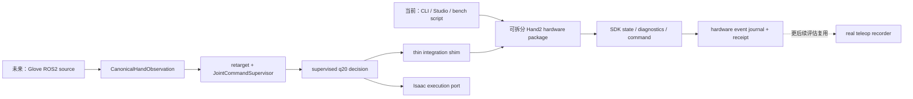

# 015：Wuji Hand2 Beta1 真机 Bring-up、仿真解耦与遥操作采集预埋计划

- 状态：实施中；右手 H0–H3 已通过，H4-A live 部分完成、全 20 轴待验收；官方 SDK example 右手遥操作效果正常；左手与项目 ROS2 真机遥操作尚未开始
- 日期：2026-08-11 至 2026-08-14
- 官方软件基线：Wuji SDK / Wuji Studio / Wuji CLI `2026.8.3`
- 设备范围：左右 Wuji Hand2 Beta1；先单手、后双手，先独立台架、后 NERO
- 当前真机证据：双手已到货；右手 H0/H1 通过，H2 通信项按项目 `85%` 下限关闭，H3 五个 S1 轴通过；H4-A 已取得部分逐轴 receipt；2026-08-14 官方 SDK example 的右 Glove→校准 URDF→右 Hand2 功能链由操作者确认正常；长期热平衡、H4-A 全 20 轴、左手和项目 Sim→Real 尚未关闭
- 后续预埋：Glove + Tracker + 双 NERO + 双 Hand2 真机遥操作与数据采集；本计划不实现该业务链
- 依据：2026-08-11 通过官方 `wuji-docs` MCP 读取的 Hand2、SDK、Studio、CLI 文档
- 实施边界：[guard-hand2-hardware-boundary](../skills/guard-hand2-hardware-boundary/SKILL.md)
- 实施状态与证据：[docs/real-hardware/](real-hardware/index.md)

## 0. 结论

真机调试应继续留在当前仓库，但不能并入 Isaac runner，也不能给现有仿真入口增加含糊的
`--real` 开关。正确关系是：

1. 当前设备 bring-up 先建立可独立拆出的 `wujihand-hand2-hardware` 内部 package，不依赖
   Glove、ROS2、Isaac、NERO 或 dataset；
2. 后续真实遥操作阶段再复用 Glove source、ROS2 typed envelope、canonical hand observation、
   retarget、q20 layout 和 `JointCommandSupervisor`；
3. 仿真和真机分别实现独立 execution port、adapter、安全状态机、配置和 Deployment；
4. 真机按 host/device timestamp、sequence 和 command correlation 组织事件，不伪造或复用仿真
   control/physics/render tick 对齐；
5. 真机 executor 是唯一命令写入者，Studio、CLI、诊断脚本和 recorder 不得成为第二个 command owner；
6. 当前 bring-up 只写独立 hardware journal、diagnostics 和 qualification receipt，不接入仿真
   recorder；
7. 当前仿真主线和历史 Deployment 保持不变，真机链从独立、默认只读的入口开始。

当前设备调试的收口点是左右 Hand2 独立 bring-up，不是双臂真机采集。之后另立 ROS2 + Glove
真实 Hand2 遥操作需求；该链稳定后，才评估复用现有采集基础设施并与真实 NERO、Tracker、D405
和 dataset gate 组合。

## 1. 官方软件与推荐测试方法

### 1.1 Hand2 Beta1 可用的官方软件

| 官方组件 | Hand2 Beta1 适用性 | 本项目用途 |
|---|---|---|
| Wuji CLI `2026.8.3` | 官方明确支持 | 首轮发现、身份/网络检查、资源枚举、只读版本检查、日志导出 |
| Wuji Studio `2026.8.3` | 官方明确支持 | 图形化设备管理、状态可视化、Glove 标定、日志与受控固件升级 |
| Wuji SDK `2026.8.3` | 官方明确支持 | 程序化连接、状态/诊断读取、MIT 参数与 effort limit 管理、受控运动 |
| wuji-description `v2026.8.3` | 官方明确支持 | 仿真/可视模型和 Sim→Real 对照，不是真机驱动 |

官方没有在当前 Hand2 文档中提供“一键完成 Hand2 电机验收”的专用测试套件，也未发布可作为
Hand2 Beta1 主线依据的 ROS 2 hardware driver。因此本项目采用官方组件组合出的分层方法：

```text
Wuji CLI 只读发现/握手
  -> Wuji Studio 人工查看身份、状态和日志
  -> Wuji SDK 只读 joint_states/diagnostics/comm_diag
  -> 项目安全状态机下的单关节小动作
  -> 单手全关节脚本
  -> Glove 遥操作
  -> 双手与 NERO 集成
```

以下旧产品不能误用为 Hand2 Beta1 资格依据：

- `Wuji Hand HMI` 的官方适用范围是 Wuji Hand v1；
- `wujihand-upgrader` 的官方适用范围是 Wuji Hand v1；
- `wujihandros2` 的官方适用范围是 Wuji Hand v1；
- Wuji CLI 的 `doctor` 当前只覆盖 Glove 的 EMF/触觉检查，不是 Hand2 硬件健康检查。

所以，官方推荐工具是有的：日常人工检查优先用 **Wuji CLI + Wuji Studio**，可重复的真实控制与
工程验收用 **Wuji SDK**。本仓库的 ROS 2 真机入口应包裹 SDK，而不是复用 v1 ROS 2 驱动。

### 1.2 官方 API 给出的实现约束

- Beta1 默认静态地址为左手 `192.168.1.110`、右手 `192.168.1.111`；主机必须处于同一子网。
- 多设备连接必须显式绑定 serial、address 或 handedness，禁止“扫描到第一台就连接”。
- `joint_states()` 只返回在线关节且长度可变；必须按 `nid` 映射，不能把数组位置当 q20 顺序。
- `joint_command()` 每次发送恰好 20 个 `JointCommand`；发送前必须完成 side、layout、有限值和
  在线关节 Gate。
- 位置单位是 rad，速度是 rad/s，effort 是 A；不得与 Isaac drive 参数混用。
- SDK 8.3 的 joint diagnostics 和 communication summary 应进入 preflight 与运行证据。
- 当前右手固定栈采用 `85%`（含）作为项目 response-rate 下限；低于它才阻断，timeout/transport/
  `comm_diag` counter 保留 receipt 但不独立叠加 Gate。该值不是 Wuji 官方指标，软件、硬件、网络或
  side 变化后必须重新评估。
- Studio 的 Hand2 共享连接是可读写的，多客户端可能相互覆盖命令或参数；正式 SDK 运动测试前
  必须关闭 Studio 的写入会话并确认单一 command owner。
- CLI 若遇到 Studio 占有直接会话，可能退化为只读；这可用于观察，但不能当作 SDK 写入已被隔离的
  充分证明。
- C SDK 在 8.3 的 joint diagnostics ABI 有变化，C 客户端需用新 header 重编译；本项目第一阶段
  使用 Python SDK，避免引入额外 ABI 变量。

## 2. Beta1 安全边界

官方当前约束必须被写成 fail-closed preflight，而不是只放在操作说明里：

- 仅使用 12 V DC；使用官方 12 V / 20 A 电源，供电能力至少 200 W；
- 上电前检查 XT30 极性与连接；运行中不热插拔电源或通信线；
- 断电前先停止运动；固件升级时不得断线、断电或关闭工具；
- 清空手指运动空间，防夹、防坠落、防与机械臂/台架碰撞；
- 环境保持 15–30 ℃、干燥、通风，避免金属和磁性物靠近关节；
- 指部排线脆弱，不把外力、碰撞或抓取负载当作初期验收手段；
- Beta1 不提供可用的指尖触觉；不设计依赖触觉的 Gate；
- 不把关节电流解释为接触力或力矩，不以电流阈值判断抓取成功；
- 软皮仍是 Beta 状态，不做长时间高负载或寿命结论；
- 零位精度仍在改进，首轮禁止自动 `set_origin`，只读取和记录现状。

`clear_fault`、`set_origin`、MIT 参数写入、effort limit 写入、固件升级均是显式维护动作，不能由
普通启动脚本、ROS launch 或 teleoperation Deployment 隐式触发。

## 3. 与现有仿真主线的架构关系

### 3.1 当前独立 bring-up，未来复用控制核心



当前 bring-up 必须保持：

- SDK adapter、readback、diagnostics、安全状态机和 journal 位于独立内部 package；
- package 只认识真实设备协议、host/device 时间、sequence、command correlation 和硬件事件；
- package 不导入 ROS2、canonical controller、Isaac、仿真 Session 或 dataset；
- 设备探针和台架脚本在没有 Isaac、Glove、Tracker、NERO、D405 时可以完整运行。

未来真实遥操作必须复用：

- `CanonicalHandObservation` 及 ROS↔canonical 转换；
- 当前 Glove source 的 lifecycle、identity、sequence、timestamp 和 freshness 语义；
- SDK 8.3 retarget 与左右 q20 layout；
- `JointCommandSupervisor` 的有限值、关节范围、速率、stale、hold/disarm 语义。

上述复用通过薄 integration shim 完成，不把 ROS2/application 类型带进 hardware package。现有
recording/checksum 只能在真实遥操作事件稳定后按组件逐项评估；当前 bring-up 不复用其 runtime。

必须隔离：

- Isaac articulation、control/physics/render tick、contact、drive `kp/kv`；
- Hand2 SDK connection、enable/disable、MIT `kp/kd`、effort limit、diagnostics 和 watchdog；
- 仿真 reset 与真机 fault/origin/estop；
- 仿真 Asset/Binding 与真机 serial/IP/firmware/origin；
- 仿真 qualification 与真机 qualification 的通过结论。

当前 bring-up 不以重构 `GloveHand2SimulationController` 为前置条件。进入真实遥操作阶段时，再把
其中 canonical→retarget→supervisor 逻辑中性化为唯一 Hand2 application controller；允许保留兼容
wrapper，不允许复制长期分叉的 `GloveHand2RealController`。当前 `ports/hand_command.py` 含历史
右手 layout 假设，不能直接扩展为双手真机 port；后续 integration shim 必须使用显式 side + layout
revision contract。

### 3.2 目标目录结构

以下为实施目标，不表示这些文件已存在：

```text
packages/
  wujihand-hand2-hardware/
    pyproject.toml                    # 独立依赖和测试边界
    src/wujihand_hand2_hardware/
      __init__.py
      api.py                          # 小而稳定的公开 facade
      types.py                        # identity/state/diagnostic/command/event
      sdk_client.py                   # SdkManager/connect 生命周期
      mapping.py                      # nid/label 与 SDK 20 关节协议
      readonly.py                     # joint_states/diagnostics/comm_diag/logs
      safety.py                       # 状态机、watchdog、fault Gate
      executor.py                     # 单一 writer、enable/disable/estop
      journal.py                      # bring-up 事件与 receipt；不依赖 dataset
    tests/
      unit/
      contract/

src/wujihand/                         # 后续真实 teleop integration 才修改
  domain/hand2_control.py             # backend-neutral q20 decision/feedback
  ports/hand2_execution.py
  adapters/hardware/
    wuji_hand2_package.py             # package <-> domain/port 薄转换

ros2/
  wujihand_interfaces/msg/            # 后续 REAL_TELEOP_INTEGRATION
    Hand2ControlTrace.msg            # 只发布，不作为外部无监督 command input
    Hand2HardwareState.msg
    Hand2HardwareDiagnostics.msg
  wujihand_hand2_hardware/           # 单独 ROS package，包裹 SDK package
    wujihand_hand2_hardware/
      executor_node.py               # 唯一 SDK command owner
    launch/
      hand2_real_bench.launch.py

tools/
  preflight_wuji_hand2_hardware.py
  qualify_wuji_hand2_hardware_readonly.py
  bringup_wuji_hand2_joint.py
```

依赖方向必须通过 import contract test 固定：

```text
wujihand_hand2_hardware       -X-> wujihand / rclpy / Isaac / USD / dataset
main-repo integration shim    -> wujihand_hand2_hardware + domain/ports
ROS hardware package          -> integration shim + wujihand_interfaces
simulation adapter            -X-> wuji_sdk / hardware package
```

hardware package 仅依赖 Python 基础库、`wuji_sdk` 和自身值对象；不解析主仓库五层仿真配置。这样
package 可在未来连同 contract tests 独立发布或迁出，而 retarget/canonical/supervisor 仍由主仓库保持
唯一实现。

### 3.3 配置与 Deployment 结构

真机事实不塞进现有仿真 Asset/Binding，也不让缺省值在两个 backend 之间回落：

```text
configs/hardware/
  wuji_hand2_beta1_sdk_v2026_8_3_v1.yaml       # 产品/API/layout 事实，无设备身份
configs/profiles/
  wuji_hand2_beta1_real_readonly_v1.yaml       # 禁止写入
  wuji_hand2_beta1_real_bench_v1.yaml          # 有界台架策略
configs/qualifications/
  wuji_hand2_beta1_hardware_readonly_v1.yaml
  wuji_hand2_beta1_hardware_motion_v1.yaml
configs/deployments/
  workstation2_wuji_hand2_real_bench_v1.yaml
configs/examples/
  workstation2_wuji_hand2_real_local_binding.example.yaml
configs/local/                                  # Git 忽略
  workstation2_wuji_hand2_real_local_binding.yaml
```

portable 配置只写 schema、SDK/API/layout 和安全策略；serial、实际 IP、MAC、固件 readback、硬件版、
零位状态、校准 URDF 本地路径等写入 `configs/local/` 和 qualification receipt。Glove 的 Studio 8.3
用户校准 URDF 只在进入后续 teleoperation Gate 时检查 side/hash，不是 Hand2 真机模型，也不是 H0/H1
只读连接的依赖。

hardware package 接收已解析的 typed config，不导入主仓库 resolver。当前 bring-up CLI 直接读取专用
hardware/local profile；进入 ROS2 teleop 后，Deployment 才显式声明
`backend: wuji_hand2_hardware`。其 schema 禁止出现 Isaac drive 字段；禁止自动发现后选择目标、禁止从
仿真配置推导真机参数。

## 4. 分阶段实施计划

### H0：官方工具与供电基线（只读）

目标：在不发送运动命令、不写参数、不升级固件的前提下确认两只手可识别。

1. 记录 CLI、Studio、Python SDK 的精确版本、安装来源与 hash；
2. 按官方电源和环境要求完成上电前人工 checklist；
3. 每次只接一只手，使用 `wuji devices --json` 发现设备；
4. 用 `wuji ping --sn <SN> --json` 完成具名握手；
5. 用 `wuji resources --sn <SN> --json` 枚举资源；
6. 读取 firmware version、serial、handedness、address；
7. 仅运行 `wuji upgrade --check --json` 查看升级状态，不执行 upgrade；
8. 在 Studio 中核对同一身份、状态和日志后退出写入会话；
9. 左右手各产出独立 receipt，禁止用左手通过替代右手。

通过标准：serial/IP/side/firmware 唯一且一致；网络无地址冲突；无非预期写入；日志可导出。

### H1：内部 hardware package 与无设备验证

目标：建立不依赖主仓库 application/runtime 的 SDK 依赖岛，并证明它不会触达 Isaac 主线。

1. 初始化 `packages/wujihand-hand2-hardware` 的独立 `pyproject.toml`、facade、值对象和 tests；
2. 建立 SDK client、`nid`/label mapping、read-only、safety、executor 和 event journal 边界；
3. 用 fake SDK 覆盖断连、少关节、错误 side、错 serial、NaN、stale、fault、超温/欠压、通信丢包；
4. 建立 `disconnected -> read_only -> armed -> enabled -> faulted/estopped` 状态机；
5. 验证未显式 arm 时永不调用 `enable` 或 `joint_command().send()`；
6. 建立 dependency/import Gate，拒绝 `wujihand`、ROS、Isaac、USD、dataset import；
7. 验证 package 的 read-only CLI 与测试可在无 Isaac、无 ROS、无设备环境运行。

通过标准：hardware package 可独立构建/测试；只依赖 `wuji_sdk` 和自身类型；本阶段不修改仿真代码。

### H2：SDK 8.3 单手只读资格验证

目标：用项目 adapter 读取真实设备，不使能、不写参数、不发送 command。

1. 显式按 SN + side + address 连接，先左后右；
2. 读取 serial、firmware、hardware revision、handedness、online joint count；
3. 连续采集 `joint_states()`、`joint_diagnostics()` 和 `comm_diag()`；
4. 按 `nid` 建立 q20 映射，要求 20 个预期关节全部在线、唯一且名称/单位匹配；
5. 记录 status word、current、vbus、temperature、error、e2e loss、retry、timeout、SDK dropped；
6. 测试拔除网络/进程退出后的可控断连，不做运行中热插拔电源；
7. 导出 SDK/设备日志和机器环境 snapshot。

通过标准：左右分别连续稳定读回；无未知错误；response rate 不低于冻结门槛；退出后连接释放；
零写入。当前仅右手完成，冻结门槛为项目 `85%`；通信计数作为观测证据。左手不得继承该结论。

### H3：单手、单关节、有界运动

目标：在空载台架上验证 SDK 命令语义、方向、零位和 watchdog。

前置条件：H0-H2 全部通过；独立急停/断能路径已验证；操作者在场；Studio 关闭；明确唯一
command owner。

1. 先用 fake SDK 验证全部写入路径和停止路径；
2. 从设备 readback/官方支持确认 MIT 参数与 effort limit，禁止引用 Isaac `kp/kv`；
3. 显式人工 arm，仅使能一只手；
4. 每次只测一个关节、小位移、低速、短时，核对正负方向和 observed/commanded q；
5. 对每指先测近端再逐步扩展，不执行闭合抓取或负载测试；
6. 人工停止、watchdog timeout、SDK 断连和异常诊断均必须触发 fail-closed；
7. 每次结束先停止并 disable，再按官方流程断电。

通过标准：方向/单位/零位无歧义；超时和故障可靠停止；无参数漂移；每个动作有 receipt 和视频。

右手实施状态（2026-08-13）：限定 `right-s1-flexion-v1` 已完成 thumb/index/middle/ring/pinky 五个
S1 轴串行往返，自动检查与操作者可见性观察均通过；证据与适用边界见
[`docs/real-hardware/wuji-hand2-right-h3-bounded-motion.md`](real-hardware/wuji-hand2-right-h3-bounded-motion.md)。
这不等于 H4、S2/S3/S4、多关节同步、闭合抓取或负载通过。

### H4：单手 20 关节独立台架脚本

目标：验证一只手的全关节映射，不引入 Glove、ROS2、Isaac、NERO 或 dataset。

- H4-A 先用 hardware package 自带脚本串行验收全部 20 轴，每次只使能一个关节；
- H4-A live 继续冻结 20 轴方向与隔离事实；它只审计 mapping，不作为跟踪性能 benchmark；
- 功能手型不再在 hardware package 内另写 H4-B executor，改用固定版本的官方 SDK teleoperation
  example 与人工张开、分指、屈伸、对指观察；官方 example 对 MIT/effort 的写入必须记录，且不能与
  H4-A 同时成为 command owner；
- 只比较 attempted command、SDK result 和真实 observed state，不同步驱动数字孪生；
- 检查每个 `nid`、关节方向、范围、跟踪误差、迟滞、抖动、温升与通信健康；
- 左右手分别验收；不把镜像关系当作相同 mapping 的证据；
- 全程写 hardware event journal、diagnostics 和 receipt，不启动 rosbag/episode recorder。

通过标准：H4-A 无串指/错向、20 轴均有非零 readback 并经人工确认；官方 example 的功能手型由
操作者确认正常；诊断无持续恶化；hardware package 可在无主仓库仿真 runtime 的环境独立复验。
H0-H4 通过即表示“设备调试阶段”收口，但不表示项目 ROS2 真机遥操作已完成。

右手详细实施计划见
[`docs/real-hardware/wuji-hand2-right-h4-full-joint-bench.md`](real-hardware/wuji-hand2-right-h4-full-joint-bench.md)。

### T0：后续 ROS2 真机集成（另立需求）

目标：复用现有 ROS2 输入流程，但不复用仿真 tick 和 executor。

- 建立 main-repo integration shim 和独立 `wujihand_hand2_hardware` ROS package；
- 中性化唯一 canonical→retarget→supervisor controller，不复制 real-only controller；
- ROS hardware executor 成为唯一 SDK command owner；
- 使用 `INPUT_OBSERVED`、`DECISION_PRODUCED`、`COMMAND_ATTEMPTED`、`COMMAND_ACCEPTED/FAILED`、
  `HARDWARE_STATE_OBSERVED`、`DIAGNOSTIC_OBSERVED` 和 `SAFETY_TRANSITION` 等事件；
- 事件按 host/device timestamp、sequence 和 command correlation 关联，不填 simulation tick；
- 验证默认仿真入口继续零真机发现和写入。

### T1：后续 Glove 单手、再双手遥操作（另立需求）

- 复用 Studio 8.3 calibrated 用户左右 URDF、SDK 8.3 retarget 和 canonical pipeline；
- preflight 校验用户、side、URDF hash、Glove serial、Hand2 serial、SDK/firmware 和 q20 layout；
- 先单手完成张开、握拳、逐指和四组对指，再做双手并发；
- stale、低 confidence、网络异常或任一硬件 Gate 失败时 hold/disable；
- NERO 保持断电或物理隔离；不在该阶段引入仿真 recorder 或训练 episode。

### D0：未来真实遥操作数据采集（仅预埋）

真实 teleop 事件链稳定后另立需求，目标链为：

```text
Glove + Tracker
  -> canonical hand/arm intent
  -> supervisors
  -> 双 NERO + 双 Hand2 hardware executors
  -> D405 / operator preview / rosbag
  -> integrity gate -> quality gate -> dataset release
```

当前计划只要求 hardware package 事件可以被未来 integration shim 投影到该链，不新增真实 NERO
控制、不启动 D405、不采集训练 episode，也不要求同步运行 Isaac。届时逐项评估复用现有 manifest、
checksum、integrity/quality gate；仿真 truth 和 tick 对齐逻辑不复用。

## 5. 真机事件与遥操作采集的预埋契约

当前 hardware journal 和未来 ROS2/recorder 使用相同的因果事件结构，但不是同一个 runtime。每个
事件至少保存 `event_id`、event kind、side/serial、host monotonic time、可用的 device
timestamp/sequence、command correlation id、safety state 和 payload schema revision。

未来 recorder 必须保存以下因果事实：

| 层级 | 必须保存 |
|---|---|
| 输入 | Glove canonical observation、Tracker pose、identity、sequence、device/host timestamp、confidence |
| 决策 | retarget q20、supervised q20、限幅/拒绝/hold 原因、safety state |
| 执行 | attempted command、SDK send/result、command owner、command correlation id、host/device time |
| 反馈 | observed q20、velocity、effort、电压、温度、status/error、communication summary |
| 身份 | Hand2 serial/side/hw/firmware、SDK wheel、Glove serial/校准 URDF hash、layout revision |
| 视觉/机械臂 | D405 frame identity、NERO command/readback、安全事件；在后续需求中实现 |

规则：

- hardware-only 诊断保留独立 topic，不伪装成仿真 contact 或 rigid-body truth；
- 真实数据不得生成虚假的 Isaac ground-truth topic；
- 不要求 input、command 和 feedback 一一同 tick；保留原始事件后按因果 ID/时间离线关联；
- input、decision、attempted command、ack/readback 必须分开，不能只存“最终 q”；
- 当前 H0-H4 只写 package 自带 journal/receipt，不启动现有 rosbag、episode 或 dataset runtime；
- qualification run 默认 `qualification_only=true`、`dataset_eligible=false`；
- 只有真实任务完成度、视野、动作多样性、抖动、手指参与度和完整性 Gate 通过后才能提升数据资格；
- 紧急停止、通信异常、设备 fault 或人工接管必须成为可见 safety event，并切断 episode eligibility；
- Glove calibration URDF 和设备私密身份只记录 hash/receipt，不复制用户文件到数据集或仓库。

## 6. 固件策略

官方建议 SDK、Studio 和 firmware 保持兼容的最新组合，但这不构成“发现新版本即自动升级”的授权。
本项目执行：

1. H0 只读当前版本和 `upgrade --check`；
2. 先用当前固件完成身份、只读状态和日志备份；
3. 若官方兼容矩阵明确要求升级，另开显式维护步骤并由操作者批准；
4. 每次只升级一只手，保证供电与网络稳定，禁止 Studio/CLI/SDK 多方竞争；
5. 升级后从 H0、H2 重新验收，再授权 H3；
6. firmware、SDK、Studio 任一变化均使既有硬件 qualification receipt 失效。

## 7. 证据目录与报告

建议每次运行写入不入库 artifact，正式结论另写 `docs/validation/`：

```text
artifacts/validation/wuji-hand2-hardware-<date>/
  manifest.json
  environment.json
  left/
    identity.json
    joint_states.jsonl
    joint_diagnostics.jsonl
    comm_diag.jsonl
    logs/
  right/
    ...
  events.jsonl                    # host/device time + sequence + correlation
  commands.jsonl                  # H3 以后才存在
  safety_events.jsonl
  checksums.sha256
  qualification.json
```

每份报告至少锁定：git commit、配置 hash、SDK distribution/wheel hash、CLI/Studio version、设备
serial/side/IP/hw/firmware、q20 layout revision、操作者、command owner、开始/结束时间、通过 Gate 和
未通过项。身份原文若含敏感信息，只在本地 artifact 保存，正式文档使用必要的脱敏标识。

## 8. Definition of Done

当前设备调试阶段（H0-H4）完成需要同时满足：

- 左右 Hand2 在 CLI/Studio/SDK 三侧身份一致；
- SDK 8.3 只读状态、joint diagnostics、comm diagnostics 和日志导出可重复；
- q20↔`nid` 左右 mapping 有 contract test，少/重/未知关节 fail closed；
- `wujihand-hand2-hardware` 可独立构建/测试，公开 facade 稳定且无主仓库/ROS/Isaac/dataset import；
- arm/enable/disable/estop/watchdog/fault 状态机通过 fake SDK 和真机受控测试；
- 左右单关节和全关节独立脚本资格验证通过；
- hardware journal 保留 host/device 时间、sequence、command correlation 和 safety transition；
- 当前仿真/ROS2/record 代码未成为 bring-up 依赖，默认仿真运行零真机访问；
- 所有真机参数都来自受控 readback/官方依据，不复用 Isaac drive 值；
- Beta1 无触觉、不可用电流判断接触、零位/软皮限制在报告和 Gate 中长期可见。

T0/T1/D0 不属于当前 DoD。它们分别要求 ROS2/canonical 集成、真实 Glove 遥操作和真实双臂数据
采集，必须在后续需求中独立验收，不能由 H0-H4 通过自动继承。

## 9. 开发顺序、难度与首个工作包

当前只推进 `H0 -> H1 -> H2 -> H3 -> H4`。收口后再按独立需求推进 `T0 -> T1`；真实 teleop
事件链稳定后才推进 `D0`。不要先写真机 teleop launch，也不要在双手/双臂系统中首次验证 joint
mapping。

| 工作包 | 难度 | 主要风险 |
|---|---|---|
| H0 官方工具基线 | 低 | 工具会话竞争、设备身份记错 |
| H1 内部 hardware package + fake SDK | 中 | SDK 依赖泄漏、历史 layout 假设、可拆包性 |
| H2 双手只读 adapter | 中 | `nid` 映射、在线关节变化、通信诊断门槛 |
| H3 单关节运动 | 中高 | 真机参数、零位/方向、watchdog 与急停 |
| H4 全手独立脚本 | 中高 | 串指、抖动、温升与双设备身份 |
| T0-T1 ROS2/Glove（后续） | 中高 | 事件时间、stale、双设备带宽与 command ownership |
| D0 真实采集（更后续） | 高 | 把硬件/teleop 通过误扩张为数据质量通过 |

当前首个真机实现提交覆盖公共 H1 package 与右手 H0–H3 限定台架验收；不修改仿真 controller、
ROS2 或 dataset。H4、左手和后续真实遥操作继续作为独立需求，便于审查和轻量撤回。

## 10. 官方依据

以下页面均由 `wuji-docs` MCP 于 2026-08-11 读取；`latest` 是官方滚动入口，实际资格报告必须再
记录页面显示版本和本地软件/固件 readback，不能把未来滚动内容追溯套用到本计划。

- [Wuji Hand2 文档首页](https://docs.wuji.tech/docs/zh/wuji-hand/latest/)
- [Wuji Hand2 用户须知](https://docs.wuji.tech/docs/zh/wuji-hand/latest/user-notice/)
- [Wuji Hand2 使用约束](https://docs.wuji.tech/docs/zh/wuji-hand/latest/usage-constraints/)
- [Wuji Hand2 SDK Reference](https://docs.wuji.tech/docs/zh/wuji-hand/latest/sdk-reference/)
- [Wuji SDK 发布记录](https://docs.wuji.tech/docs/zh/wuji-sdk/latest/release-notes/)
- [Wuji SDK 设备连接](https://docs.wuji.tech/docs/zh/wuji-sdk/latest/device-connection/)
- [Wuji Studio 首页](https://docs.wuji.tech/docs/zh/wuji-studio/latest/)
- [Wuji Studio 设备连接](https://docs.wuji.tech/docs/zh/wuji-studio/latest/device-connection/)
- [Wuji Studio 设备日志](https://docs.wuji.tech/docs/zh/wuji-studio/latest/visualization/device-logs/)
- [Wuji Studio 固件升级](https://docs.wuji.tech/docs/zh/wuji-studio/latest/firmware-upgrade/)
- [Wuji CLI 首页](https://docs.wuji.tech/docs/zh/wuji-cli/latest/)
- [Wuji CLI 设备管理](https://docs.wuji.tech/docs/zh/wuji-cli/latest/device-management/)
- [Wuji CLI 参数与资源](https://docs.wuji.tech/docs/zh/wuji-cli/latest/parameters/)
- [Wuji CLI 日志导出](https://docs.wuji.tech/docs/zh/wuji-cli/latest/logs/)
- [Wuji CLI Doctor](https://docs.wuji.tech/docs/zh/wuji-cli/latest/doctor/)
- [Wuji CLI 固件升级](https://docs.wuji.tech/docs/zh/wuji-cli/latest/firmware-upgrade/)
- [Wuji Hand HMI（仅 Wuji Hand v1）](https://docs.wuji.tech/docs/zh/wuji-hand-hmi/latest/)
- [Wuji Hand Upgrader（仅 Wuji Hand v1）](https://docs.wuji.tech/docs/zh/wuji-hand-upgrader/latest/)
- [Wuji Hand ROS2（仅 Wuji Hand v1）](https://docs.wuji.tech/docs/zh/wujihandros2/latest/)
