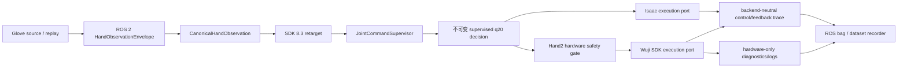

# 015：Wuji Hand2 Beta1 真机 Bring-up、仿真解耦与遥操作采集预埋计划

- 状态：设计完成，待实施；当前不授权真机运动、参数写入或固件升级
- 日期：2026-08-11
- 官方软件基线：Wuji SDK / Wuji Studio / Wuji CLI `2026.8.3`
- 设备范围：左右 Wuji Hand2 Beta1；先单手、后双手，先独立台架、后 NERO
- 当前真机证据：双手已到货，但本仓库仍为零真机资格验证、零 Sim→Real 结论
- 后续预埋：Glove + Tracker + 双 NERO + 双 Hand2 真机遥操作与数据采集；本计划不实现该业务链
- 依据：2026-08-11 通过官方 `wuji-docs` MCP 读取的 Hand2、SDK、Studio、CLI 文档

## 0. 结论

真机调试应继续留在当前仓库，但不能并入 Isaac runner，也不能给现有仿真入口增加含糊的
`--real` 开关。正确关系是：

1. 复用 Glove source、ROS 2 typed envelope、canonical hand observation、retarget、q20 layout 和
   `JointCommandSupervisor`；
2. 仿真和真机分别实现独立 execution port、adapter、安全状态机、配置和 Deployment；
3. 同一个 control tick 只生成一份不可变的 supervised q20 decision，再由明确选择的 backend 执行；
4. 真机 executor 是唯一命令写入者，Studio、CLI、诊断脚本和 recorder 不得成为第二个 command owner；
5. 真机 readback、通信、温度、电压、错误码等证据独立保存，只向共同录制层投影可比较字段；
6. 当前仿真主线和历史 Deployment 保持不变，真机链从独立、默认只读的入口开始。

完成本计划不等于完成双臂真机采集。它先建立 Hand2 真机可信执行后端；未来再把该后端与真实
NERO、Tracker、Glove、D405 和 dataset gate 组合。

## 1. 官方软件与推荐测试方法

### 1.1 Hand2 Beta1 可用的官方软件

| 官方组件 | Hand2 Beta1 适用性 | 本项目用途 |
|---|---|---|
| Wuji CLI `2026.8.3` | 官方明确支持 | 首轮发现、身份/网络检查、资源枚举、只读版本检查、日志导出 |
| Wuji Studio `2026.8.3` | 官方明确支持 | 图形化设备管理、状态可视化、Glove 标定、日志与受控固件升级 |
| Wuji SDK `2026.8.3` | 官方明确支持 | 程序化连接、状态/诊断读取、MIT 参数与 effort limit 管理、受控运动 |
| wuji-description `v2026.8.3` | 官方明确支持 | 仿真/可视模型和 Sim→Real 对照，不是真机驱动 |

官方没有在当前 Hand2 文档中提供“一键完成 Hand2 电机验收”的专用测试套件，也未发布可作为
Hand2 Beta1 主线依据的 ROS 2 hardware driver。因此本项目采用官方组件组合出的分层方法：

```text
Wuji CLI 只读发现/握手
  -> Wuji Studio 人工查看身份、状态和日志
  -> Wuji SDK 只读 joint_states/diagnostics/comm_diag
  -> 项目安全状态机下的单关节小动作
  -> 单手全关节脚本
  -> Glove 遥操作
  -> 双手与 NERO 集成
```

以下旧产品不能误用为 Hand2 Beta1 资格依据：

- `Wuji Hand HMI` 的官方适用范围是 Wuji Hand v1；
- `wujihand-upgrader` 的官方适用范围是 Wuji Hand v1；
- `wujihandros2` 的官方适用范围是 Wuji Hand v1；
- Wuji CLI 的 `doctor` 当前只覆盖 Glove 的 EMF/触觉检查，不是 Hand2 硬件健康检查。

所以，官方推荐工具是有的：日常人工检查优先用 **Wuji CLI + Wuji Studio**，可重复的真实控制与
工程验收用 **Wuji SDK**。本仓库的 ROS 2 真机入口应包裹 SDK，而不是复用 v1 ROS 2 驱动。

### 1.2 官方 API 给出的实现约束

- Beta1 默认静态地址为左手 `192.168.1.110`、右手 `192.168.1.111`；主机必须处于同一子网。
- 多设备连接必须显式绑定 serial、address 或 handedness，禁止“扫描到第一台就连接”。
- `joint_states()` 只返回在线关节且长度可变；必须按 `nid` 映射，不能把数组位置当 q20 顺序。
- `joint_command()` 每次发送恰好 20 个 `JointCommand`；发送前必须完成 side、layout、有限值和
  在线关节 Gate。
- 位置单位是 rad，速度是 rad/s，effort 是 A；不得与 Isaac drive 参数混用。
- SDK 8.3 的 joint diagnostics 和 communication summary 应进入 preflight 与运行证据。
- Studio 的 Hand2 共享连接是可读写的，多客户端可能相互覆盖命令或参数；正式 SDK 运动测试前
  必须关闭 Studio 的写入会话并确认单一 command owner。
- CLI 若遇到 Studio 占有直接会话，可能退化为只读；这可用于观察，但不能当作 SDK 写入已被隔离的
  充分证明。
- C SDK 在 8.3 的 joint diagnostics ABI 有变化，C 客户端需用新 header 重编译；本项目第一阶段
  使用 Python SDK，避免引入额外 ABI 变量。

## 2. Beta1 安全边界

官方当前约束必须被写成 fail-closed preflight，而不是只放在操作说明里：

- 仅使用 12 V DC；使用官方 12 V / 20 A 电源，供电能力至少 200 W；
- 上电前检查 XT30 极性与连接；运行中不热插拔电源或通信线；
- 断电前先停止运动；固件升级时不得断线、断电或关闭工具；
- 清空手指运动空间，防夹、防坠落、防与机械臂/台架碰撞；
- 环境保持 15–30 ℃、干燥、通风，避免金属和磁性物靠近关节；
- 指部排线脆弱，不把外力、碰撞或抓取负载当作初期验收手段；
- Beta1 不提供可用的指尖触觉；不设计依赖触觉的 Gate；
- 不把关节电流解释为接触力或力矩，不以电流阈值判断抓取成功；
- 软皮仍是 Beta 状态，不做长时间高负载或寿命结论；
- 零位精度仍在改进，首轮禁止自动 `set_origin`，只读取和记录现状。

`clear_fault`、`set_origin`、MIT 参数写入、effort limit 写入、固件升级均是显式维护动作，不能由
普通启动脚本、ROS launch 或 teleoperation Deployment 隐式触发。

## 3. 与现有仿真主线的架构关系

### 3.1 唯一控制核心、两个执行后端



必须复用：

- `CanonicalHandObservation` 及 ROS↔canonical 转换；
- 当前 Glove source 的 lifecycle、identity、sequence、timestamp 和 freshness 语义；
- SDK 8.3 retarget 与左右 q20 layout；
- `JointCommandSupervisor` 的有限值、关节范围、速率、stale、hold/disarm 语义；
- replay、qualification trace 和现有 recording/checksum 基础设施。

必须隔离：

- Isaac articulation、physics tick、contact、drive `kp/kv`；
- Hand2 SDK connection、enable/disable、MIT `kp/kd`、effort limit、diagnostics 和 watchdog；
- 仿真 reset 与真机 fault/origin/estop；
- 仿真 Asset/Binding 与真机 serial/IP/firmware/origin；
- 仿真 qualification 与真机 qualification 的通过结论。

当前 `GloveHand2SimulationController` 中的 canonical→retarget→supervisor 逻辑应中性化为唯一
Hand2 application controller；允许保留兼容 wrapper，不允许复制一份长期分叉的
`GloveHand2RealController`。当前 `ports/hand_command.py` 含有历史右手 layout 假设，不能直接扩展为
双手真机 port；应先建立显式 side + layout revision 的新 contract。

### 3.2 目标目录结构

以下为实施目标，不表示这些文件已存在：

```text
src/wujihand/
  domain/
    hand2_control.py                 # backend-neutral q20 decision/feedback
    hand2_hardware.py                # 无 SDK import 的身份、诊断与安全状态值对象
  ports/
    hand2_execution.py               # 仿真/真机共同的最小执行契约
    hand2_hardware.py                # readback、diagnostics、arm/disable/estop 契约
  application/
    teleoperation/
      glove_hand2.py                 # 中性化后的唯一 retarget + supervisor controller
    qualification/
      hand2_hardware.py              # H0-H5 Gate 与报告编排
  adapters/
    simulation/
      hand2_execution.py             # 包裹现有 Isaac 执行实现
    hardware/
      wuji_hand2/
        __init__.py
        sdk_client.py                # SdkManager/connect 生命周期
        identity.py                  # SN/IP/side/hw/firmware 校验
        mapping.py                   # nid <-> canonical q20，拒绝位置猜测
        readonly.py                  # joint_states/diagnostics/comm_diag
        executor.py                  # 单一 writer、watchdog、enable/disable/estop
        evidence.py                  # SDK/device log 与只读 snapshot
  runtime/
    hardware/
      wuji_hand2_preflight.py
      wuji_hand2_bench.py
      wuji_hand2_compare.py

ros2/
  wujihand_interfaces/msg/
    Hand2ControlTrace.msg            # 只发布，不作为外部无监督 command input
    Hand2HardwareState.msg
    Hand2HardwareDiagnostics.msg
  wujihand_ros2/wujihand_ros2/nodes/
    hand2_hardware_executor.py        # 唯一 SDK command owner
  wujihand_ros2/launch/
    hand2_real_bench.launch.py
    hand2_sim_real_compare.launch.py

tools/
  preflight_wuji_hand2_hardware.py
  qualify_wuji_hand2_hardware_readonly.py
  bringup_wuji_hand2_joint.py
```

依赖方向必须通过 import contract test 固定：

```text
domain / ports / application  -X-> Isaac / rclpy / wuji_sdk
simulation adapter            -X-> wuji_sdk
hardware adapter              -X-> Isaac / USD / simulation clock
```

### 3.3 配置与 Deployment 结构

真机事实不塞进现有仿真 Asset/Binding，也不让缺省值在两个 backend 之间回落：

```text
configs/hardware/
  wuji_hand2_beta1_sdk_v2026_8_3_v1.yaml       # 产品/API/layout 事实，无设备身份
configs/profiles/
  wuji_hand2_beta1_real_readonly_v1.yaml       # 禁止写入
  wuji_hand2_beta1_real_bench_v1.yaml          # 有界台架策略
configs/qualifications/
  wuji_hand2_beta1_hardware_readonly_v1.yaml
  wuji_hand2_beta1_hardware_motion_v1.yaml
configs/deployments/
  workstation2_wuji_hand2_real_bench_v1.yaml
configs/examples/
  workstation2_wuji_hand2_real_local_binding.example.yaml
configs/local/                                  # Git 忽略
  workstation2_wuji_hand2_real_local_binding.yaml
```

portable 配置只写 schema、SDK/API/layout 和安全策略；serial、实际 IP、MAC、固件 readback、硬件版、
零位状态、校准 URDF 本地路径等写入 `configs/local/` 和 qualification receipt。Glove 的 Studio 8.3
用户校准 URDF 只在进入 teleoperation Gate 时检查 side/hash，不是 Hand2 真机模型，也不是 H0/H1
只读连接的依赖。

Deployment 必须显式声明 `backend: simulation` 或 `backend: wuji_hand2_hardware`，且 schema 禁止同时
出现 Isaac drive 与硬件 MIT 参数。禁止自动发现后选择目标、禁止从仿真配置推导真机参数。

## 4. 分阶段实施计划

### H0：官方工具与供电基线（只读）

目标：在不发送运动命令、不写参数、不升级固件的前提下确认两只手可识别。

1. 记录 CLI、Studio、Python SDK 的精确版本、安装来源与 hash；
2. 按官方电源和环境要求完成上电前人工 checklist；
3. 每次只接一只手，使用 `wuji devices --json` 发现设备；
4. 用 `wuji ping --sn <SN> --json` 完成具名握手；
5. 用 `wuji resources --sn <SN> --json` 枚举资源；
6. 读取 firmware version、serial、handedness、address；
7. 仅运行 `wuji upgrade --check --json` 查看升级状态，不执行 upgrade；
8. 在 Studio 中核对同一身份、状态和日志后退出写入会话；
9. 左右手各产出独立 receipt，禁止用左手通过替代右手。

通过标准：serial/IP/side/firmware 唯一且一致；网络无地址冲突；无非预期写入；日志可导出。

### H1：控制核心中性化与无设备验证

目标：先证明新增硬件边界不会污染已通过的 Isaac 主线。

1. 用固定 canonical fixture 冻结当前左右 q20 decision 作为重构 oracle；
2. 中性化 `GloveHand2SimulationController`，输出不可变 supervised decision；
3. 新建 execution/hardware ports 和 SDK adapter 骨架；
4. 用 fake SDK 覆盖断连、少关节、错误 side、错 serial、NaN、stale、fault、超温/欠压、通信丢包；
5. 建立 `disconnected -> read_only -> armed -> enabled -> faulted/estopped` 状态机；
6. 验证未显式 arm 时永不调用 `enable` 或 `joint_command().send()`；
7. 跑完现有仿真、Glove、ROS 2 record 回归，历史 Deployment 输出不变。

通过标准：sim-only 环境无需安装 `wuji_sdk`；hardware-only 环境无需 Isaac；现有仿真入口行为不变。

### H2：SDK 8.3 单手只读资格验证

目标：用项目 adapter 读取真实设备，不使能、不写参数、不发送 command。

1. 显式按 SN + side + address 连接，先左后右；
2. 读取 serial、firmware、hardware revision、handedness、online joint count；
3. 连续采集 `joint_states()`、`joint_diagnostics()` 和 `comm_diag()`；
4. 按 `nid` 建立 q20 映射，要求 20 个预期关节全部在线、唯一且名称/单位匹配；
5. 记录 status word、current、vbus、temperature、error、e2e loss、retry、timeout、SDK dropped；
6. 测试拔除网络/进程退出后的可控断连，不做运行中热插拔电源；
7. 导出 SDK/设备日志和机器环境 snapshot。

通过标准：左右分别连续稳定读回；无未知错误；通信摘要在冻结门槛内；退出后连接释放；零写入。
门槛数值在首轮 readback 后冻结，不能凭仿真或经验预填。

### H3：单手、单关节、有界运动

目标：在空载台架上验证 SDK 命令语义、方向、零位和 watchdog。

前置条件：H0-H2 全部通过；独立急停/断能路径已验证；操作者在场；Studio 关闭；明确唯一
command owner。

1. 先用 fake SDK 验证全部写入路径和停止路径；
2. 从设备 readback/官方支持确认 MIT 参数与 effort limit，禁止引用 Isaac `kp/kv`；
3. 显式人工 arm，仅使能一只手；
4. 每次只测一个关节、小位移、低速、短时，核对正负方向和 observed/commanded q；
5. 对每指先测近端再逐步扩展，不执行闭合抓取或负载测试；
6. 人工停止、watchdog timeout、SDK 断连和异常诊断均必须触发 fail-closed；
7. 每次结束先停止并 disable，再按官方流程断电。

通过标准：方向/单位/零位无歧义；超时和故障可靠停止；无参数漂移；每个动作有 receipt 和视频。

### H4：单手 20 关节脚本与数字孪生对照

目标：验证一只手的全关节映射，不引入 Glove 和 NERO。

- 执行张开、分指、逐指屈伸和四组对指的低速脚本；
- 同步驱动/回放 Isaac Hand2 8.3，比较 commanded、supervised、sim observed 和 real observed q20；
- 检查每个 `nid`、关节方向、范围、跟踪误差、迟滞、抖动、温升与通信健康；
- 左右手分别验收；不把镜像关系当作相同 mapping 的证据。

通过标准：无串指/错向；跟踪误差和抖动门槛由安全样本冻结；诊断无持续恶化。

### H5：Glove 单手、再双手遥操作

目标：在 NERO 不运动的条件下验证真实 Hand2 遥操作。

- 复用当前 Studio 8.3 calibrated 用户左右 URDF、SDK 8.3 retarget 和 canonical pipeline；
- preflight 校验用户、side、URDF hash、Glove serial、Hand2 serial、SDK/firmware 和 q20 layout；
- 先单手完成张开、握拳、逐指和四组对指；再做双手并发；
- 保留 input→retarget→supervisor→attempted command→ack/readback 的完整 trace；
- stale、低 confidence、网络异常或任一硬件 Gate 失败时 hold/disable，禁止继续发送旧命令；
- NERO 保持断电或由物理隔离确保不运动。

通过标准：五指和对指映射正确；无持续抖动、错误镜像或跨手串扰；双手通信和控制周期稳定。

### H6：真实 NERO 集成前的 Sim→Real 收口

目标：把 Hand2 真机后端标记为可被上层组合，但仍不直接开始数据采集。

- 固定左右手硬件 compatibility receipt；
- 对同一 Glove/replay 输入比较仿真和真机 q20，解释而非掩盖机械/软皮/零位差异；
- 验证仿真、真机、sim-real compare 三个入口互不自动发现或误写设备；
- 确认真实 NERO executor 有独立安全 Gate，Hand2 通过不授权机械臂运动；
- 产出面向上层的稳定 `Hand2ExecutionPort` 和 ROS 2 observed/diagnostic topics。

通过标准：真机 Hand2 可以作为显式 backend 被组合；默认仿真入口保持零真机访问。

### H7：未来真实遥操作数据采集（仅预埋）

后续另立需求，目标链为：

```text
Glove + Tracker
  -> canonical hand/arm intent
  -> supervisors
  -> 双 NERO + 双 Hand2 hardware executors
  -> D405 / operator preview / rosbag
  -> integrity gate -> quality gate -> dataset release
```

本计划只要求前置接口可承载该链，不新增真实 NERO 控制、不启动 D405、不采集训练 episode。

## 5. 真机遥操作采集的预埋契约

未来 recorder 必须同时保存以下因果事实：

| 层级 | 必须保存 |
|---|---|
| 输入 | Glove canonical observation、Tracker pose、identity、sequence、device/host timestamp、confidence |
| 决策 | retarget q20、supervised q20、限幅/拒绝/hold 原因、safety state |
| 执行 | attempted command、SDK send/ack 结果、command owner、control tick |
| 反馈 | observed q20、velocity、effort、电压、温度、status/error、communication summary |
| 身份 | Hand2 serial/side/hw/firmware、SDK wheel、Glove serial/校准 URDF hash、layout revision |
| 视觉/机械臂 | D405 frame identity、NERO command/readback、安全事件；在后续需求中实现 |

规则：

- hardware-only 诊断保留独立 topic，不伪装成仿真 contact 或 rigid-body truth；
- 真实数据不得生成虚假的 Isaac ground-truth topic；
- input、decision、attempted command、ack/readback 必须分开，不能只存“最终 q”；
- qualification run 默认 `qualification_only=true`、`dataset_eligible=false`；
- 只有真实任务完成度、视野、动作多样性、抖动、手指参与度和完整性 Gate 通过后才能提升数据资格；
- 紧急停止、通信异常、设备 fault 或人工接管必须成为可见 safety event，并切断 episode eligibility；
- Glove calibration URDF 和设备私密身份只记录 hash/receipt，不复制用户文件到数据集或仓库。

## 6. 固件策略

官方建议 SDK、Studio 和 firmware 保持兼容的最新组合，但这不构成“发现新版本即自动升级”的授权。
本项目执行：

1. H0 只读当前版本和 `upgrade --check`；
2. 先用当前固件完成身份、只读状态和日志备份；
3. 若官方兼容矩阵明确要求升级，另开显式维护步骤并由操作者批准；
4. 每次只升级一只手，保证供电与网络稳定，禁止 Studio/CLI/SDK 多方竞争；
5. 升级后从 H0、H2 重新验收，再授权 H3；
6. firmware、SDK、Studio 任一变化均使既有硬件 qualification receipt 失效。

## 7. 证据目录与报告

建议每次运行写入不入库 artifact，正式结论另写 `docs/validation/`：

```text
artifacts/validation/wuji-hand2-hardware-<date>/
  manifest.json
  environment.json
  left/
    identity.json
    joint_states.jsonl
    joint_diagnostics.jsonl
    comm_diag.jsonl
    logs/
  right/
    ...
  commands.jsonl                  # H3 以后才存在
  safety_events.jsonl
  checksums.sha256
  qualification.json
```

每份报告至少锁定：git commit、配置 hash、SDK distribution/wheel hash、CLI/Studio version、设备
serial/side/IP/hw/firmware、q20 layout revision、操作者、command owner、开始/结束时间、通过 Gate 和
未通过项。身份原文若含敏感信息，只在本地 artifact 保存，正式文档使用必要的脱敏标识。

## 8. Definition of Done

本计划完成需要同时满足：

- 左右 Hand2 在 CLI/Studio/SDK 三侧身份一致；
- SDK 8.3 只读状态、joint diagnostics、comm diagnostics 和日志导出可重复；
- q20↔`nid` 左右 mapping 有 contract test，少/重/未知关节 fail closed；
- backend-neutral controller 已中性化，现有 Isaac/ROS 2/record 回归无行为漂移；
- 真机 adapter 不依赖 Isaac，仿真 adapter 不依赖 `wuji_sdk`；
- arm/enable/disable/estop/watchdog/fault 状态机通过 fake SDK 和真机受控测试；
- 左右单关节、全关节脚本、Glove 单手/双手资格验证通过；
- sim、real、compare 三个入口显式分离，默认仿真运行零真机访问；
- 所有真机参数都来自受控 readback/官方依据，不复用 Isaac drive 值；
- Beta1 无触觉、不可用电流判断接触、零位/软皮限制在报告和 Gate 中长期可见；
- 上层真实 NERO + Hand2 + record 所需的状态、诊断和因果 trace contract 已冻结，但未被误标为
  数据集可用。

## 9. 开发顺序、难度与首个工作包

建议顺序是 `H0 -> H1 -> H2 -> H3 -> H4 -> H5 -> H6`。不要先写完整真机 teleop launch 再补
只读和安全层，也不要在双手/双臂系统中首次验证 joint mapping。

| 工作包 | 难度 | 主要风险 |
|---|---|---|
| H0 官方工具基线 | 低 | 工具会话竞争、设备身份记错 |
| H1 核心中性化 + fake SDK | 中 | 仿真主线行为漂移、历史 layout 假设 |
| H2 双手只读 adapter | 中 | `nid` 映射、在线关节变化、通信诊断门槛 |
| H3 单关节运动 | 中高 | 真机参数、零位/方向、watchdog 与急停 |
| H4-H5 全手/Glove | 中高 | 串指、抖动、stale、双设备带宽与 command ownership |
| H6 上层组合收口 | 中 | 把 Hand2 通过误扩张为 NERO/数据集通过 |

首个可提交工作包应只覆盖 H0-H2：官方 CLI/Studio 基线、controller 中性化、fake SDK、只读 adapter、
左右设备 receipt。H3 必须作为后续单独的显式真机运动变更，便于审查和轻量撤回。

## 10. 官方依据

以下页面均由 `wuji-docs` MCP 于 2026-08-11 读取；`latest` 是官方滚动入口，实际资格报告必须再
记录页面显示版本和本地软件/固件 readback，不能把未来滚动内容追溯套用到本计划。

- [Wuji Hand2 文档首页](https://docs.wuji.tech/docs/zh/wuji-hand/latest/)
- [Wuji Hand2 用户须知](https://docs.wuji.tech/docs/zh/wuji-hand/latest/user-notice/)
- [Wuji Hand2 使用约束](https://docs.wuji.tech/docs/zh/wuji-hand/latest/usage-constraints/)
- [Wuji Hand2 SDK Reference](https://docs.wuji.tech/docs/zh/wuji-hand/latest/sdk-reference/)
- [Wuji SDK 发布记录](https://docs.wuji.tech/docs/zh/wuji-sdk/latest/release-notes/)
- [Wuji SDK 设备连接](https://docs.wuji.tech/docs/zh/wuji-sdk/latest/device-connection/)
- [Wuji Studio 首页](https://docs.wuji.tech/docs/zh/wuji-studio/latest/)
- [Wuji Studio 设备连接](https://docs.wuji.tech/docs/zh/wuji-studio/latest/device-connection/)
- [Wuji Studio 设备日志](https://docs.wuji.tech/docs/zh/wuji-studio/latest/visualization/device-logs/)
- [Wuji Studio 固件升级](https://docs.wuji.tech/docs/zh/wuji-studio/latest/firmware-upgrade/)
- [Wuji CLI 首页](https://docs.wuji.tech/docs/zh/wuji-cli/latest/)
- [Wuji CLI 设备管理](https://docs.wuji.tech/docs/zh/wuji-cli/latest/device-management/)
- [Wuji CLI 参数与资源](https://docs.wuji.tech/docs/zh/wuji-cli/latest/parameters/)
- [Wuji CLI 日志导出](https://docs.wuji.tech/docs/zh/wuji-cli/latest/logs/)
- [Wuji CLI Doctor](https://docs.wuji.tech/docs/zh/wuji-cli/latest/doctor/)
- [Wuji CLI 固件升级](https://docs.wuji.tech/docs/zh/wuji-cli/latest/firmware-upgrade/)
- [Wuji Hand HMI（仅 Wuji Hand v1）](https://docs.wuji.tech/docs/zh/wuji-hand-hmi/latest/)
- [Wuji Hand Upgrader（仅 Wuji Hand v1）](https://docs.wuji.tech/docs/zh/wuji-hand-upgrader/latest/)
- [Wuji Hand ROS2（仅 Wuji Hand v1）](https://docs.wuji.tech/docs/zh/wujihandros2/latest/)
